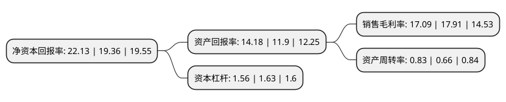

> 本页面由自动化程序生成于 2022年5月20日 01:11
> 内容可能存在错误，如有bug请提交issue至：https://github.com/Eroleice/doc-pi/issues
{.is-warning}

# 上市公司基本情况

## 基本资料

葵花药业集团股份有限公司（以下简称“葵花药业”）成立于2005年09月07日，哈尔滨市。于2014年12月30日在深交所中小板上市。

葵花药业注册资本58,400万元，主营业务为各类中成药，化学药品(包括生物制药)的研发，生产和销售。主要产品为胃康灵胶囊，护肝片，小儿肺热咳喘口服液，小儿化痰止咳颗粒，康妇消炎栓，小儿氨酚黄那敏颗粒。以下是详细信息：

- 公司名称: 葵花药业集团股份有限公司
- 股票代码: 002737.SZ
- 所在地: 黑龙江 - 哈尔滨市
- 成立日期: 2005年09月07日
- 注册资本: 58,400万元
- 法定代表人: 关玉秀
- 主营业务: 主营业务为各类中成药，化学药品(包括生物制药)的研发，生产和销售主要产品为胃康灵胶囊，护肝片，小儿肺热咳喘口服液，小儿化痰止咳颗粒，康妇消炎栓，小儿氨酚黄那敏颗粒
- 公司官网: www.kuihuayaoye.com
- 公司介绍: 公司是集药品制造、营销、科研于一体的大型民营医药企业集团。葵花曾成功研发出以护肝片、胃康灵胶囊为代表的全国知名中药产品，为我国中药事业的发展做出了突出贡献。现在北京、哈尔滨、重庆、天津分别设立了药物研究院，在各生产企业设立了药物研究所(部)，专注于中药、天然药、化学药、生物药和健康品的新技术、新剂型、新口味、新标准的研究开发。集团两次荣获“全国五一劳动奖状”，先后荣获“全国就业与社会保障先进民营企业”、“全国守合同重信用企业”、“全国AAA级信用企业”、“全国实施卓越绩效模式先进企业”、“全国民营企业政治思想工作先进单位”、“全国企业文化建设优秀单位”、“全国模范职工之家”、中国“儿童用药安全突出贡献单位”等荣誉称号。

## 股东及高管情况

上市公司第一大股东为葵花集团有限公司，持股265,200,000股，占比45.41%，为上市公司实际控制人。

截至2022年03月31日，上市公司的前十大股东中，共有4名自然人股东，2名机构股东，3个产品账户，1个海外主体，其中5%以上大股东共有2名。上市公司前十大股东明细如下：

> 截至2022年03月31日，上市公司前十大股东信息如下：

| 股东名称 | 持股数量（股） | 持股比例 |
| --- | --- | --- |
| 葵花集团有限公司 | 265,200,000 | 45.41% |
| 关彦斌 | 52,740,422 | 9.03% |
| 黑龙江金葵投资股份有限公司 | 24,000,000 | 4.11% |
| 香港中央结算有限公司(陆股通) | 9,316,614 | 1.6% |
| 张权 | 4,343,506 | 0.74% |
| 葵花药业集团股份有限公司-2021年员工持股计划 | 4,180,000 | 0.72% |
| 张玉玲 | 3,901,320 | 0.67% |
| 李杰 | 3,281,648 | 0.56% |
| 中国工商银行股份有限公司-富国中证红利指数增强型证券投资基金 | 3,224,000 | 0.55% |
| 中国建设银行股份有限公司-大成中证红利指数证券投资基金 | 1,735,200 | 0.3% |

## 杜邦分析

> 数据列示周期：2021年 | 2020年 | 2019年
{.is-info}

上市公司的净资产收益率在近一年有所上升，上升幅度为14.31%，其变化情况分解如下：
- 上市公司的销售毛利率在近一年下降了-4.58%，可能是生产效率的下降、商品原材料价格上涨或商品价格的下跌所致。
- 上市公司的资产周转率在近一年上升了25.76%，可能是源自于更快的销售回款或库存管理效果提升。
- 上市公司的财务杠杆比率在近一年下降了-4.29%，可能是减少负债降低财务费用。

