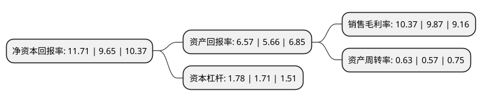

> 本页面由自动化程序生成于 2022年5月20日 01:12
> 内容可能存在错误，如有bug请提交issue至：https://github.com/Eroleice/doc-pi/issues
{.is-warning}

# 上市公司基本情况

## 基本资料

贵阳新天药业股份有限公司（以下简称“新天药业”）成立于1995年08月11日，贵阳市。于2017年05月19日在深交所中小板上市。

新天药业注册资本16,404.803万元，中成药生产，公司拥有国家医保目录品种26个，国家基本药物目录品种10个，非处方药(OTC)品种21个，独家品种13个。公司目前主要产品为宁泌泰胶囊，坤泰胶囊，苦参凝胶，夏枯草口服液。公司拥有通过GMP认证的硬胶囊剂，合剂，颗粒剂，凝胶剂，片剂五个剂型生产线，主要从事泌尿系统类疾病，妇科类及其他病因复杂类疾病用药的中成药产品研究，开发，生产与销售。以下是详细信息：

- 公司名称: 贵阳新天药业股份有限公司
- 股票代码: 002873.SZ
- 所在地: 贵州 - 贵阳市
- 成立日期: 1995年08月11日
- 注册资本: 16,404.803万元
- 法定代表人: 董大伦
- 主营业务: 中成药生产，公司拥有国家医保目录品种26个，国家基本药物目录品种10个，非处方药(OTC)品种21个，独家品种13个公司目前主要产品为宁泌泰胶囊，坤泰胶囊，苦参凝胶，夏枯草口服液公司拥有通过GMP认证的硬胶囊剂，合剂，颗粒剂，凝胶剂，片剂五个剂型生产线，主要从事泌尿系统类疾病，妇科类及其他病因复杂类疾病用药的中成药产品研究，开发，生产与销售
- 公司官网: www.gyxtyy.com
- 公司介绍: 公司创建于1995年8月，是一家集新药研发、药品生产及销售为一体的国家高新技术企业、全国民族特需商品定点生产企业、农业产业化国家重点龙头企业。公司拥有通过GMP认证的硬胶囊剂、凝胶剂、合剂、颗粒剂、片剂五个剂型生产线；拥有50多个药品批准文号，以疗效显著的泌尿科药宁泌泰胶囊、妇科药坤泰胶囊、苦参凝胶、夏枯草口服液为主导产品。公司以专业学术推广为核心竞争力，坚持“销售服务化、推广专业化、产品优质化”。在全国26个省、自治区、直辖市建立了销售网点，与国内数百家大型医药商业公司建立长期稳定的战略伙伴关系，产品覆盖8000余家医疗单位。

## 股东及高管情况

上市公司第一大股东为贵阳新天生物技术开发有限公司，持股60,576,547股，占比36.51%，为上市公司实际控制人。

截至2022年03月31日，上市公司的前十大股东中，共有2名自然人股东，2名机构股东，6个产品账户，其中5%以上大股东共有1名。上市公司前十大股东明细如下：

> 截至2022年03月31日，上市公司前十大股东信息如下：

| 股东名称 | 持股数量（股） | 持股比例 |
| --- | --- | --- |
| 贵阳新天生物技术开发有限公司 | 60,576,547 | 36.51% |
| 张全槐 | 7,123,906 | 4.29% |
| 王金华 | 5,018,762 | 3.03% |
| 全国社保基金一一六组合 | 4,836,153 | 2.91% |
| 上海国盛资本管理有限公司-上海国盛海通股权投资基金合伙企业(有限合伙) | 3,346,060 | 2.02% |
| 兴业银行股份有限公司-万家成长优选灵活配置混合型证券投资基金 | 2,569,100 | 1.55% |
| 中国农业银行股份有限公司-万家内需增长一年持有期混合型证券投资基金 | 1,902,900 | 1.15% |
| 贵阳甲秀创业投资中心(有限合伙) | 1,680,000 | 1.01% |
| 中国建设银行股份有限公司-万家健康产业混合型证券投资基金 | 1,278,212 | 0.77% |
| 中国建设银行股份有限公司-万家科创主题3年封闭运作灵活配置混合型证券投资基金 | 1,220,400 | 0.74% |

## 利润表分析

上市公司2021年总收入为9.69亿元，净利润为1亿元，实现盈利。

## 杜邦分析

> 数据列示周期：2021年 | 2020年 | 2019年
{.is-info}

上市公司的净资产收益率在近一年有所上升，上升幅度为21.35%，其变化情况分解如下：
- 上市公司的销售毛利率在近一年上升了5.07%，可能是生产效率的提升、商品原材料价格下跌或商品价格的上涨所致。
- 上市公司的资产周转率在近一年上升了10.53%，可能是源自于更快的销售回款或库存管理效果提升。
- 上市公司的财务杠杆比率在近一年上升了4.09%，可能是增加负债扩大生产规模。

