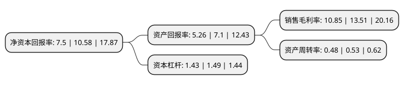

> 本页面由自动化程序生成于 2022年5月20日 01:13
> 内容可能存在错误，如有bug请提交issue至：https://github.com/Eroleice/doc-pi/issues
{.is-warning}

# 上市公司基本情况

## 基本资料

重庆华森制药股份有限公司（以下简称“华森制药”）成立于1996年11月04日，重庆市。于2017年10月20日在深交所中小板上市。

华森制药注册资本40,169.65万元，主营业务:专注于中成药，化学药的研发，生产和销售。产品涵盖消化系统，精神神经系统，耳鼻喉科，心脑血管系统，免疫系统等多个用药领域，包括威地美(铝碳酸镁片)，甘桔冰梅片，都梁软胶囊，长松(聚乙二醇4000散)，痛泻宁颗粒，八味芪龙颗粒，六味安神胶囊，融通(注射用阿魏酸钠)，注射用奥美拉唑钠，注射用甲磺酸加贝酯和注射用胞磷胆碱钠等。以下是详细信息：

- 公司名称: 重庆华森制药股份有限公司
- 股票代码: 002907.SZ
- 所在地: 重庆 - 重庆市
- 成立日期: 1996年11月04日
- 注册资本: 40,169.65万元
- 法定代表人: 游洪涛
- 主营业务: 主营业务:专注于中成药，化学药的研发，生产和销售产品涵盖消化系统，精神神经系统，耳鼻喉科，心脑血管系统，免疫系统等多个用药领域，包括威地美(铝碳酸镁片)，甘桔冰梅片，都梁软胶囊，长松(聚乙二醇4000散)，痛泻宁颗粒，八味芪龙颗粒，六味安神胶囊，融通(注射用阿魏酸钠)，注射用奥美拉唑钠，注射用甲磺酸加贝酯和注射用胞磷胆碱钠等
- 公司官网: www.pharscin.com
- 公司介绍: 公司是一家集药品研发、生产和销售于一体的国家重点高新技术企业、全国守合同重信用企业、国家生物产业基地龙头企业、国家中药现代化科技产业基地、中药先进工艺技术中心、设立博士后科研工作站和院士专家工作站、重庆市创新型企业、重庆市首批技术创新示范企业、三峡移民企业、重庆市优秀企业技术中心。集团下设重庆华森制药股份有限公司、重庆华森生物技术有限责任公司、重庆华森医药有限公司、重庆华森大药房零售连锁有限公司。公司产品始终蝉联出厂成品检验、药监局抽检、国家评价性抽检和市场抽检合格率四个100%。荣获“中国医药行业优秀质量管理小组”、“全国优秀质量管理小组”、卫生部健康报“放心药”等荣誉称号，在广大消费者和医务工作者中享有较高的声誉。

## 股东及高管情况

上市公司第一大股东为成都地方建筑机械化工程有限公司，持股188,100,000股，占比46.82%，为上市公司实际控制人。

截至2022年03月31日，上市公司的前十大股东中，共有6名自然人股东，1名机构股东，3个海外主体，其中5%以上大股东共有4名。上市公司前十大股东明细如下：

> 截至2022年03月31日，上市公司前十大股东信息如下：

| 股东名称 | 持股数量（股） | 持股比例 |
| --- | --- | --- |
| 成都地方建筑机械化工程有限公司 | 188,100,000 | 46.82% |
| 游洪涛 | 78,300,000 | 19.49% |
| 王瑛 | 39,600,000 | 9.86% |
| 刘小英 | 35,894,679 | 8.94% |
| 王忠友 | 1,781,600 | 0.44% |
| 高华—汇丰—GOLDMASACHS&CO.LLC | 469,951 | 0.12% |
| 高华-汇丰-GOLDMASACHS&CO.LLC | 469,951 | 0.12% |
| 赖满红 | 403,609 | 0.1% |
| JPMORGCHASEBANK,NASSOCI | 402,527 | 0.1% |
| 张吉虎 | 384,000 | 0.1% |

## 利润表分析

上市公司2021年总收入为8.46亿元，净利润为0.91亿元，实现盈利。

## 杜邦分析

> 数据列示周期：2021年 | 2020年 | 2019年
{.is-info}

上市公司的净资产收益率在近一年有所下降，下降幅度为-29.11%，其变化情况分解如下：
- 上市公司的销售毛利率在近一年下降了-19.69%，可能是生产效率的下降、商品原材料价格上涨或商品价格的下跌所致。
- 上市公司的资产周转率在近一年下降了-9.43%，可能是源自于更慢的销售回款或库存管理效果下降。
- 上市公司的财务杠杆比率在近一年下降了-4.03%，可能是减少负债降低财务费用。

