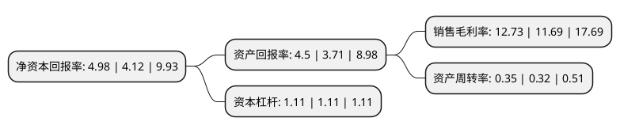

> 本页面由自动化程序生成于 2022年5月20日 01:14
> 内容可能存在错误，如有bug请提交issue至：https://github.com/Eroleice/doc-pi/issues
{.is-warning}

# 上市公司基本情况

## 基本资料

上海凯宝药业股份有限公司（以下简称“上海凯宝”）成立于2000年04月12日，上海市。于2010年01月08日在深交所创业板上市。

上海凯宝注册资本104,600万元，主要产品:痰热清注射液。另外还少量生产盐酸吡格列酮片，卡托普利缓释片，多索茶碱胶囊等产品。主营业务:清热解毒类中成药痰热清注射液的研发，生产和销售。以下是详细信息：

- 公司名称: 上海凯宝药业股份有限公司
- 股票代码: 300039.SZ
- 所在地: 上海 - 上海市
- 成立日期: 2000年04月12日
- 注册资本: 104,600万元
- 法定代表人: 穆竟伟
- 主营业务: 主要产品:痰热清注射液另外还少量生产盐酸吡格列酮片，卡托普利缓释片，多索茶碱胶囊等产品主营业务:清热解毒类中成药痰热清注射液的研发，生产和销售
- 公司官网: www.xykb.com
- 公司介绍: 公司一家主要从事现代中药研发、生产、销售的综合制药企业。属国家现代中药高科技产业化示范项目基地、中国医药工业百强企业、中国诚信楷模企业、全国质量诚信双优医药企业、上海市高新技术企业、上海市生物医药重点企业。是国内首家通过新版GMP(2010版)认证的中药注射剂企业。核心产品痰热清注射液具有清热解毒、止咳化痰的独特功效，主要用于肺炎、急慢性支气管炎以及上呼吸道感染，临床效果十分显著。在儿科、外科、内科以及传染病、肿瘤、职业病的临床应用中，一直发挥着重要作用。

## 股东及高管情况

上市公司第一大股东为穆竟伟，持股168,029,270股，占比16.06%，**疑似为**上市公司实际控制人。

截至2022年03月31日，上市公司的前十大股东中，共有8名自然人股东，1名机构股东，1个产品账户，其中5%以上大股东共有3名。上市公司前十大股东明细如下：

> 未能通过持股比例判定出上市公司实际控制人（持股30%以上）
> 可能存在通过间接持股、联合持股、协议控制等方式拥有实际控制权的主体，具体请参考上市公司定期公告！
{.is-warning}

> 截至2022年03月31日，上市公司前十大股东信息如下：

| 股东名称 | 持股数量（股） | 持股比例 |
| --- | --- | --- |
| 穆竟伟 | 168,029,270 | 16.06% |
| 张艳琪 | 160,790,370 | 15.37% |
| 新乡市凯谊实业有限公司 | 78,425,019 | 7.5% |
| 穆竟男 | 8,211,182 | 0.79% |
| 薛万金 | 3,544,300 | 0.34% |
| 苑怀进 | 3,240,075 | 0.31% |
| 王成军 | 3,086,000 | 0.3% |
| 中国建设银行股份有限公司-汇添富中证中药指数型发起式证券投资基金(LOF) | 2,800,400 | 0.27% |
| 冯德宏 | 2,590,000 | 0.25% |
| 王国明 | 2,257,840 | 0.22% |

## 利润表分析

上市公司2021年总收入为11亿元，净利润为1.4亿元，实现盈利。

## 杜邦分析

> 数据列示周期：2021年 | 2020年 | 2019年
{.is-info}

上市公司的净资产收益率在近一年有所上升，上升幅度为20.87%，其变化情况分解如下：
- 上市公司的销售毛利率在近一年上升了8.9%，可能是生产效率的提升、商品原材料价格下跌或商品价格的上涨所致。
- 上市公司的资产周转率在近一年上升了9.38%，可能是源自于更快的销售回款或库存管理效果提升。
- 上市公司的财务杠杆比率在近一年下降了0%，可能是减少负债降低财务费用。

