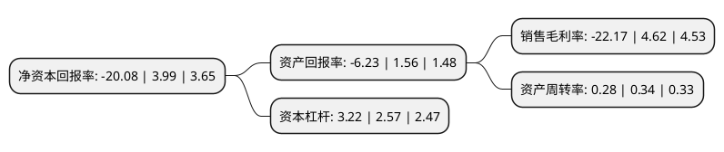

> 本页面由自动化程序生成于 2022年5月20日 01:15
> 内容可能存在错误，如有bug请提交issue至：https://github.com/Eroleice/doc-pi/issues
{.is-warning}

# 上市公司基本情况

## 基本资料

广州市香雪制药股份有限公司（以下简称“香雪制药”）成立于1986年04月30日，广州市。于2010年12月15日在深交所创业板上市。

香雪制药注册资本66,136.144万元，主营业务为现代中药生产与销售，辅之医疗设备等业务。主要产品为抗病毒口服液，板蓝根颗粒。以下是详细信息：

- 公司名称: 广州市香雪制药股份有限公司
- 股票代码: 300147.SZ
- 所在地: 广东 - 广州市
- 成立日期: 1986年04月30日
- 注册资本: 66,136.144万元
- 法定代表人: 王永辉
- 主营业务: 主营业务为现代中药生产与销售，辅之医疗设备等业务主要产品为抗病毒口服液，板蓝根颗粒
- 公司官网: www.xphcn.com
- 公司介绍: 公司是一家以中成药制药和研发为主业，集西药制药、生物医学工程和药材规范种植于一体的现代化高新技术医药企业。公司一直以来，专注于以抗病毒口服液、板蓝根颗粒为主导产品的系列中成药的生产与销售。公司主导产品之一抗病毒口服液为纯天然植物配方，是公司首创的国家级新药。公司秉承“厚生臻善维新”的企业理念，坚持“崇尚品质关爱健康”的质量方针，坚持自主创新、自主品牌，在品质、技术、研发、品牌和规模等多方面成长为行业领先者，得到消费者、行业和政府主管部门的高度评价和广泛认可。

## 股东及高管情况

上市公司第一大股东为广州市昆仑投资有限公司，持股165,500,578股，占比25.02%，**疑似为**上市公司实际控制人。

截至2022年03月31日，上市公司的前十大股东中，共有4名自然人股东，3名机构股东，1个产品账户，2个海外主体，其中5%以上大股东共有2名。上市公司前十大股东明细如下：

> 未能通过持股比例判定出上市公司实际控制人（持股30%以上）
> 可能存在通过间接持股、联合持股、协议控制等方式拥有实际控制权的主体，具体请参考上市公司定期公告！
{.is-warning}

> 截至2022年03月31日，上市公司前十大股东信息如下：

| 股东名称 | 持股数量（股） | 持股比例 |
| --- | --- | --- |
| 广州市昆仑投资有限公司 | 165,500,578 | 25.02% |
| 广州市昆仑投资有限公司 | 165,500,578 | 25.02% |
| 广州市罗岗自来水有限公司 | 26,832,260 | 4.06% |
| 陈建 | 7,500,000 | 1.13% |
| 张毅 | 3,160,468 | 0.48% |
| 刘武雄 | 2,684,406 | 0.41% |
| 中国建设银行股份有限公司-汇添富中证中药指数型发起式证券投资基金(LOF) | 2,360,800 | 0.36% |
| 廖廷彬 | 2,220,858 | 0.34% |
| JPMORGAN CHASE BANK,NATIONAL ASSOCIATION | 1,746,047 | 0.26% |
| UBS AG | 1,408,314 | 0.21% |

## 利润表分析

上市公司2021年总收入为29.7亿元，净利润为-6.59亿元，**未实现盈利**。

## 杜邦分析

> 数据列示周期：2021年 | 2020年 | 2019年
{.is-info}

上市公司的净资产收益率在近一年有所下降，下降幅度为-603.26%，其变化情况分解如下：
- 上市公司的销售毛利率在近一年下降了-579.87%，可能是生产效率的下降、商品原材料价格上涨或商品价格的下跌所致。
- 上市公司的资产周转率在近一年下降了-17.65%，可能是源自于更慢的销售回款或库存管理效果下降。
- 上市公司的财务杠杆比率在近一年上升了25.29%，可能是增加负债扩大生产规模。

