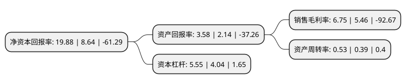

> 本页面由自动化程序生成于 2022年5月20日 01:17
> 内容可能存在错误，如有bug请提交issue至：https://github.com/Eroleice/doc-pi/issues
{.is-warning}

# 上市公司基本情况

## 基本资料

康跃科技股份有限公司（以下简称“康跃科技”）成立于2001年12月24日，潍坊市。于2014年08月01日在深交所创业板上市。

康跃科技注册资本35,033.611万元，主营业务为内燃机增压器的研发，制造和销售，是我国主要的内燃机配套增压器专业制造商，产品广泛应用于汽车，工程机械，农业机械，船舶，发电机组等领域。以下是详细信息：

- 公司名称: 康跃科技股份有限公司
- 股票代码: 300391.SZ
- 所在地: 山东 - 潍坊市
- 成立日期: 2001年12月24日
- 注册资本: 35,033.611万元
- 法定代表人: 郭晓伟
- 主营业务: 主营业务为内燃机增压器的研发，制造和销售，是我国主要的内燃机配套增压器专业制造商，产品广泛应用于汽车，工程机械，农业机械，船舶，发电机组等领域
- 公司官网: www.chinakangyue.com
- 公司介绍: 公司是一家集设计、研发、生产、销售涡轮增压器为一体的高新技术企业。公司3GJs-1型涡轮增压器被誉为国家级新产品称号；JP50S汽油机涡轮增压器被列为国家火炬计划项目，并获得中国工业机械科学技术奖二等奖；KT60S双层通道可变截面涡轮增压器获山东省科学技术进步奖二等奖；HP60S电辅助涡轮增压器及JP30S汽油机涡轮增压器等多个产品先后通过省、市级科技成果鉴定，整体水平达到了国内领先或国际先进水平，其中多项关键技术填补了国内外空白。公司先后被评为中国内燃机工业突出贡献企业、中国汽车零部件增压器龙头企业、中国内燃机零部件行业排头兵企业，荣获中国内燃机工业百年成就奖、山东省产学研展洽会金奖，山东省企业技术创新奖等。2017年，公司收购羿珩科技100%股权，公司进入智能成套装备制造领域，实现内燃机配套产品生产与智能装备制造的双轮驱动业务。

## 股东及高管情况

上市公司第一大股东为长兴盛世丰华商务有限公司，持股65,897,500股，占比18.81%，**疑似为**上市公司实际控制人。

截至2022年03月31日，上市公司的前十大股东中，共有5名自然人股东，3名机构股东，2个产品账户，其中5%以上大股东共有3名。上市公司前十大股东明细如下：

> 未能通过持股比例判定出上市公司实际控制人（持股30%以上）
> 可能存在通过间接持股、联合持股、协议控制等方式拥有实际控制权的主体，具体请参考上市公司定期公告！
{.is-warning}

> 截至2022年03月31日，上市公司前十大股东信息如下：

| 股东名称 | 持股数量（股） | 持股比例 |
| --- | --- | --- |
| 长兴盛世丰华商务有限公司 | 65,897,500 | 18.81% |
| 芜湖远澈泉历投资中心(有限合伙) | 22,550,000 | 6.44% |
| 刘丽丽 | 17,681,253 | 5.05% |
| 寿光市康跃投资有限公司 | 17,516,747 | 5% |
| 冯军智 | 4,169,739 | 1.19% |
| 西藏博恩资产管理有限公司-博恩添富7号私募证券投资基金 | 3,873,525 | 1.11% |
| 姚晓华 | 2,730,000 | 0.78% |
| 李玉芳 | 2,408,885 | 0.69% |
| 西藏博恩资产管理有限公司-博恩光华成长六期私募证券投资基金 | 2,390,000 | 0.68% |
| 张建荣 | 2,044,500 | 0.58% |

## 利润表分析

上市公司2021年总收入为23.61亿元，净利润为1.59亿元，实现盈利。

## 杜邦分析

> 数据列示周期：2021年 | 2020年 | 2019年
{.is-info}

上市公司的净资产收益率在近一年有所上升，上升幅度为130.09%，其变化情况分解如下：
- 上市公司的销售毛利率在近一年上升了23.63%，可能是生产效率的提升、商品原材料价格下跌或商品价格的上涨所致。
- 上市公司的资产周转率在近一年上升了35.9%，可能是源自于更快的销售回款或库存管理效果提升。
- 上市公司的财务杠杆比率在近一年上升了37.38%，可能是增加负债扩大生产规模。

