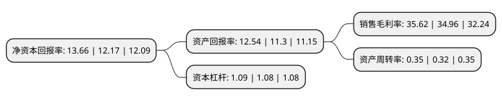

> 本页面由自动化程序生成于 2022年5月20日 01:18
> 内容可能存在错误，如有bug请提交issue至：https://github.com/Eroleice/doc-pi/issues
{.is-warning}

# 上市公司基本情况

## 基本资料

浙江新光药业股份有限公司（以下简称“新光药业”）成立于1998年11月18日，绍兴市。于2016年06月24日在深交所创业板上市。

新光药业注册资本16,000万元，主营业务:主要从事中成药的研发，生产和销售。目前主要产品为黄芪生脉饮，伸筋丹胶囊，西洋参口服液等。以下是详细信息：

- 公司名称: 浙江新光药业股份有限公司
- 股票代码: 300519.SZ
- 所在地: 浙江 - 绍兴市
- 成立日期: 1998年11月18日
- 注册资本: 16,000万元
- 法定代表人: 王岳钧
- 主营业务: 主营业务:主要从事中成药的研发，生产和销售目前主要产品为黄芪生脉饮，伸筋丹胶囊，西洋参口服液等
- 公司官网: www.xgpharma.com
- 公司介绍: 公司是一家集生产和经营于一体的股份制现代化制药企业。公司拥有固体制剂、液体制剂、胶囊制剂和中药炮制提取等多条现代化生产线，厂房、设施达到国内先进水平。公司全部生产厂房和剂型均已通过国家GMP认证和ISO14001环境管理体系认证。公司现为国家级高新技术企业、国家火炬计划重点高新技术企业、浙江省“五个一批”重点骨干企业、首批浙江省诚信示范企业、浙江省信用管理示范企业、浙江省劳动保障诚信单位、浙江省绿色企业。“新光”商标荣获浙江省著名商标称号。“新光”牌黄芪生脉饮荣获浙江省名牌产品称号。公司主导产品黄芪生脉饮、伸筋丹胶囊和西洋参口服液，经过企业多年培育，产品质量稳定，疗效显著，市场信誉高，深受市场欢迎。

## 股东及高管情况

上市公司第一大股东为王岳钧，持股61,200,000股，占比38.25%，为上市公司实际控制人。

截至2022年04月29日，上市公司的前十大股东中，共有5名自然人股东，2名机构股东，2个产品账户，1个海外主体，其中5%以上大股东共有4名。上市公司前十大股东明细如下：

> 截至2022年04月29日，上市公司前十大股东信息如下：

| 股东名称 | 持股数量（股） | 持股比例 |
| --- | --- | --- |
| 王岳钧 | 61,200,000 | 38.25% |
| 王岳钧 | 61,200,000 | 38.25% |
| 嵊州市和丰投资股份有限公司 | 33,603,000 | 21% |
| 嵊州市和丰投资股份有限公司 | 32,703,000 | 20.4394% |
| 莫常春 | 1,209,900 | 0.76% |
| JPMORGAN CHASE BANK,NATIONAL ASSOCIATION | 688,048 | 0.43% |
| 中信证券股份有限公司-民生加银医药健康股票型证券投资基金 | 430,600 | 0.27% |
| 中国建设银行股份有限公司-汇添富中证中药指数型发起式证券投资基金(LOF) | 316,600 | 0.2% |
| 谭永华 | 310,000 | 0.19% |
| 刘猛 | 293,700 | 0.18% |

## 利润表分析

上市公司2021年总收入为3.2亿元，净利润为1.14亿元，实现盈利。

## 杜邦分析

> 数据列示周期：2021年 | 2020年 | 2019年
{.is-info}

上市公司的净资产收益率在近一年有所上升，上升幅度为12.24%，其变化情况分解如下：
- 上市公司的销售毛利率在近一年上升了1.89%，可能是生产效率的提升、商品原材料价格下跌或商品价格的上涨所致。
- 上市公司的资产周转率在近一年上升了9.38%，可能是源自于更快的销售回款或库存管理效果提升。
- 上市公司的财务杠杆比率在近一年上升了0.93%，可能是增加负债扩大生产规模。

