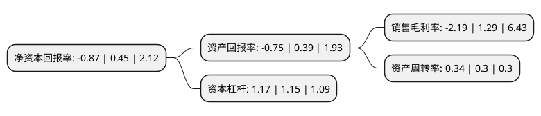

> 本页面由自动化程序生成于 2022年5月20日 01:18
> 内容可能存在错误，如有bug请提交issue至：https://github.com/Eroleice/doc-pi/issues
{.is-warning}

# 上市公司基本情况

## 基本资料

甘肃陇神戎发药业股份有限公司（以下简称“陇神戎发”）成立于2002年06月03日，兰州市。于2016年09月13日在深交所创业板上市。

陇神戎发注册资本30,334.5万元，公司主营业务为中成药的生产及销售。主要产品:目前共有滴丸剂，片剂，硬胶囊剂，膜剂等4种剂型，16个药品生产批准文号。公司主要产品元胡止痛滴丸，酸枣仁油滴丸，鞣酸小檗碱膜和七味温阳胶囊均为独家品种。以下是详细信息：

- 公司名称: 甘肃陇神戎发药业股份有限公司
- 股票代码: 300534.SZ
- 所在地: 甘肃 - 兰州市
- 成立日期: 2002年06月03日
- 注册资本: 30,334.5万元
- 法定代表人: 康海军
- 主营业务: 公司主营业务为中成药的生产及销售主要产品:目前共有滴丸剂，片剂，硬胶囊剂，膜剂等4种剂型，16个药品生产批准文号公司主要产品元胡止痛滴丸，酸枣仁油滴丸，鞣酸小檗碱膜和七味温阳胶囊均为独家品种
- 公司官网: www.lsrfzy.com
- 公司介绍: 公司是一家集新药研发、中药加工和生产经营为一体的国家级高新技术企业，中国中药协会中药材种植养殖专业委员会理事单位，甘肃省公司协会副会长单位，元胡止痛滴丸国家行业标准起草单位。其主打产品、国家中药保护品种元胡止痛滴丸被列入《国家基本用药目录》，并先后荣获甘肃省著名商标、甘肃省名牌产品等多项荣誉称号，营销网点遍布全国三十个省、直辖市，止痛类滴丸剂生产销售规模在国内同行业中名列第一。近年来，随着国家西部大开发战略的带动和甘肃省提倡高新技术改造传统产业的政策鼓动，公司已被甘肃省委、省政府确定为“十二五”重点发展的战略新兴产业。公司先后荣获甘肃省科技进步三等奖、甘肃省中药新药剂型研究工程实验室、甘肃省企业技术中心、甘肃省企业质量信用AA级企业、兰州市药品质量安全信用良好单位等多项荣誉及称号。未来，公司致力于成为集现代中药生产、中药材种植、中药饮片加工、新药研发、药品商贸物流等为一体的大型医药集团公司，成为甘肃乃至西北地区种、研、产、销为一体的医药龙头企业。

## 股东及高管情况

上市公司第一大股东为甘肃药业投资集团有限公司，持股90,785,250股，占比29.93%，**疑似为**上市公司实际控制人。

截至2022年03月31日，上市公司的前十大股东中，共有5名自然人股东，2名机构股东，2个产品账户，1个海外主体，其中5%以上大股东共有2名。上市公司前十大股东明细如下：

> 未能通过持股比例判定出上市公司实际控制人（持股30%以上）
> 可能存在通过间接持股、联合持股、协议控制等方式拥有实际控制权的主体，具体请参考上市公司定期公告！
{.is-warning}

> 截至2022年03月31日，上市公司前十大股东信息如下：

| 股东名称 | 持股数量（股） | 持股比例 |
| --- | --- | --- |
| 甘肃药业投资集团有限公司 | 90,785,250 | 29.93% |
| 甘肃生物产业创业投资基金有限公司 | 21,575,777 | 7.11% |
| UBS  AG | 1,749,818 | 0.58% |
| 康永红 | 1,681,183 | 0.55% |
| 甘肃省国有资产投资集团有限公司 | 1,351,000 | 0.45% |
| 洪棋新 | 1,268,300 | 0.42% |
| 张金德 | 1,170,045 | 0.39% |
| 中国建设银行股份有限公司-汇添富中证中药指数型发起式证券投资基金(LOF) | 1,050,600 | 0.35% |
| 詹显财 | 1,000,000 | 0.33% |
| 刘利洪 | 756,000 | 0.25% |

## 利润表分析

上市公司2021年总收入为2.87亿元，净利润为-0.07亿元，**未实现盈利**。

## 杜邦分析

> 数据列示周期：2021年 | 2020年 | 2019年
{.is-info}

上市公司的净资产收益率在近一年有所下降，下降幅度为-293.33%，其变化情况分解如下：
- 上市公司的销售毛利率在近一年下降了-269.77%，可能是生产效率的下降、商品原材料价格上涨或商品价格的下跌所致。
- 上市公司的资产周转率在近一年上升了13.33%，可能是源自于更快的销售回款或库存管理效果提升。
- 上市公司的财务杠杆比率在近一年上升了1.74%，可能是增加负债扩大生产规模。

