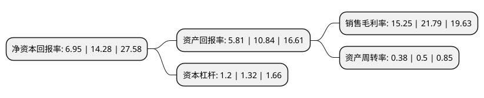

> 本页面由自动化程序生成于 2022年5月20日 01:21
> 内容可能存在错误，如有bug请提交issue至：https://github.com/Eroleice/doc-pi/issues
{.is-warning}

# 上市公司基本情况

## 基本资料

浙江维康药业股份有限公司（以下简称“维康药业”）成立于2000年03月31日，丽水市。于2020年08月24日在深交所创业板上市。

维康药业注册资本8,043.907万元，主营业务为现代中药及西药的研发，生产和销售，主要产品包括银黄滴丸，益母草软胶囊，益母草分散片，骨刺胶囊，枫蓼肠胃康分散片，人参健脾片等中成药以及罗红霉素软胶囊等西药，生产剂型覆盖硬胶囊剂，片剂，颗粒剂，软胶囊剂，丸剂(滴丸)。以下是详细信息：

- 公司名称: 浙江维康药业股份有限公司
- 股票代码: 300878.SZ
- 所在地: 浙江 - 丽水市
- 成立日期: 2000年03月31日
- 注册资本: 8,043.907万元
- 法定代表人: 刘忠良
- 主营业务: 主营业务为现代中药及西药的研发，生产和销售，主要产品包括银黄滴丸，益母草软胶囊，益母草分散片，骨刺胶囊，枫蓼肠胃康分散片，人参健脾片等中成药以及罗红霉素软胶囊等西药，生产剂型覆盖硬胶囊剂，片剂，颗粒剂，软胶囊剂，丸剂(滴丸)
- 公司官网: www.zjwk.com
- 公司介绍: 公司是一家集中成药研发、制造、销售于一体的现代化高科技制药企业。主营业务为现代中药及西药的研发、生产和销售，主要产品包括银黄滴丸、益母草软胶囊、益母草分散片、骨刺胶囊、枫蓼肠胃康分散片、人参健脾片等中成药以及罗红霉素软胶囊等西药，生产剂型覆盖硬胶囊剂、片剂、颗粒剂、软胶囊剂、丸剂(滴丸)。除医药工业外，公司还经营医药商业产品的零售连锁等流通业务作为主营业务的补充。公司以“为公众服务，对生命负责”为质量要求，严格按照GMP要求建设厂房、配置设备，各类生产线均通过GMP认证,秉承“维系苍生、致力安康”的企业使命，重视研发投入和人才引进，先后成立了省级高新技术企业研究开发中心、省级企业技术中心、省级企业研究院、浙江省院士专家工作站、浙江省博士后工作站等多个科研平台，不断强化在制药领域的核心竞争力。

## 股东及高管情况

上市公司第一大股东为刘忠良，持股48,979,389股，占比60.89%，为上市公司实际控制人。

截至2022年03月31日，上市公司的前十大股东中，共有9名自然人股东，1名机构股东，其中5%以上大股东共有2名。上市公司前十大股东明细如下：

> 截至2022年03月31日，上市公司前十大股东信息如下：

| 股东名称 | 持股数量（股） | 持股比例 |
| --- | --- | --- |
| 刘忠良 | 48,979,389 | 60.89% |
| 刘忠姣 | 5,484,461 | 6.82% |
| 丽水顺泽投资管理合伙企业(有限合伙) | 3,290,675 | 4.09% |
| 卢卫芳 | 603,291 | 0.75% |
| 孔晓霞 | 493,602 | 0.61% |
| 何仁财 | 460,000 | 0.57% |
| 庄毅智 | 397,500 | 0.49% |
| 谢立恒 | 329,068 | 0.41% |
| 刘根才 | 329,068 | 0.41% |
| 戴德雄 | 329,068 | 0.41% |

## 利润表分析

上市公司2021年总收入为6.32亿元，净利润为0.96亿元，实现盈利。

## 杜邦分析

> 数据列示周期：2021年 | 2020年 | 2019年
{.is-info}

上市公司的净资产收益率在近一年有所下降，下降幅度为-51.33%，其变化情况分解如下：
- 上市公司的销售毛利率在近一年下降了-30.01%，可能是生产效率的下降、商品原材料价格上涨或商品价格的下跌所致。
- 上市公司的资产周转率在近一年下降了-24%，可能是源自于更慢的销售回款或库存管理效果下降。
- 上市公司的财务杠杆比率在近一年下降了-9.09%，可能是减少负债降低财务费用。

