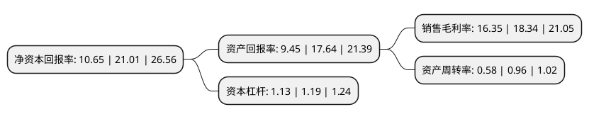

> 本页面由自动化程序生成于 2022年5月20日 01:23
> 内容可能存在错误，如有bug请提交issue至：https://github.com/Eroleice/doc-pi/issues
{.is-warning}

# 上市公司基本情况

## 基本资料

广东万年青制药股份有限公司（以下简称“粤万年青”）成立于1981年03月16日，汕头市。于2021年12月07日在深交所创业板上市。

粤万年青注册资本16,000万元，公司主营业务为中成药的研发，生产和销售。经过多年发展。公司主要医药产品为消炎利胆片，胆石通胶囊，参芪降糖片，苦木注射液，妇炎平胶囊，归脾液，固精补肾丸，健儿清解液等，主要口罩产品分为一次性使用医用口罩，医用外科口罩，KN95口罩等。以下是详细信息：

- 公司名称: 广东万年青制药股份有限公司
- 股票代码: 301111.SZ
- 所在地: 广东 - 汕头市
- 成立日期: 1981年03月16日
- 注册资本: 16,000万元
- 法定代表人: 欧先涛
- 主营业务: 公司主营业务为中成药的研发，生产和销售经过多年发展公司主要医药产品为消炎利胆片，胆石通胶囊，参芪降糖片，苦木注射液，妇炎平胶囊，归脾液，固精补肾丸，健儿清解液等，主要口罩产品分为一次性使用医用口罩，医用外科口罩，KN95口罩等
- 公司官网: www.wnqzy.com.cn
- 公司介绍: 公司主营业务为中成药的研发、生产和销售，产品应用范围涵盖胆道类、降糖类、清热解毒类、妇科类、补益类、儿科类、止咳平喘类、心脑血管类、感冒类、泌尿类、消化类、风湿类及伤科类13个用药领域。公司拥有片剂、硬胶囊剂、注射剂、丸剂、合剂、糖浆剂、颗粒剂、酒剂、酊剂、流浸膏剂和散剂11类剂型产品，主要产品包括消炎利胆片、胆石通胶囊、参芪降糖片、苦木注射液、妇炎平胶囊、归脾液、固精补肾丸、健儿清解液等。公司拥有101个药品批准文号，其中10个产品为独家品种，4个产品为独家剂型，16个产品列入国家基药目录，39个产品列入国家医保目录，25个产品列入国家低价药目录。

## 股东及高管情况

上市公司第一大股东为广东金欧健康科技有限公司，持股72,000,000股，占比45%，为上市公司实际控制人。

截至2022年03月31日，上市公司的前十大股东中，共有1名自然人股东，7名机构股东，1个产品账户，1个海外主体，其中5%以上大股东共有3名。上市公司前十大股东明细如下：

> 截至2022年03月31日，上市公司前十大股东信息如下：

| 股东名称 | 持股数量（股） | 持股比例 |
| --- | --- | --- |
| 广东金欧健康科技有限公司 | 72,000,000 | 45% |
| 合和投资控股(广州)合伙企业(有限合伙) | 18,000,000 | 11.25% |
| 广东侨银房地产开发有限公司 | 12,000,000 | 7.5% |
| 汕头市银康企业管理咨询合伙企业(有限合伙) | 5,861,520 | 3.66% |
| 广东中小企业股权投资基金有限公司 | 5,084,760 | 3.18% |
| 海宁海睿投资管理有限公司-海宁海睿产业投资合伙企业(有限合伙) | 3,050,880 | 1.91% |
| 圣商资本管理有限公司-新余圣商创邦投资管理中心(有限合伙) | 1,017,000 | 0.64% |
| 深圳市前海东方银石资产管理有限公司-新余银石八号投资管理合伙企业(有限合伙) | 1,017,000 | 0.64% |
| 张印发 | 1,016,951 | 0.64% |
| UBS AG | 286,418 | 0.18% |

## 利润表分析

上市公司2021年总收入为3.49亿元，净利润为0.57亿元，实现盈利。

## 杜邦分析

> 数据列示周期：2021年 | 2020年 | 2019年
{.is-info}

上市公司的净资产收益率在近一年有所下降，下降幅度为-49.31%，其变化情况分解如下：
- 上市公司的销售毛利率在近一年下降了-10.85%，可能是生产效率的下降、商品原材料价格上涨或商品价格的下跌所致。
- 上市公司的资产周转率在近一年下降了-39.58%，可能是源自于更慢的销售回款或库存管理效果下降。
- 上市公司的财务杠杆比率在近一年下降了-5.04%，可能是减少负债降低财务费用。

