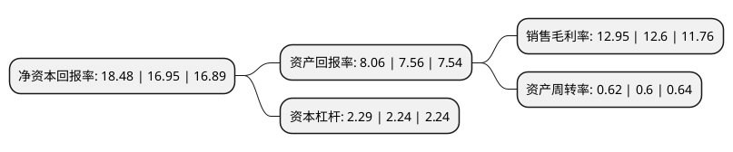

> 本页面由自动化程序生成于 2022年5月20日 01:24
> 内容可能存在错误，如有bug请提交issue至：https://github.com/Eroleice/doc-pi/issues
{.is-warning}

# 上市公司基本情况

## 基本资料

北京同仁堂股份有限公司（以下简称“同仁堂”）成立于1997年06月18日，北京市。于1997年06月25日在上交所主板上市。

同仁堂注册资本137,147.026万元，主要产品:乌鸡白凤丸系列，六味地黄丸系列。以下是详细信息：

- 公司名称: 北京同仁堂股份有限公司
- 股票代码: 600085.SH
- 所在地: 北京 - 北京市
- 成立日期: 1997年06月18日
- 注册资本: 137,147.026万元
- 法定代表人: 邸淑兵
- 主营业务: 主要产品:乌鸡白凤丸系列，六味地黄丸系列
- 公司官网: gf.tongrentang.com
- 公司介绍: 公司是中药行业著名的老字号，是集生产、销售、科研、配送一条龙的产品公司，主要生产剂型有蜜丸、水蜜丸、水丸、硬胶囊、口服液、酒剂、颗粒剂、散剂等。公司拥有经国内外质量认证的22条生产线，是同仁堂对外展示的重要窗口。母公司拥有500余个产品批准文号，常年生产品种200余个，涵盖以原粉制剂为核心的丸剂、散剂、酒剂及胶囊剂、口服液、滴丸剂等28个产品剂型，形成了以安宫牛黄丸、同仁牛黄清心丸、同仁大活络丸为代表的心脑血管系列；以同仁乌鸡白凤丸、坤宝丸为代表的妇科系列，以国公酒、骨刺消痛液为代表的酒剂系列等十二个不同系列品种群。此外，中药抗抑郁症新药巴戟天寡糖胶囊也已正式生产并在部分省市陆续上市。公司产品以其配方独特、选料上乘、工艺精湛、疗效显著而蜚声海内外。

## 股东及高管情况

上市公司第一大股东为中国北京同仁堂(集团)有限责任公司，持股719,308,540股，占比52.45%，为上市公司实际控制人。

截至2022年03月31日，上市公司的前十大股东中，共有1名自然人股东，3名机构股东，6个产品账户，其中5%以上大股东共有1名。上市公司前十大股东明细如下：

> 截至2022年03月31日，上市公司前十大股东信息如下：

| 股东名称 | 持股数量（股） | 持股比例 |
| --- | --- | --- |
| 中国北京同仁堂(集团)有限责任公司 | 719,308,540 | 52.45% |
| 上海高毅资产管理合伙企业(有限合伙)-高毅邻山1号远望基金 | 65,000,000 | 4.74% |
| 中国证券金融股份有限公司 | 41,033,808 | 2.99% |
| 中国工商银行股份有限公司-中欧医疗健康混合型证券投资基金 | 35,654,400 | 2.6% |
| 中国建设银行股份有限公司-银华富裕主题混合型证券投资基金 | 9,774,101 | 0.71% |
| 方圆圆 | 8,078,807 | 0.59% |
| 中国建设银行股份有限公司-汇添富创新医药主题混合型证券投资基金 | 7,224,921 | 0.53% |
| 金东投资集团有限公司 | 7,223,772 | 0.53% |
| 中国建设银行股份有限公司-工银瑞信前沿医疗股票型证券投资基金 | 6,000,000 | 0.44% |
| 上海浦东发展银行股份有限公司-中欧创新未来18个月封闭运作混合型证券投资基金 | 5,570,562 | 0.41% |

## 利润表分析

上市公司2021年总收入为146.03亿元，净利润为18.9亿元，实现盈利。

## 杜邦分析

> 数据列示周期：2021年 | 2020年 | 2019年
{.is-info}

上市公司的净资产收益率在近一年有所上升，上升幅度为9.03%，其变化情况分解如下：
- 上市公司的销售毛利率在近一年上升了2.78%，可能是生产效率的提升、商品原材料价格下跌或商品价格的上涨所致。
- 上市公司的资产周转率在近一年上升了3.33%，可能是源自于更快的销售回款或库存管理效果提升。
- 上市公司的财务杠杆比率在近一年上升了2.23%，可能是增加负债扩大生产规模。

