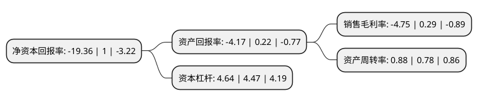

> 本页面由自动化程序生成于 2022年5月20日 01:24
> 内容可能存在错误，如有bug请提交issue至：https://github.com/Eroleice/doc-pi/issues
{.is-warning}

# 上市公司基本情况

## 基本资料

重庆太极实业(集团)股份有限公司（以下简称“太极集团”）成立于1979年11月26日，重庆市。于1997年11月18日在上交所主板上市。

太极集团注册资本55,689.074万元，主要产品:曲美，急支糖浆，补肾益寿胶囊，儿康宁，藿香正气口服液，通天口服液，蕃茄胶囊，盐酸格拉斯琼，紫杉醇，风湿马钱片等。以下是详细信息：

- 公司名称: 重庆太极实业(集团)股份有限公司
- 股票代码: 600129.SH
- 所在地: 重庆 - 重庆市
- 成立日期: 1979年11月26日
- 注册资本: 55,689.074万元
- 法定代表人: 李阳春
- 主营业务: 主要产品:曲美，急支糖浆，补肾益寿胶囊，儿康宁，藿香正气口服液，通天口服液，蕃茄胶囊，盐酸格拉斯琼，紫杉醇，风湿马钱片等
- 公司官网: www.taiji.com
- 公司介绍: 公司主要从事中、西成药的生产和销售，拥有医药工业、医药商业、药材种植等完整的医药产业链，是集“工、商、科、贸”一体的大型医药集团，是目前国内医药产业链最为完整的大型企业集团之一。“太极”(TAIJI)为中国首批驰名商标，OTC品牌药企第一名；“桐君阁”为百年老字号，桐君阁传统丸剂制作技艺已进入国家“非物质文化遗产”保护名录。太极集团中药提取分离纯化创新技术平台成为国内多项先进技术集成应用的典范，为中药新药研究、药品二次开发和产业化提供了技术平台，为国内领先。

## 股东及高管情况

上市公司第一大股东为太极集团有限公司，持股153,812,354股，占比27.62%，**疑似为**上市公司实际控制人。

截至2022年03月31日，上市公司的前十大股东中，共有7名机构股东，2个产品账户，1个海外主体，其中5%以上大股东共有2名。上市公司前十大股东明细如下：

> 未能通过持股比例判定出上市公司实际控制人（持股30%以上）
> 可能存在通过间接持股、联合持股、协议控制等方式拥有实际控制权的主体，具体请参考上市公司定期公告！
{.is-warning}

> 截至2022年03月31日，上市公司前十大股东信息如下：

| 股东名称 | 持股数量（股） | 持股比例 |
| --- | --- | --- |
| 太极集团有限公司 | 153,812,354 | 27.62% |
| 重庆市涪陵国有资产投资经营集团有限公司 | 44,095,337 | 7.92% |
| 重庆市涪陵区希兰生物科技有限公司 | 11,895,294 | 2.14% |
| 太平人寿保险有限公司-分红-个险分红 | 11,000,000 | 1.98% |
| JPMORGAN CHASE BANK,NATIONAL ASSOCIATION | 7,659,718 | 1.38% |
| 太平人寿保险有限公司 | 6,999,901 | 1.26% |
| 中国建设银行股份有限公司-工银瑞信前沿医疗股票型证券投资基金 | 6,000,000 | 1.08% |
| 重庆市涪陵城市建设投资集团有限公司 | 5,856,839 | 1.05% |
| 中国银行股份有限公司-博时医疗保健行业混合型证券投资基金 | 4,795,900 | 0.86% |
| 中国国际金融香港资产管理有限公司-客户资金 | 4,445,156 | 0.8% |

## 利润表分析

上市公司2021年总收入为121.49亿元，净利润为-5.78亿元，**未实现盈利**。

## 杜邦分析

> 数据列示周期：2021年 | 2020年 | 2019年
{.is-info}

上市公司的净资产收益率在近一年有所下降，下降幅度为-2036%，其变化情况分解如下：
- 上市公司的销售毛利率在近一年下降了-1737.93%，可能是生产效率的下降、商品原材料价格上涨或商品价格的下跌所致。
- 上市公司的资产周转率在近一年上升了12.82%，可能是源自于更快的销售回款或库存管理效果提升。
- 上市公司的财务杠杆比率在近一年上升了3.8%，可能是增加负债扩大生产规模。

