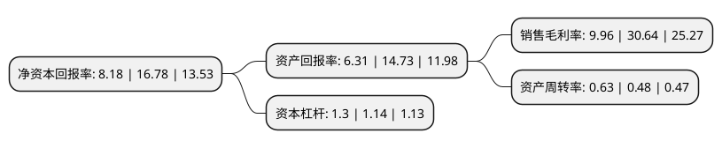

> 本页面由自动化程序生成于 2022年5月20日 01:25
> 内容可能存在错误，如有bug请提交issue至：https://github.com/Eroleice/doc-pi/issues
{.is-warning}

# 上市公司基本情况

## 基本资料

西藏诺迪康药业股份有限公司（以下简称“西藏药业”）成立于1999年07月14日，拉萨市。于1999年07月21日在上交所主板上市。

西藏药业注册资本24,793.784万元，主要产品:诺迪康胶囊，诺迪康颗粒，诺迪康口服液，小儿双清颗粒，藏药产品。以下是详细信息：

- 公司名称: 西藏诺迪康药业股份有限公司
- 股票代码: 600211.SH
- 所在地: 西藏 - 拉萨市
- 成立日期: 1999年07月14日
- 注册资本: 24,793.784万元
- 法定代表人: 陈达彬
- 主营业务: 主要产品:诺迪康胶囊，诺迪康颗粒，诺迪康口服液，小儿双清颗粒，藏药产品
- 公司官网: www.xzyy.cn
- 公司介绍: 公司是西藏雪域高原上诞生的第一家高新技术制药上市企业。公司注巨资于生物制品和传统药品的研发，并构建了林芝种植基地和四个生产基地及覆盖全国的营销网络，产品涵盖生物制品、藏药和中药、化学药的产品系列，奠定了西藏药业持续发展的基础，其中具有自主知识产权的生物制品一类新药新活素，代表着目前国际急性心衰急救治疗药物的最高水平，填补了该领域的国内空白。公司上市以来连续被西藏自治区认定为高新技术企业、西藏自治区农牧业龙头企业。公司图形商标(祥云图)经国家工商总局认定为中国驰名商标，公司产品诺迪康胶囊和十味蒂达胶囊被评为国家中药保护品种，同时，还被国家保密局、科学技术部评为秘密级国家秘密技术。

## 股东及高管情况

上市公司第一大股东为西藏康哲企业管理有限公司，持股80,033,379股，占比32.28%，为上市公司实际控制人。

截至2022年03月31日，上市公司的前十大股东中，共有2名自然人股东，7名机构股东，1个海外主体，其中5%以上大股东共有2名。上市公司前十大股东明细如下：

> 截至2022年03月31日，上市公司前十大股东信息如下：

| 股东名称 | 持股数量（股） | 持股比例 |
| --- | --- | --- |
| 西藏康哲企业管理有限公司 | 80,033,379 | 32.28% |
| 西藏华西药业集团有限公司 | 44,072,000 | 17.78% |
| 北京新凤凰城房地产开发有限公司 | 7,910,000 | 3.19% |
| 深圳市康哲药业有限公司 | 7,708,690 | 3.11% |
| 西藏科技创新投资有限责任公司 | 4,928,000 | 1.99% |
| 天津康哲医药科技发展有限公司 | 4,876,491 | 1.97% |
| 国金证券(香港)有限公司-客户资金(交易所) | 1,853,019 | 0.75% |
| 香港中央结算有限公司(陆股通) | 1,655,893 | 0.67% |
| 李崇众 | 1,451,900 | 0.59% |
| 李志辉 | 1,368,800 | 0.55% |

## 利润表分析

上市公司2021年总收入为21.38亿元，净利润为2.13亿元，实现盈利。

## 杜邦分析

> 数据列示周期：2021年 | 2020年 | 2019年
{.is-info}

上市公司的净资产收益率在近一年有所下降，下降幅度为-51.25%，其变化情况分解如下：
- 上市公司的销售毛利率在近一年下降了-67.49%，可能是生产效率的下降、商品原材料价格上涨或商品价格的下跌所致。
- 上市公司的资产周转率在近一年上升了31.25%，可能是源自于更快的销售回款或库存管理效果提升。
- 上市公司的财务杠杆比率在近一年上升了14.04%，可能是增加负债扩大生产规模。

