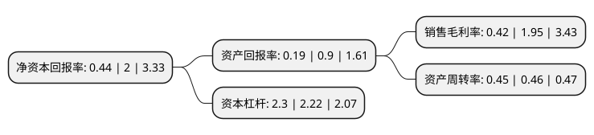

> 本页面由自动化程序生成于 2022年5月20日 01:25
> 内容可能存在错误，如有bug请提交issue至：https://github.com/Eroleice/doc-pi/issues
{.is-warning}

# 上市公司基本情况

## 基本资料

河南太龙药业股份有限公司（以下简称“太龙药业”）成立于1998年08月31日，郑州市。于1999年11月05日在上交所主板上市。

太龙药业注册资本57,388.628万元，主要产品:口服液，输液。以下是详细信息：

- 公司名称: 河南太龙药业股份有限公司
- 股票代码: 600222.SH
- 所在地: 河南 - 郑州市
- 成立日期: 1998年08月31日
- 注册资本: 57,388.628万元
- 法定代表人: 尹辉
- 主营业务: 主要产品:口服液，输液
- 公司官网: www.taloph.com
- 公司介绍: 公司是集生产、经营、科研于一体，以中西药产品为主，生产口服液、片剂、胶囊、原料药等多种剂型共100多种产品的现代化制药企业。主要产品有双黄连系列产品、双金连合剂、哈伯因(石杉碱甲片)、竹林胺(盐酸酚苄明片)等100多个中西药品，双黄连等主要产品均收录在《国家基本药物目录》之内。双黄连系列产品是公司主导产品，该产品具有独特的抗菌、抗病毒疗效。公司在双黄连口服液的基础上，成功开发的具有自主知识产权的独家专利产品——双金连合剂被国家四部委联合评定为“国家重点新产品”。公司是河南省高新技术企业，是经国家科学技术部认证的国家火炬计划重点高新技术企业，国家发改委评为的“国家高技术产业化示范工程”，国家人事部批准的博士后工作站分站。多次被评为“郑州市优秀企业”、“药品规范化管理先进集体”、河南省“实施以品种为单元GMP管理工作先进企业”、“最佳诚信雇主单位”、“国税免检企业”、“A级纳税信用单位”。公司注册商标被认定为“中国驰名商标”、“河南省著名商标”。

## 股东及高管情况

上市公司第一大股东为郑州泰容产业投资有限公司，持股82,441,168股，占比14.37%，**疑似为**上市公司实际控制人。

截至2022年03月31日，上市公司的前十大股东中，共有4名自然人股东，3名机构股东，3个产品账户，其中5%以上大股东共有3名。上市公司前十大股东明细如下：

> 未能通过持股比例判定出上市公司实际控制人（持股30%以上）
> 可能存在通过间接持股、联合持股、协议控制等方式拥有实际控制权的主体，具体请参考上市公司定期公告！
{.is-warning}

> 截至2022年03月31日，上市公司前十大股东信息如下：

| 股东名称 | 持股数量（股） | 持股比例 |
| --- | --- | --- |
| 郑州泰容产业投资有限公司 | 82,441,168 | 14.37% |
| 郑州众生实业集团有限公司 | 50,000,000 | 8.71% |
| 吴澜 | 34,536,496 | 6.02% |
| 潘德仕 | 12,626,382 | 2.2% |
| 潘峻芳 | 12,105,156 | 2.11% |
| 河南太龙药业股份有限公司-第二期员工持股计划 | 9,850,135 | 1.72% |
| 深圳市利百加资本管理有限公司-利百加臻海投资3号私募证券投资基金 | 5,557,500 | 0.97% |
| 上海博霜雪云投资中心(有限合伙) | 3,021,329 | 0.53% |
| 曼林(山东)私募(投资)基金管理有限公司-曼林医药器械私募证券投资基金 | 2,957,500 | 0.52% |
| 刘亚光 | 2,942,300 | 0.51% |

## 利润表分析

上市公司2021年总收入为16.04亿元，净利润为0.06亿元，实现盈利。

## 杜邦分析

> 数据列示周期：2021年 | 2020年 | 2019年
{.is-info}

上市公司的净资产收益率在近一年有所下降，下降幅度为-78%，其变化情况分解如下：
- 上市公司的销售毛利率在近一年下降了-78.46%，可能是生产效率的下降、商品原材料价格上涨或商品价格的下跌所致。
- 上市公司的资产周转率在近一年下降了-2.17%，可能是源自于更慢的销售回款或库存管理效果下降。
- 上市公司的财务杠杆比率在近一年上升了3.6%，可能是增加负债扩大生产规模。

