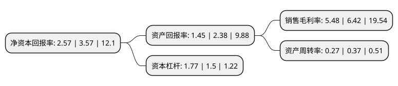

> 本页面由自动化程序生成于 2022年5月20日 01:25
> 内容可能存在错误，如有bug请提交issue至：https://github.com/Eroleice/doc-pi/issues
{.is-warning}

# 上市公司基本情况

## 基本资料

广西梧州中恒集团股份有限公司（以下简称“中恒集团”）成立于1993年07月28日，梧州市。于2000年11月30日在上交所主板上市。

中恒集团注册资本347,510.715万元，主营业务;医药制造，食品生产，房地产开发以下是详细信息：

- 公司名称: 广西梧州中恒集团股份有限公司
- 股票代码: 600252.SH
- 所在地: 广西 - 梧州市
- 成立日期: 1993年07月28日
- 注册资本: 347,510.715万元
- 法定代表人: 莫宏胜
- 主营业务: 主营业务;医药制造，食品生产，房地产开发
- 公司官网: www.wz-zhongheng.com
- 公司介绍: 公司是以制药为核心业务，同时拥有健康食品等延伸板块的公司，主要经营业务可分为医药制造、食品生产、房地产开发三大板块。中恒集团旗下的广西梧州制药(集团)股份有限公司，经过近90年发展，已发展成为一家集研发、生产、销售、服务于一体的现代化综合型高新技术制药企业，为广西龙头药品生产企业、华南区大型中药注射剂生产企业。中恒集团旗下的广西梧州双钱实业有限公司专业从事龟苓膏、龟苓宝、罐装食品、即食粥类、饮料和固体食品饮料，是集研发、生产和销售于一体龟苓膏现代化生产企业，是广西高新技术企业、“中华老字号”企业。

## 股东及高管情况

上市公司第一大股东为广西投资集团有限公司，持股963,596,802股，占比27.73%，**疑似为**上市公司实际控制人。

截至2022年03月31日，上市公司的前十大股东中，共有2名自然人股东，4名机构股东，3个产品账户，1个海外主体，其中5%以上大股东共有1名。上市公司前十大股东明细如下：

> 未能通过持股比例判定出上市公司实际控制人（持股30%以上）
> 可能存在通过间接持股、联合持股、协议控制等方式拥有实际控制权的主体，具体请参考上市公司定期公告！
{.is-warning}

> 截至2022年03月31日，上市公司前十大股东信息如下：

| 股东名称 | 持股数量（股） | 持股比例 |
| --- | --- | --- |
| 广西投资集团有限公司 | 963,596,802 | 27.73% |
| 广西中恒实业有限公司 | 69,409,162 | 2% |
| 中央汇金资产管理有限责任公司 | 49,780,800 | 1.43% |
| 香港中央结算有限公司(陆股通) | 43,483,124 | 1.25% |
| 钟振鑫 | 30,881,600 | 0.89% |
| 大成基金-农业银行-大成中证金融资产管理计划 | 25,335,000 | 0.73% |
| 南方基金-农业银行-南方中证金融资产管理计划 | 25,335,000 | 0.73% |
| 中国建设银行股份有限公司-汇添富中证中药指数型发起式证券投资基金(LOF) | 12,429,600 | 0.36% |
| 陆晓民 | 11,500,000 | 0.33% |
| 深圳市合生堂生物工程有限公司 | 11,279,523 | 0.32% |

## 利润表分析

上市公司2021年总收入为31.61亿元，净利润为1.73亿元，实现盈利。

## 杜邦分析

> 数据列示周期：2021年 | 2020年 | 2019年
{.is-info}

上市公司的净资产收益率在近一年有所下降，下降幅度为-28.01%，其变化情况分解如下：
- 上市公司的销售毛利率在近一年下降了-14.64%，可能是生产效率的下降、商品原材料价格上涨或商品价格的下跌所致。
- 上市公司的资产周转率在近一年下降了-27.03%，可能是源自于更慢的销售回款或库存管理效果下降。
- 上市公司的财务杠杆比率在近一年上升了18%，可能是增加负债扩大生产规模。

