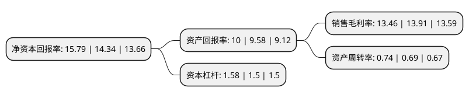

> 本页面由自动化程序生成于 2022年5月20日 01:25
> 内容可能存在错误，如有bug请提交issue至：https://github.com/Eroleice/doc-pi/issues
{.is-warning}

# 上市公司基本情况

## 基本资料

河南羚锐制药股份有限公司（以下简称“羚锐制药”）成立于1999年04月18日，信阳市。于2000年10月18日在上交所主板上市。

羚锐制药注册资本56,745.899万元，主要业务:中药橡胶膏剂，颗粒剂，酊剂，片剂，胶囊剂的生产和销售。以下是详细信息：

- 公司名称: 河南羚锐制药股份有限公司
- 股票代码: 600285.SH
- 所在地: 河南 - 信阳市
- 成立日期: 1999年04月18日
- 注册资本: 56,745.899万元
- 法定代表人: 熊伟
- 主营业务: 中药橡胶膏剂，颗粒剂，酊剂，片剂，胶囊剂的生产和销售
- 公司官网: www.lingrui.com
- 公司介绍: 公司是一家以药品生产经营为主业的国家火炬计划重点高新技术企业，也是全国橡胶膏剂药业中的首家上市企业，拥有橡胶膏剂、片剂、胶囊剂、注射剂等十余种剂型百余种产品，其中包括通络祛痛膏(骨质增生一贴灵)、培元通脑胶囊、丹鹿通督片、胃疼宁片、参芪降糖胶囊等独家拥有知识产权的产品及国家中药保护品种和国家医保药品。公司的所有产品剂型及其生产车间均通过国家GMP认证，质量标准实现了与国际接轨。公司先后被评为“全国中药50强企业”和“河南省十一五重点扶持成长型高新技术企业”，“羚锐”商标被国家工商行政管理总局认定为“中国驰名商标”，成为国内橡胶膏剂药业中首件驰名商标。

## 股东及高管情况

上市公司第一大股东为河南羚锐集团有限公司，持股121,817,898股，占比21.47%，**疑似为**上市公司实际控制人。

截至2022年03月31日，上市公司的前十大股东中，共有4名机构股东，5个产品账户，1个海外主体，其中5%以上大股东共有1名。上市公司前十大股东明细如下：

> 未能通过持股比例判定出上市公司实际控制人（持股30%以上）
> 可能存在通过间接持股、联合持股、协议控制等方式拥有实际控制权的主体，具体请参考上市公司定期公告！
{.is-warning}

> 截至2022年03月31日，上市公司前十大股东信息如下：

| 股东名称 | 持股数量（股） | 持股比例 |
| --- | --- | --- |
| 河南羚锐集团有限公司 | 121,817,898 | 21.47% |
| 上海高毅资产管理合伙企业(有限合伙)-高毅邻山1号远望基金 | 27,000,000 | 4.76% |
| 中国工商银行股份有限公司-广发稳健回报混合型证券投资基金 | 14,586,344 | 2.57% |
| 中国工商银行-广发稳健增长证券投资基金 | 12,000,000 | 2.11% |
| 香港中央结算有限公司(陆股通) | 11,984,007 | 2.11% |
| 信阳新锐投资发展有限公司 | 10,867,500 | 1.92% |
| 太平人寿保险有限公司 | 9,499,909 | 1.67% |
| 基本养老保险基金八零五组合 | 8,600,000 | 1.52% |
| 新县鑫源贸易有限公司 | 7,538,315 | 1.33% |
| 平安银行股份有限公司-前海开源中药研究精选股票型发起式证券投资基金 | 6,651,124 | 1.17% |

## 利润表分析

上市公司2021年总收入为26.93亿元，净利润为3.62亿元，实现盈利。

## 杜邦分析

> 数据列示周期：2021年 | 2020年 | 2019年
{.is-info}

上市公司的净资产收益率在近一年有所上升，上升幅度为10.11%，其变化情况分解如下：
- 上市公司的销售毛利率在近一年下降了-3.24%，可能是生产效率的下降、商品原材料价格上涨或商品价格的下跌所致。
- 上市公司的资产周转率在近一年上升了7.25%，可能是源自于更快的销售回款或库存管理效果提升。
- 上市公司的财务杠杆比率在近一年上升了5.33%，可能是增加负债扩大生产规模。

