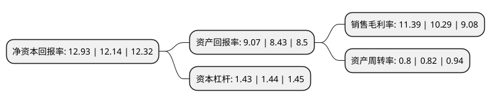

> 本页面由自动化程序生成于 2022年5月20日 01:25
> 内容可能存在错误，如有bug请提交issue至：https://github.com/Eroleice/doc-pi/issues
{.is-warning}

# 上市公司基本情况

## 基本资料

天津中新药业集团股份有限公司（以下简称“中新药业”）成立于1981年12月29日，天津市。于2001年06月06日在上交所主板上市。

中新药业注册资本77,344.308万元，主要产品:速效救心丸，牛黄降压丸，藿香正气软胶囊，更年安，银翘解毒片，金芪降糖片，紫龙金片，痹祺胶囊，血府逐瘀胶囊，安福隆干扰素，格列齐特，法洛西，特子社复等。以下是详细信息：

- 公司名称: 天津中新药业集团股份有限公司
- 股票代码: 600329.SH
- 所在地: 天津 - 天津市
- 成立日期: 1981年12月29日
- 注册资本: 77,344.308万元
- 法定代表人: 张铭芮
- 主营业务: 主要产品:速效救心丸，牛黄降压丸，藿香正气软胶囊，更年安，银翘解毒片，金芪降糖片，紫龙金片，痹祺胶囊，血府逐瘀胶囊，安福隆干扰素，格列齐特，法洛西，特子社复等
- 公司官网: www.zhongxinp.com
- 公司介绍: 公司主要从事药品的开发，生产和销售。公司主要产品包括中成药，西药，中药材，药品原料及制剂，生物医药，膳食补充剂等产品。公司的主要产品包括用于治疗心血管疾病和胃肠炎的药物，呼吸药物，以及抗肿瘤药物等。它将产品分销到国内市场和海外市场。公司通过实施大品种战略，业已形成以速效救心丸和通脉养心丸等为代表的心脑血管用药，以清肺消炎丸和清咽滴丸等为代表的呼吸系统用药，以胃肠安丸和藿香正气软胶囊等为代表的胃肠用药，以紫龙金片和生血丸等为代表的抗肿瘤中药等系列大产品群，保障了公司持续、稳定、健康地发展。

## 股东及高管情况

上市公司第一大股东为天津市医药集团有限公司，持股331,120,528股，占比42.811%，为上市公司实际控制人。

截至2022年03月31日，上市公司的前十大股东中，共有1名自然人股东，1名机构股东，8个海外主体，其中5%以上大股东共有1名。上市公司前十大股东明细如下：

> 截至2022年03月31日，上市公司前十大股东信息如下：

| 股东名称 | 持股数量（股） | 持股比例 |
| --- | --- | --- |
| 天津市医药集团有限公司 | 331,120,528 | 42.811% |
| ABN AMRO CLEARING BANK N.V. | 30,546,000 | 3.949% |
| PHILLIP SECURITIES PTE LTD | 26,020,105 | 3.364% |
| DBS NOMINEES PTE LTD | 20,340,940 | 2.63% |
| RAFFLES NOMINEES(PTE) LIMITED | 19,288,628 | 2.494% |
| CITIBANK NOMS SPORE PTE LTD | 15,527,345 | 2.008% |
| 冯志浩 | 15,000,000 | 1.939% |
| 香港中央结算有限公司(陆股通) | 12,814,712 | 1.657% |
| MORGAN STANLEY ASIA (S) SEC PTE LTD | 5,169,200 | 0.668% |
| LU ZU LIANG | 4,610,000 | 0.596% |

## 利润表分析

上市公司2021年总收入为69.07亿元，净利润为7.86亿元，实现盈利。

## 杜邦分析

> 数据列示周期：2021年 | 2020年 | 2019年
{.is-info}

上市公司的净资产收益率在近一年有所上升，上升幅度为6.51%，其变化情况分解如下：
- 上市公司的销售毛利率在近一年上升了10.69%，可能是生产效率的提升、商品原材料价格下跌或商品价格的上涨所致。
- 上市公司的资产周转率在近一年下降了-2.44%，可能是源自于更慢的销售回款或库存管理效果下降。
- 上市公司的财务杠杆比率在近一年下降了-0.69%，可能是减少负债降低财务费用。

