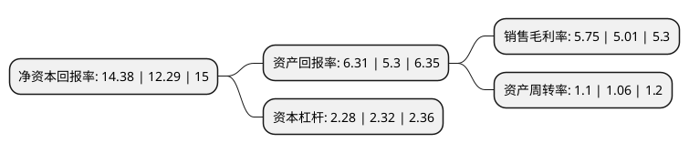

> 本页面由自动化程序生成于 2022年5月20日 01:25
> 内容可能存在错误，如有bug请提交issue至：https://github.com/Eroleice/doc-pi/issues
{.is-warning}

# 上市公司基本情况

## 基本资料

广州白云山医药集团股份有限公司（以下简称“白云山”）成立于1997年09月01日，广州市。于2001年02月06日在上交所主板上市。

白云山注册资本162,579.095万元，主要产品为消渴丸，夏桑菊，乌鸡白凤丸，华佗再造丸，蜜炼川贝枇杷膏，清开灵口服液，小柴胡冲剂等，西药制造企业主要产品为头孢硫脒，阿莫西林等化学制剂药，头孢曲松钠等化学原料药，预包装食品制造企业主要产品为王老吉凉茶等。以下是详细信息：

- 公司名称: 广州白云山医药集团股份有限公司
- 股票代码: 600332.SH
- 所在地: 广东 - 广州市
- 成立日期: 1997年09月01日
- 注册资本: 162,579.095万元
- 法定代表人: 李楚源
- 主营业务: 主要产品为消渴丸，夏桑菊，乌鸡白凤丸，华佗再造丸，蜜炼川贝枇杷膏，清开灵口服液，小柴胡冲剂等，西药制造企业主要产品为头孢硫脒，阿莫西林等化学制剂药，头孢曲松钠等化学原料药，预包装食品制造企业主要产品为王老吉凉茶等
- 公司官网: www.gybys.com.cn
- 公司介绍: 公司是一家大型控股型企业，一直专注于医药健康产业，经过多年的发展，规模与效益持续扩大。目前，本集团主要从事：(1)中西成药、化学原料药、天然药物、生物医药、化学原料药中间体的研究开发、制造与销售；(2)西药、中药和医疗器械的批发、零售和进出口业务；(3)大健康产品的研发、生产与销售；及(4)医疗服务、健康管理、养生养老等健康产业投资等。经过多年的发展，本集团实现了全产业链覆盖；在抗菌消炎、糖尿病、心脑血管、消化系统、清热解毒、男科、儿童用药等领域形成了相对完善的产品布局，在中药、化学原料药、化学药制剂等细分领域市场占有重要地位。2012年，本公司成立王老吉大健康公司，以“王老吉”品牌引领大健康产业，主要产品王老吉凉茶在中国凉茶市场上已占据领先地位。

## 股东及高管情况

上市公司第一大股东为广州医药集团有限公司，持股732,305,103股，占比45.04%，为上市公司实际控制人。

截至2022年03月31日，上市公司的前十大股东中，共有4名机构股东，4个产品账户，2个海外主体，其中5%以上大股东共有2名。上市公司前十大股东明细如下：

> 截至2022年03月31日，上市公司前十大股东信息如下：

| 股东名称 | 持股数量（股） | 持股比例 |
| --- | --- | --- |
| 广州医药集团有限公司 | 732,305,103 | 45.04% |
| 香港中央结算(代理人)有限公司 | 219,769,290 | 13.52% |
| 广州国寿城市发展产业投资企业(有限合伙) | 73,313,783 | 4.51% |
| 广州产业投资控股集团有限公司 | 55,548,800 | 3.42% |
| 香港中央结算有限公司(陆股通) | 47,788,367 | 2.94% |
| 中国证券金融股份有限公司 | 47,277,962 | 2.91% |
| 华夏基金-农业银行-华夏中证金融资产管理计划 | 8,795,136 | 0.54% |
| 中欧基金-农业银行-中欧中证金融资产管理计划 | 8,680,636 | 0.53% |
| 博时基金-农业银行-博时中证金融资产管理计划 | 8,662,836 | 0.53% |
| 大成基金-农业银行-大成中证金融资产管理计划 | 8,657,836 | 0.53% |

## 利润表分析

上市公司2021年总收入为690.14亿元，净利润为39.68亿元，实现盈利。

## 杜邦分析

> 数据列示周期：2021年 | 2020年 | 2019年
{.is-info}

上市公司的净资产收益率在近一年有所上升，上升幅度为17.01%，其变化情况分解如下：
- 上市公司的销售毛利率在近一年上升了14.77%，可能是生产效率的提升、商品原材料价格下跌或商品价格的上涨所致。
- 上市公司的资产周转率在近一年上升了3.77%，可能是源自于更快的销售回款或库存管理效果提升。
- 上市公司的财务杠杆比率在近一年下降了-1.72%，可能是减少负债降低财务费用。

