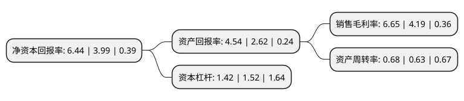

> 本页面由自动化程序生成于 2022年5月20日 01:26
> 内容可能存在错误，如有bug请提交issue至：https://github.com/Eroleice/doc-pi/issues
{.is-warning}

# 上市公司基本情况

## 基本资料

亚宝药业集团股份有限公司（以下简称“亚宝药业”）成立于1999年01月26日，运城市。于2002年09月26日在上交所主板上市。

亚宝药业注册资本77,000.002万元，主要产品:丁桂儿脐贴，曲克芦丁片。以下是详细信息：

- 公司名称: 亚宝药业集团股份有限公司
- 股票代码: 600351.SH
- 所在地: 山西 - 运城市
- 成立日期: 1999年01月26日
- 注册资本: 77,000.002万元
- 法定代表人: 任武贤
- 主营业务: 主要产品:丁桂儿脐贴，曲克芦丁片
- 公司官网: www.yabao.com.cn
- 公司介绍: 公司是一个集药品生产、研发、物流、贸易于一体的企业集团，是山西省医药行业首家股票上市公司和首批认定的高新技术企业。公司以中药现代化生产为主体，生物药和化学药为两翼，医用卫生材料和包装材料为辅助，主要生产中西药制剂、原料药等，形成了治疗心脑血管病用药、妇女用药、儿童用药和抗癌用药的强势品牌。公司是高新技术企业，是工信部认定的“中国医药工业百强企业”。创新力居20强，是“中国医药研发产品线最佳工业企业”。“亚宝”商标为中国驰名商标。

## 股东及高管情况

上市公司第一大股东为山西亚宝投资集团有限公司，持股94,300,000股，占比12.25%，**疑似为**上市公司实际控制人。

截至2022年03月31日，上市公司的前十大股东中，共有4名自然人股东，3名机构股东，3个产品账户，其中5%以上大股东共有1名。上市公司前十大股东明细如下：

> 未能通过持股比例判定出上市公司实际控制人（持股30%以上）
> 可能存在通过间接持股、联合持股、协议控制等方式拥有实际控制权的主体，具体请参考上市公司定期公告！
{.is-warning}

> 截至2022年03月31日，上市公司前十大股东信息如下：

| 股东名称 | 持股数量（股） | 持股比例 |
| --- | --- | --- |
| 山西亚宝投资集团有限公司 | 94,300,000 | 12.25% |
| 广东晋亚纾困股权投资合伙企业(有限合伙) | 30,800,000 | 4% |
| 华远陆港资本运营有限公司 | 25,891,756 | 3.36% |
| 宁波梅山保税港区凌顶投资管理有限公司-凌顶十七号私募证券投资基金 | 12,853,100 | 1.67% |
| 宁波梅山保税港区凌顶投资管理有限公司-凌顶守拙七号私募证券投资基金 | 9,843,100 | 1.28% |
| 大同中药厂 | 6,220,000 | 0.81% |
| 王敏奎 | 6,002,041 | 0.78% |
| 曹金秋 | 4,260,900 | 0.55% |
| 杨力 | 4,144,200 | 0.54% |
| 山西省科技基金发展有限公司 | 4,000,000 | 0.52% |

## 利润表分析

上市公司2021年总收入为27.63亿元，净利润为1.83亿元，实现盈利。

## 杜邦分析

> 数据列示周期：2021年 | 2020年 | 2019年
{.is-info}

上市公司的净资产收益率在近一年有所上升，上升幅度为61.4%，其变化情况分解如下：
- 上市公司的销售毛利率在近一年上升了58.71%，可能是生产效率的提升、商品原材料价格下跌或商品价格的上涨所致。
- 上市公司的资产周转率在近一年上升了7.94%，可能是源自于更快的销售回款或库存管理效果提升。
- 上市公司的财务杠杆比率在近一年下降了-6.58%，可能是减少负债降低财务费用。

