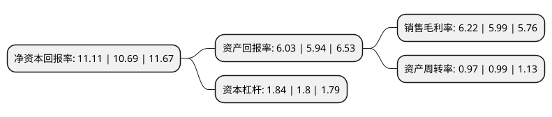

> 本页面由自动化程序生成于 2022年5月20日 01:26
> 内容可能存在错误，如有bug请提交issue至：https://github.com/Eroleice/doc-pi/issues
{.is-warning}

# 上市公司基本情况

## 基本资料

昆药集团股份有限公司（以下简称“昆药集团”）成立于1995年12月14日，昆明市。于2000年12月06日在上交所主板上市。

昆药集团注册资本75,825.577万元，主要产品有蒿甲醚系列，三七系列，天麻素系列等。主营业务为中西药生产，销售等以下是详细信息：

- 公司名称: 昆药集团股份有限公司
- 股票代码: 600422.SH
- 所在地: 云南 - 昆明市
- 成立日期: 1995年12月14日
- 注册资本: 75,825.577万元
- 法定代表人: 钟祥刚
- 主营业务: 主要产品有蒿甲醚系列，三七系列，天麻素系列等主营业务为中西药生产，销售等
- 公司官网: www.kpc.com.cn
- 公司介绍: 公司拥有深厚的专业制药经验，是国家重点高新技术企业、中国医药工业百强企业。部分自有品牌享誉国内外。公司集药物研发、生产、销售、商业批发和国际营销为一体，形成了以自主天然植物药为主，涵盖中药、化学药和医药流通领域的业务格局。落地昆明高新区国家生物产业基地的“昆药生物医药科技园”，建成后将成为世界领先、国内一流的规模化、专业化、国际化生物医药园区。公司先后开发了青蒿系列、三七系列、天麻系列及特色中药、特色民族药等40多个具有国内外先进水平的天然植物药新产品，拥有多项国家发明专利，填补了多项国内外空白，在心脑血管、神经系统、疟疾等疾病治疗领域拥有较高的知名度与美誉度，为人类的健康事业做出了积极、重大的贡献。

## 股东及高管情况

上市公司第一大股东为华立医药集团有限公司，持股234,928,716股，占比30.98%，为上市公司实际控制人。

截至2022年03月31日，上市公司的前十大股东中，共有2名自然人股东，3名机构股东，4个产品账户，1个海外主体，其中5%以上大股东共有2名。上市公司前十大股东明细如下：

> 截至2022年03月31日，上市公司前十大股东信息如下：

| 股东名称 | 持股数量（股） | 持股比例 |
| --- | --- | --- |
| 华立医药集团有限公司 | 234,928,716 | 30.98% |
| 云南合和(集团)股份有限公司 | 59,982,730 | 7.91% |
| 中国建设银行股份有限公司-工银瑞信前沿医疗股票型证券投资基金 | 23,000,032 | 3.03% |
| 陈世辉 | 14,040,338 | 1.85% |
| 中央汇金资产管理有限责任公司 | 11,814,900 | 1.56% |
| 中国银行股份有限公司-易方达医疗保健行业混合型证券投资基金 | 5,332,800 | 0.7% |
| 香港中央结算有限公司(陆股通) | 5,065,221 | 0.67% |
| 中国银行股份有限公司-工银瑞信医疗保健行业股票型证券投资基金 | 4,000,000 | 0.53% |
| 中国工商银行股份有限公司-光大保德信健康优加混合型证券投资基金 | 3,706,200 | 0.49% |
| 杨克峰 | 3,687,597 | 0.49% |

## 利润表分析

上市公司2021年总收入为82.53亿元，净利润为5.13亿元，实现盈利。

## 杜邦分析

> 数据列示周期：2021年 | 2020年 | 2019年
{.is-info}

上市公司的净资产收益率在近一年有所上升，上升幅度为3.93%，其变化情况分解如下：
- 上市公司的销售毛利率在近一年上升了3.84%，可能是生产效率的提升、商品原材料价格下跌或商品价格的上涨所致。
- 上市公司的资产周转率在近一年下降了-2.02%，可能是源自于更慢的销售回款或库存管理效果下降。
- 上市公司的财务杠杆比率在近一年上升了2.22%，可能是增加负债扩大生产规模。

