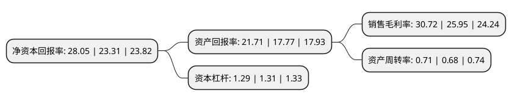

> 本页面由自动化程序生成于 2022年5月20日 01:26
> 内容可能存在错误，如有bug请提交issue至：https://github.com/Eroleice/doc-pi/issues
{.is-warning}

# 上市公司基本情况

## 基本资料

漳州片仔癀药业股份有限公司（以下简称“片仔癀”）成立于1999年12月28日，漳州市。于2003年06月16日在上交所主板上市。

片仔癀注册资本60,331.721万元，主要产品为片仔癀及其系列产品。以下是详细信息：

- 公司名称: 漳州片仔癀药业股份有限公司
- 股票代码: 600436.SH
- 所在地: 福建 - 漳州市
- 成立日期: 1999年12月28日
- 注册资本: 60,331.721万元
- 法定代表人: 林纬奇
- 主营业务: 主要产品为片仔癀及其系列产品
- 公司官网: www.zzpzh.com
- 公司介绍: 公司于1999年12月由原漳州制药厂改制创立，是国家高新技术企业、中华老字号企业。生产设备达到世界先进水平，并已通过国家药品GMP认证。公司主要业务包括中成药制造、医药流通。其中，核心产品为片仔癀系列，包括片仔癀、片仔癀胶囊、复方片仔癀含片、复方片仔癀软膏、复方片仔癀痔疮膏等片仔癀系列产品。除药品销售之外，公司积极打造健康、保健、养生食品的健康产业，产品延伸至保健品、保健食品、特色功效化妆品和日化产品。独家生产的国家一级中药保护品种——片仔癀，被誉为“国宝神药”、传统制作技艺被列入国家非遗名录，并被列入国家一级中药保护品种，被评为中国中药名牌产品。近年来，公司积极构建以传统中药、生物制药为核心，以保健药品、保健食品，功能饮料和特色功效化妆品、日化产品为两翼，以药品流通为补充的“一核两翼”大健康产业发展战略。致力把片仔癀打造成国内一流的健康养生品牌。

## 股东及高管情况

上市公司第一大股东为漳州市九龙江集团有限公司，持股329,022,643股，占比54.54%，为上市公司实际控制人。

截至2022年04月16日，上市公司的前十大股东中，共有1名自然人股东，6名机构股东，2个产品账户，1个海外主体，其中5%以上大股东共有2名。上市公司前十大股东明细如下：

> 截至2022年04月16日，上市公司前十大股东信息如下：

| 股东名称 | 持股数量（股） | 持股比例 |
| --- | --- | --- |
| 漳州市九龙江集团有限公司 | 329,022,643 | 54.54% |
| 漳州市九龙江集团有限公司 | 329,022,643 | 54.54% |
| 王富济 | 27,037,500 | 4.48% |
| 香港中央结算有限公司(陆股通) | 19,342,221 | 3.21% |
| 中国工商银行股份有限公司-中欧医疗健康混合型证券投资基金 | 7,965,504 | 1.32% |
| 福建漳龙集团有限公司 | 4,800,000 | 0.8% |
| 福建漳州城投集团有限公司 | 4,800,000 | 0.8% |
| 漳州市交通发展集团有限公司 | 4,800,000 | 0.8% |
| 中国建设银行股份有限公司-银华富裕主题混合型证券投资基金 | 4,311,725 | 0.71% |
| 漳州市国有资产投资经营有限公司 | 3,017,812 | 0.5% |

## 利润表分析

上市公司2021年总收入为80.21亿元，净利润为24.64亿元，实现盈利。

## 杜邦分析

> 数据列示周期：2021年 | 2020年 | 2019年
{.is-info}

上市公司的净资产收益率在近一年有所上升，上升幅度为20.33%，其变化情况分解如下：
- 上市公司的销售毛利率在近一年上升了18.38%，可能是生产效率的提升、商品原材料价格下跌或商品价格的上涨所致。
- 上市公司的资产周转率在近一年上升了4.41%，可能是源自于更快的销售回款或库存管理效果提升。
- 上市公司的财务杠杆比率在近一年下降了-1.53%，可能是减少负债降低财务费用。

