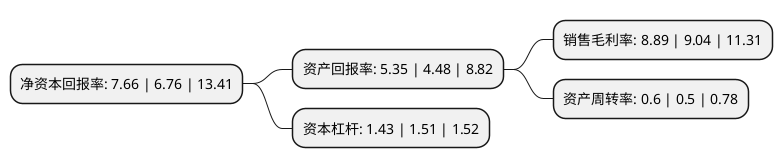

> 本页面由自动化程序生成于 2022年5月20日 01:27
> 内容可能存在错误，如有bug请提交issue至：https://github.com/Eroleice/doc-pi/issues
{.is-warning}

# 上市公司基本情况

## 基本资料

江苏康缘药业股份有限公司（以下简称“康缘药业”）成立于1996年05月08日，连云港市。于2002年09月18日在上交所主板上市。

康缘药业注册资本59,288.104万元，胶囊，口服液，冲剂片，丸剂。以下是详细信息：

- 公司名称: 江苏康缘药业股份有限公司
- 股票代码: 600557.SH
- 所在地: 江苏 - 连云港市
- 成立日期: 1996年05月08日
- 注册资本: 59,288.104万元
- 法定代表人: 肖伟
- 主营业务: 胶囊，口服液，冲剂片，丸剂
- 公司官网: www.kanion.com
- 公司介绍: 公司是一家集中药研发、生产、贸易为一体的大型中药企业。公司目前主要产品线聚焦呼吸系统疾病、妇科疾病、心脑血管疾病、骨伤科疾病等中医优势领域，呼吸系统产品线的代表品种有热毒宁注射液、金振口服液等；妇科产品线的代表品种有桂枝茯苓胶囊、散结镇痛胶囊等；心脑血管产品线的代表品种有银杏二萜内酯葡胺注射液、天舒胶囊等；骨科产品线的代表品种有腰痹通胶囊、复方南星止痛膏等；同时还拥有主治小儿多发性抽动症的九味熄风颗粒等儿科产品线品种。公司是国家中药现代化示范企业、国家重点高新技术企业、国内A股上市公司、国家创新型企业，全国制药工业百强企业,获国家“质量管理先进企业”，“守合同重信用企业”等荣誉称号，“康缘”商标为国家驰名商标。

## 股东及高管情况

上市公司第一大股东为江苏康缘集团有限责任公司，持股176,173,467股，占比30.56%，为上市公司实际控制人。

截至2022年03月31日，上市公司的前十大股东中，共有1名自然人股东，3名机构股东，6个产品账户，其中5%以上大股东共有2名。上市公司前十大股东明细如下：

> 截至2022年03月31日，上市公司前十大股东信息如下：

| 股东名称 | 持股数量（股） | 持股比例 |
| --- | --- | --- |
| 江苏康缘集团有限责任公司 | 176,173,467 | 30.56% |
| 连云港康贝尔医疗器械有限公司 | 31,870,567 | 5.53% |
| 中央汇金资产管理有限责任公司 | 17,886,480 | 3.1% |
| 肖伟 | 17,003,232 | 2.95% |
| 上海银叶投资有限公司-银叶攻玉10号私募证券投资基金 | 11,945,196 | 2.07% |
| 交通银行股份有限公司-创金合信数字经济主题股票型发起式证券投资基金 | 5,967,422 | 1.04% |
| 易方达基金-农业银行-易方达中证金融资产管理计划 | 5,439,480 | 0.94% |
| 博时基金-农业银行-博时中证金融资产管理计划 | 5,439,480 | 0.94% |
| 大成基金-农业银行-大成中证金融资产管理计划 | 5,439,480 | 0.94% |
| 中欧基金-农业银行-中欧中证金融资产管理计划 | 5,439,480 | 0.94% |

## 利润表分析

上市公司2021年总收入为36.48亿元，净利润为3.24亿元，实现盈利。

## 杜邦分析

> 数据列示周期：2021年 | 2020年 | 2019年
{.is-info}

上市公司的净资产收益率在近一年有所上升，上升幅度为13.31%，其变化情况分解如下：
- 上市公司的销售毛利率在近一年下降了-1.66%，可能是生产效率的下降、商品原材料价格上涨或商品价格的下跌所致。
- 上市公司的资产周转率在近一年上升了20%，可能是源自于更快的销售回款或库存管理效果提升。
- 上市公司的财务杠杆比率在近一年下降了-5.3%，可能是减少负债降低财务费用。

