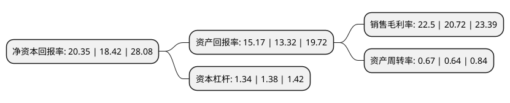

> 本页面由自动化程序生成于 2022年5月20日 01:27
> 内容可能存在错误，如有bug请提交issue至：https://github.com/Eroleice/doc-pi/issues
{.is-warning}

# 上市公司基本情况

## 基本资料

湖北济川药业股份有限公司（以下简称“济川药业”）成立于1997年01月22日，荆州市。于2001年08月22日在上交所主板上市。

济川药业注册资本88,827.302万元，主营业务;药品的研发，生产和销售以下是详细信息：

- 公司名称: 湖北济川药业股份有限公司
- 股票代码: 600566.SH
- 所在地: 湖北 - 荆州市
- 成立日期: 1997年01月22日
- 注册资本: 88,827.302万元
- 法定代表人: 曹龙祥
- 主营业务: 主营业务;药品的研发，生产和销售
- 公司官网: www.jumpcan.com
- 公司介绍: 公司是集中西医药、中药日化、中药保健产品研发、生产制造、商贸流通为一体的国家级高新技术企业集团，国家火炬计划医药产业骨干企业，全国制药工业百强企业，公司秉承“用科技捍卫健康”的企业使命，倡导“引领前沿、创新精品”的研发理念，专注于“儿科、妇科、呼吸科、消化科及老年病”等优势领域药品的研发、生产和销售，不断拓展中药日化和中药保健品产业。“寿牌”和“同笑”商标为江苏省著名商标，“寿牌”商标为“中国驰名商标”；蒲地蓝消炎口服液获得“第十四届国家专利优秀奖”、“品质智胜奖”，一种治疗外感发热的药物组合物及其制备方法(同贝)荣获第十七届中国专利优秀奖。以“蒲地蓝可炎宁牙膏”领衔的中药药妆产品、以“五仙草”为主的中药保健产品，将不断增强企业市场核心竞争力，推进大健康事业迅猛发展。

## 股东及高管情况

上市公司第一大股东为江苏济川控股集团有限公司，持股416,757,360股，占比46.92%，为上市公司实际控制人。

截至2022年03月31日，上市公司的前十大股东中，共有3名自然人股东，3名机构股东，3个产品账户，1个海外主体，其中5%以上大股东共有3名。上市公司前十大股东明细如下：

> 截至2022年03月31日，上市公司前十大股东信息如下：

| 股东名称 | 持股数量（股） | 持股比例 |
| --- | --- | --- |
| 江苏济川控股集团有限公司 | 416,757,360 | 46.92% |
| 西藏济川创业投资管理有限公司 | 100,000,000 | 11.26% |
| 曹龙祥 | 46,838,458 | 5.27% |
| 荆州市古城国有投资有限责任公司 | 11,104,902 | 1.25% |
| 香港中央结算有限公司(陆股通) | 10,561,525 | 1.19% |
| 江苏疌泉毅达融京股权并购投资基金(有限合伙) | 6,804,814 | 0.77% |
| 葛红玉 | 6,431,324 | 0.72% |
| 华泰证券股份有限公司-中庚价值领航混合型证券投资基金 | 4,887,400 | 0.55% |
| 中国银行股份有限公司-广发医疗保健股票型证券投资基金 | 4,553,200 | 0.51% |
| 刘步松 | 4,222,883 | 0.48% |

## 利润表分析

上市公司2021年总收入为76.3亿元，净利润为17.17亿元，实现盈利。

## 杜邦分析

> 数据列示周期：2021年 | 2020年 | 2019年
{.is-info}

上市公司的净资产收益率在近一年有所上升，上升幅度为10.48%，其变化情况分解如下：
- 上市公司的销售毛利率在近一年上升了8.59%，可能是生产效率的提升、商品原材料价格下跌或商品价格的上涨所致。
- 上市公司的资产周转率在近一年上升了4.69%，可能是源自于更快的销售回款或库存管理效果提升。
- 上市公司的财务杠杆比率在近一年下降了-2.9%，可能是减少负债降低财务费用。

