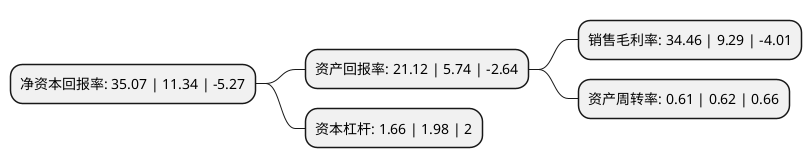

> 本页面由自动化程序生成于 2022年5月20日 01:27
> 内容可能存在错误，如有bug请提交issue至：https://github.com/Eroleice/doc-pi/issues
{.is-warning}

# 上市公司基本情况

## 基本资料

浙江康恩贝制药股份有限公司（以下简称“康恩贝”）成立于1993年01月09日，金华市。于2004年04月12日在上交所主板上市。

康恩贝注册资本257,003.732万元，主营业务:以现代植物药为核心，特色化学药为重要支持的产品结构。主要产品有天保宁牌银杏叶片，天保康牌葛根素注射液，康恩贝牌咳停片，前列康牌普乐安片，康恩贝牌银杏叶提取物等。以下是详细信息：

- 公司名称: 浙江康恩贝制药股份有限公司
- 股票代码: 600572.SH
- 所在地: 浙江 - 金华市
- 成立日期: 1993年01月09日
- 注册资本: 257,003.732万元
- 法定代表人: 胡季强
- 主营业务: 主营业务:以现代植物药为核心，特色化学药为重要支持的产品结构主要产品有天保宁牌银杏叶片，天保康牌葛根素注射液，康恩贝牌咳停片，前列康牌普乐安片，康恩贝牌银杏叶提取物等
- 公司官网: www.conba.com.cn
- 公司介绍: 公司是一家以现代中药和植物药为核心业务的制药企业集团，经过三十多年的发展，已成为中国中药十强，浙江制药工业龙头企业。多年来，公司通过实施以用户为中心的全产业链经营，努力为用户全面构筑安全、绿色的质量屏障。公司在浙江、江西、云南、内蒙古、湖北、上海、贵州等多个省市建有种植、研发、生产、营销基地，并以国家级企业技术中心、国家级博士后科研工作站、国家创新型示范企业、院士工作站等技术平台为依托，实施创新驱动。康恩贝、前列康、天保宁、金奥康、阿乐欣、珍视明等品牌和产品在市场上已经赢得了良好的美誉度，成为细分领域的优势品牌。

## 股东及高管情况

上市公司第一大股东为浙江省中医药健康产业集团有限公司，持股535,777,040股，占比20.85%，**疑似为**上市公司实际控制人。

截至2022年03月31日，上市公司的前十大股东中，共有5名自然人股东，3名机构股东，2个产品账户，其中5%以上大股东共有3名。上市公司前十大股东明细如下：

> 未能通过持股比例判定出上市公司实际控制人（持股30%以上）
> 可能存在通过间接持股、联合持股、协议控制等方式拥有实际控制权的主体，具体请参考上市公司定期公告！
{.is-warning}

> 截至2022年03月31日，上市公司前十大股东信息如下：

| 股东名称 | 持股数量（股） | 持股比例 |
| --- | --- | --- |
| 浙江省中医药健康产业集团有限公司 | 535,777,040 | 20.85% |
| 康恩贝集团有限公司 | 218,618,171 | 8.51% |
| 胡季强 | 133,579,085 | 5.2% |
| 浙江大华投资发展有限公司 | 37,069,700 | 1.44% |
| 陈丽君 | 23,965,100 | 0.93% |
| 蔡辉庭 | 11,030,700 | 0.43% |
| 中国农业银行股份有限公司-中证500交易型开放式指数证券投资基金 | 9,549,238 | 0.37% |
| 陈保华 | 8,569,948 | 0.33% |
| 中国建设银行股份有限公司-汇添富中证中药指数型发起式证券投资基金(LOF) | 8,347,815 | 0.32% |
| 翁鸣 | 7,800,000 | 0.3% |

## 杜邦分析

> 数据列示周期：2021年 | 2020年 | 2019年
{.is-info}

上市公司的净资产收益率在近一年有所上升，上升幅度为209.26%，其变化情况分解如下：
- 上市公司的销售毛利率在近一年上升了270.94%，可能是生产效率的提升、商品原材料价格下跌或商品价格的上涨所致。
- 上市公司的资产周转率在近一年下降了-1.61%，可能是源自于更慢的销售回款或库存管理效果下降。
- 上市公司的财务杠杆比率在近一年下降了-16.16%，可能是减少负债降低财务费用。

