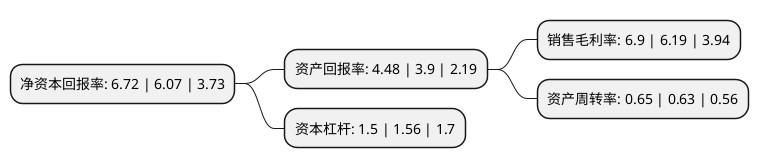

> 本页面由自动化程序生成于 2022年5月20日 01:27
> 内容可能存在错误，如有bug请提交issue至：https://github.com/Eroleice/doc-pi/issues
{.is-warning}

# 上市公司基本情况

## 基本资料

贵州益佰制药股份有限公司（以下简称“益佰制药”）成立于1995年06月12日，贵阳市。于2004年03月23日在上交所主板上市。

益佰制药注册资本79,192.74万元，OTC药，处方药。以下是详细信息：

- 公司名称: 贵州益佰制药股份有限公司
- 股票代码: 600594.SH
- 所在地: 贵州 - 贵阳市
- 成立日期: 1995年06月12日
- 注册资本: 79,192.74万元
- 法定代表人: 窦啟玲
- 主营业务: OTC药，处方药
- 公司官网: www.gzcci.com
- 公司介绍: 公司是一家集新型药品的研究、开发、生产和销售为一体的高新技术企业。主要从事现代中药产品的研制、生产和销售。公司目前的主要产品有艾迪注射液、银杏达莫注射液(杏丁注射液)、复方斑蝥胶囊(康赛迪胶囊)、克咳胶囊、感冒止咳糖浆、疏肝益阳胶囊、金骨莲胶囊、注射用洛铂等，已形成企业优势系列产品。其中，克咳胶囊、艾迪注射液为国家中药二级保护品种，大部分产品进入《国家基本医疗保险和工伤保险药品目录》，公司是贵州省高新技术企业，其中治疗肿瘤类和心脑血管类疾病的药物被列入贵州省重大科技产业化项目。

## 股东及高管情况

上市公司第一大股东为窦啟玲，持股185,457,636股，占比23.42%，**疑似为**上市公司实际控制人。

截至2022年03月31日，上市公司的前十大股东中，共有4名自然人股东，2名机构股东，4个产品账户，其中5%以上大股东共有1名。上市公司前十大股东明细如下：

> 未能通过持股比例判定出上市公司实际控制人（持股30%以上）
> 可能存在通过间接持股、联合持股、协议控制等方式拥有实际控制权的主体，具体请参考上市公司定期公告！
{.is-warning}

> 截至2022年03月31日，上市公司前十大股东信息如下：

| 股东名称 | 持股数量（股） | 持股比例 |
| --- | --- | --- |
| 窦啟玲 | 185,457,636 | 23.42% |
| 招商银行股份有限公司-上证红利交易型开放式指数证券投资基金 | 31,049,672 | 3.92% |
| 金元顺安基金-海通证券-渤海国际信托-渤海信托·恒利丰123号·益佰艾康一号集合资金信托计划 | 9,060,000 | 1.14% |
| 广州珠江实业开发股份有限公司 | 8,685,953 | 1.1% |
| 广州珠江实业集团有限公司 | 8,262,700 | 1.04% |
| 郎洪平 | 7,912,009 | 1% |
| 中国建设银行股份有限公司-大成中证红利指数证券投资基金 | 4,987,300 | 0.63% |
| 中国工商银行股份有限公司-富国中证红利指数增强型证券投资基金 | 4,920,581 | 0.62% |
| 甘宁 | 4,102,660 | 0.52% |
| 洪健山 | 4,100,000 | 0.52% |

## 利润表分析

上市公司2021年总收入为33.46亿元，净利润为2.3亿元，实现盈利。

## 杜邦分析

> 数据列示周期：2021年 | 2020年 | 2019年
{.is-info}

上市公司的净资产收益率在近一年有所上升，上升幅度为10.71%，其变化情况分解如下：
- 上市公司的销售毛利率在近一年上升了11.47%，可能是生产效率的提升、商品原材料价格下跌或商品价格的上涨所致。
- 上市公司的资产周转率在近一年上升了3.17%，可能是源自于更快的销售回款或库存管理效果提升。
- 上市公司的财务杠杆比率在近一年下降了-3.85%，可能是减少负债降低财务费用。

