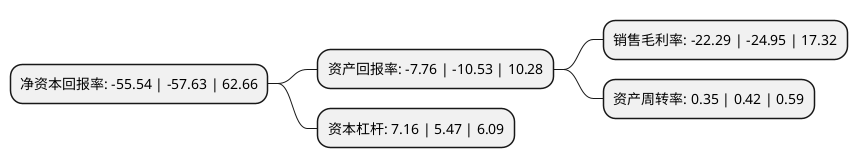

> 本页面由自动化程序生成于 2022年5月20日 01:28
> 内容可能存在错误，如有bug请提交issue至：https://github.com/Eroleice/doc-pi/issues
{.is-warning}

# 上市公司基本情况

## 基本资料

杭州天目山药业股份有限公司（以下简称“ST目药”）成立于1993年08月12日，杭州市。于1993年08月23日在上交所主板上市。

ST目药注册资本12,178万元，珍珠明目滴眼液，复方鲜竹沥液。以下是详细信息：

- 公司名称: 杭州天目山药业股份有限公司
- 股票代码: 600671.SH
- 所在地: 浙江 - 杭州市
- 成立日期: 1993年08月12日
- 注册资本: 12,178万元
- 法定代表人: 李峰
- 主营业务: 珍珠明目滴眼液，复方鲜竹沥液
- 公司官网: www.hztmyy.com
- 公司介绍: 公司是杭州市第一家上市公司，也是全国第一家中药制剂上市企业。公司拥有的天目山牌铁皮石斛被国家质检总局认定为国家地理标志保护产品。公司申报的“天目山中药文化”被列为浙江省非物质文化遗产名录。公司先后获得了浙江省高新技术企业、浙江省级农业企业科研中心、浙江省医药工业优秀企业、浙江省诚信示范企业、杭州市农业龙头企业等荣誉称号。公司产业从传统的中成药延伸到中药、西药、生物药、原料药、中药材种植、保健品、商贸等，已拥有多个技术力量雄厚、业绩显著的专业子公司和企业。公司拥有浙江省和安徽省两个省级企业技术中心；公司拥有现代化的药业生产技术和科研力量；公司拥有通过国家GMP认证的标准生产车间和各类完善的质量检测设备。公司拥有丰富的品种资源，产品种类涵盖中药、西药、生物药、保健食品等领域，药品剂型齐全。

## 股东及高管情况

上市公司第一大股东为青岛汇隆华泽投资有限公司，持股26,799,460股，占比22.01%，**疑似为**上市公司实际控制人。

截至2022年03月31日，上市公司的前十大股东中，共有4名自然人股东，6名机构股东，其中5%以上大股东共有2名。上市公司前十大股东明细如下：

> 未能通过持股比例判定出上市公司实际控制人（持股30%以上）
> 可能存在通过间接持股、联合持股、协议控制等方式拥有实际控制权的主体，具体请参考上市公司定期公告！
{.is-warning}

> 截至2022年03月31日，上市公司前十大股东信息如下：

| 股东名称 | 持股数量（股） | 持股比例 |
| --- | --- | --- |
| 青岛汇隆华泽投资有限公司 | 26,799,460 | 22.01% |
| 永新华瑞文化发展有限公司 | 25,000,000 | 20.53% |
| 浙江清风原生文化有限公司 | 5,181,813 | 4.26% |
| 青岛共享应急安全管理咨询有限公司 | 4,000,028 | 3.28% |
| 李俊凤 | 2,757,229 | 2.26% |
| 国泰君安证券股份有限公司客户信用交易担保证券账户 | 2,503,401 | 2.06% |
| 盖连东 | 2,133,545 | 1.75% |
| 李洪辛 | 2,008,556 | 1.65% |
| 郑州玖甄网络科技有限公司 | 1,830,000 | 1.5% |
| 李杰 | 1,601,923 | 1.32% |

## 利润表分析

上市公司2021年总收入为1.47亿元，净利润为-0.33亿元，**未实现盈利**。

## 杜邦分析

> 数据列示周期：2021年 | 2020年 | 2019年
{.is-info}

上市公司的净资产收益率在近一年有所下降，下降幅度为-3.63%，其变化情况分解如下：
- 上市公司的销售毛利率在近一年下降了-10.66%，可能是生产效率的下降、商品原材料价格上涨或商品价格的下跌所致。
- 上市公司的资产周转率在近一年下降了-16.67%，可能是源自于更慢的销售回款或库存管理效果下降。
- 上市公司的财务杠杆比率在近一年上升了30.9%，可能是增加负债扩大生产规模。

