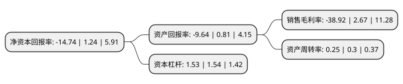

> 本页面由自动化程序生成于 2022年5月20日 01:28
> 内容可能存在错误，如有bug请提交issue至：https://github.com/Eroleice/doc-pi/issues
{.is-warning}

# 上市公司基本情况

## 基本资料

广誉远中药股份有限公司（以下简称“广誉远”）成立于1996年11月25日，晋中市。于1996年11月05日在上交所主板上市。

广誉远注册资本49,199.97万元，公司主要产品是龟龄集，定坤丹，牛黄清心丸，安宫牛黄丸，盖天力等。以下是详细信息：

- 公司名称: 广誉远中药股份有限公司
- 股票代码: 600771.SH
- 所在地: 山西 - 晋中市
- 成立日期: 1996年11月25日
- 注册资本: 49,199.97万元
- 法定代表人: 鞠振
- 主营业务: 公司主要产品是龟龄集，定坤丹，牛黄清心丸，安宫牛黄丸，盖天力等
- 公司官网: www.guangyuyuan.com
- 公司介绍: 公司是一家主营业务为精品中药、传统中药及养生酒的生产和销售的企业。主要产品有OTC类产品，处方药和保健品。公司拥有丰富的产品服务群，有丸剂、胶囊剂、酒剂、片剂、颗粒剂、散剂、口服液、煎膏剂共八个剂型，继承着龟龄集、定坤丹、安宫牛黄丸、牛黄清心丸、六味地黄丸、乌鸡白凤丸等104种中药古方及炮制工艺，从方剂、配伍、选材、炮制等诸多方面，承载并展现着中华中医药文化的核心精神与巨大价值。公司拥有龟龄集、定坤丹、安宫牛黄丸、牛黄清心丸等百余种传统中药批准文号，其中龟龄集是国内目前为止存世最完整的复方升炼技术的活标本，被誉为“中医药的活化石”，它与定坤丹均为国家保密品种。公司“龟龄集”、“定坤丹”及“安宫牛黄丸”均已先后入选国家级非物质文化遗产名录，牛黄清心丸则入选山西省非物质文化遗产名录。

## 股东及高管情况

上市公司第一大股东为晋创投资有限公司，持股71,508,968股，占比14.53%，**疑似为**上市公司实际控制人。

截至2022年03月31日，上市公司的前十大股东中，共有4名自然人股东，4名机构股东，2个产品账户，其中5%以上大股东共有1名。上市公司前十大股东明细如下：

> 未能通过持股比例判定出上市公司实际控制人（持股30%以上）
> 可能存在通过间接持股、联合持股、协议控制等方式拥有实际控制权的主体，具体请参考上市公司定期公告！
{.is-warning}

> 截至2022年03月31日，上市公司前十大股东信息如下：

| 股东名称 | 持股数量（股） | 持股比例 |
| --- | --- | --- |
| 晋创投资有限公司 | 71,508,968 | 14.53% |
| 西安东盛集团有限公司 | 8,142,293 | 1.65% |
| 蒋仕波 | 8,139,600 | 1.65% |
| 樟树市磐鑫投资管理中心(有限合伙) | 7,676,637 | 1.56% |
| 北京东富新投投资管理中心(有限合伙) | 4,000,081 | 0.81% |
| 葛新强 | 2,737,000 | 0.56% |
| 广誉远中药股份有限公司回购专用证券账户 | 2,508,556 | 0.51% |
| 中国建设银行股份有限公司-汇添富中证中药指数型发起式证券投资基金(LOF) | 2,198,106 | 0.45% |
| 刘金群 | 2,068,000 | 0.42% |
| 戴乐君 | 2,000,135 | 0.41% |

## 利润表分析

上市公司2021年总收入为8.54亿元，净利润为-3.33亿元，**未实现盈利**。

## 杜邦分析

> 数据列示周期：2021年 | 2020年 | 2019年
{.is-info}

上市公司的净资产收益率在近一年有所下降，下降幅度为-1288.71%，其变化情况分解如下：
- 上市公司的销售毛利率在近一年下降了-1557.68%，可能是生产效率的下降、商品原材料价格上涨或商品价格的下跌所致。
- 上市公司的资产周转率在近一年下降了-16.67%，可能是源自于更慢的销售回款或库存管理效果下降。
- 上市公司的财务杠杆比率在近一年下降了-0.65%，可能是减少负债降低财务费用。

