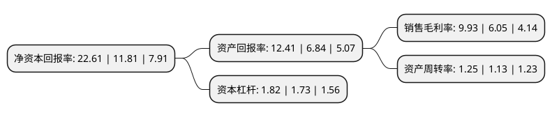

> 本页面由自动化程序生成于 2022年5月20日 01:30
> 内容可能存在错误，如有bug请提交issue至：https://github.com/Eroleice/doc-pi/issues
{.is-warning}

# 上市公司基本情况

## 基本资料

健民药业集团股份有限公司（以下简称“健民集团”）成立于1993年05月28日，武汉市。于2004年04月19日在上交所主板上市。

健民集团注册资本15,339.86万元，龙牡壮骨颗粒，健胃消食片，小儿宣肺止咳颗粒，健民咽喉片以下是详细信息：

- 公司名称: 健民药业集团股份有限公司
- 股票代码: 600976.SH
- 所在地: 湖北 - 武汉市
- 成立日期: 1993年05月28日
- 注册资本: 15,339.86万元
- 法定代表人: 何勤
- 主营业务: 龙牡壮骨颗粒，健胃消食片，小儿宣肺止咳颗粒，健民咽喉片
- 公司官网: www.whjm.com
- 公司介绍: 公司是全国中成药小儿用药生产基地、全国重点中药企业。公司主营业务分为医药工业和医药商业，以发展中医药为核心，以儿科产品为特色，已成为全国重点中药企业和小儿用药生产基地。公司为中华老字号企业，拥有“健民”、“龙牡”、“叶开泰”等品牌。综合实力跻身全国医药企业百强之列，并设立有企业博士后科研工作站和儿童药物研究院。主导品种龙牡壮骨颗粒为一级中药保护品种，是儿童健康成长药物领域的知名品牌。公司秉承叶开泰“修合虽无人见、存心自有天知”、“虔诚修合，遵古宜今；寿世健民，崇德贵生”等理念，打造了中国知名医药品牌和优质上市公司。

## 股东及高管情况

上市公司第一大股东为华立医药集团有限公司，持股37,014,073股，占比24.13%，**疑似为**上市公司实际控制人。

截至2022年03月31日，上市公司的前十大股东中，共有2名自然人股东，3名机构股东，5个产品账户，其中5%以上大股东共有1名。上市公司前十大股东明细如下：

> 未能通过持股比例判定出上市公司实际控制人（持股30%以上）
> 可能存在通过间接持股、联合持股、协议控制等方式拥有实际控制权的主体，具体请参考上市公司定期公告！
{.is-warning}

> 截至2022年03月31日，上市公司前十大股东信息如下：

| 股东名称 | 持股数量（股） | 持股比例 |
| --- | --- | --- |
| 华立医药集团有限公司 | 37,014,073 | 24.13% |
| 孙慧明 | 5,200,038 | 3.39% |
| 华立集团股份有限公司 | 5,098,541 | 3.32% |
| 中国工商银行股份有限公司-中欧医疗健康混合型证券投资基金 | 4,961,093 | 3.23% |
| 太平人寿保险有限公司 | 2,531,000 | 1.65% |
| 杨燕灵 | 2,069,861 | 1.35% |
| 中国银行股份有限公司-前海开源医疗健康灵活配置混合型证券投资基金 | 2,010,840 | 1.31% |
| 基本养老保险基金一二零四组合 | 1,581,027 | 1.03% |
| 平安基金-中国平安人寿保险股份有限公司-分红-个险分红-平安人寿-平安基金权益委托投资2号单一资产管理计划 | 1,432,774 | 0.93% |
| 中国建设银行股份有限公司-中欧新蓝筹灵活配置混合型证券投资基金 | 1,397,919 | 0.91% |

## 利润表分析

上市公司2021年总收入为32.78亿元，净利润为3.25亿元，实现盈利。

## 杜邦分析

> 数据列示周期：2021年 | 2020年 | 2019年
{.is-info}

上市公司的净资产收益率在近一年有所上升，上升幅度为91.45%，其变化情况分解如下：
- 上市公司的销售毛利率在近一年上升了64.13%，可能是生产效率的提升、商品原材料价格下跌或商品价格的上涨所致。
- 上市公司的资产周转率在近一年上升了10.62%，可能是源自于更快的销售回款或库存管理效果提升。
- 上市公司的财务杠杆比率在近一年上升了5.2%，可能是增加负债扩大生产规模。

