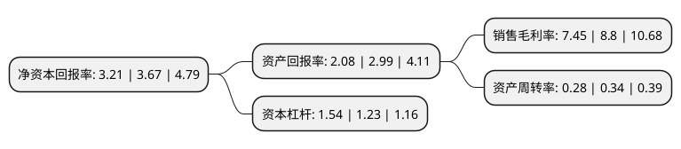

> 本页面由自动化程序生成于 2022年5月20日 01:32
> 内容可能存在错误，如有bug请提交issue至：https://github.com/Eroleice/doc-pi/issues
{.is-warning}

# 上市公司基本情况

## 基本资料

陕西康惠制药股份有限公司（以下简称“康惠制药”）成立于2009年12月24日，咸阳市。于2017年04月21日在上交所主板上市。

康惠制药注册资本9,988万元，主要产品:坤复康胶囊(片)，复方双花片，消银颗粒，附桂骨痛胶囊，芪药消渴胶囊，复方清带灌注液等，其中坤复康胶囊(片)，复方双花片，消银颗粒，附桂骨痛胶囊列入国家医保目录，消银颗粒列入国家基本药物目录。主营业务:中成药品的研究，开发，生产与销售。以下是详细信息：

- 公司名称: 陕西康惠制药股份有限公司
- 股票代码: 603139.SH
- 所在地: 陕西 - 咸阳市
- 成立日期: 2009年12月24日
- 注册资本: 9,988万元
- 法定代表人: 王延岭
- 主营业务: 主要产品:坤复康胶囊(片)，复方双花片，消银颗粒，附桂骨痛胶囊，芪药消渴胶囊，复方清带灌注液等，其中坤复康胶囊(片)，复方双花片，消银颗粒，附桂骨痛胶囊列入国家医保目录，消银颗粒列入国家基本药物目录主营业务:中成药品的研究，开发，生产与销售
- 公司官网: www.sxkh.com
- 公司介绍: 公司是融药品研究、开发、生产、销售于一体的医药高新技术企业，主营业务为中成药品的研究、开发、生产与销售。目前公司下设3个药品生产基地，拥有107个药品生产批准文号，共有片剂、硬胶囊剂、颗粒剂、口服液、酒剂、合剂、茶剂、膏药、软膏剂、搽剂、洗剂、酊剂等18条GMP认证制剂生产线。公司的“万花山及图”商标被国家工商行政管理总局商标局认定为中国驰名商标；公司“万花山”商标多次被陕西省工商行政管理局评为陕西省著名商标；公司被国家知识产权局评为“国家知识产权优势企业”。

## 股东及高管情况

上市公司第一大股东为陕西康惠控股有限公司，持股39,600,000股，占比39.65%，为上市公司实际控制人。

截至2022年03月31日，上市公司的前十大股东中，共有5名自然人股东，3名机构股东，1个产品账户，1个海外主体，其中5%以上大股东共有3名。上市公司前十大股东明细如下：

> 截至2022年03月31日，上市公司前十大股东信息如下：

| 股东名称 | 持股数量（股） | 持股比例 |
| --- | --- | --- |
| 陕西康惠控股有限公司 | 39,600,000 | 39.65% |
| TBP Traditional Medicine Investment Holdings(H.K.)Limited | 16,670,000 | 16.69% |
| 王延岭 | 6,650,000 | 6.66% |
| 曹志洪 | 800,055 | 0.8% |
| 陆训启 | 513,000 | 0.51% |
| 陕西德同福方投资管理有限公司-陕西省新材料高技术创业投资基金(有限合伙) | 500,471 | 0.5% |
| 弘成租赁集团有限公司 | 283,700 | 0.28% |
| 魏立中 | 271,900 | 0.27% |
| 华泰证券股份有限公司 | 262,339 | 0.26% |
| 许润芝 | 242,900 | 0.24% |

## 利润表分析

上市公司2021年总收入为4.42亿元，净利润为0.32亿元，实现盈利。

## 杜邦分析

> 数据列示周期：2021年 | 2020年 | 2019年
{.is-info}

上市公司的净资产收益率在近一年有所下降，下降幅度为-12.53%，其变化情况分解如下：
- 上市公司的销售毛利率在近一年下降了-15.34%，可能是生产效率的下降、商品原材料价格上涨或商品价格的下跌所致。
- 上市公司的资产周转率在近一年下降了-17.65%，可能是源自于更慢的销售回款或库存管理效果下降。
- 上市公司的财务杠杆比率在近一年上升了25.2%，可能是增加负债扩大生产规模。

