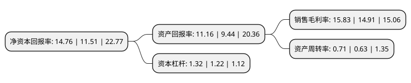

> 本页面由自动化程序生成于 2022年5月20日 01:34
> 内容可能存在错误，如有bug请提交issue至：https://github.com/Eroleice/doc-pi/issues
{.is-warning}

# 上市公司基本情况

## 基本资料

贵州三力制药股份有限公司（以下简称“贵州三力”）成立于1995年09月22日，安顺市。于2020年04月28日在上交所主板上市。

贵州三力注册资本41,086.222万元，主营业务为药品的研发，生产及销售，产品品种主要围绕儿科，呼吸系统科，心脑血管科，消化内科等领域，主要产品为开喉剑喷雾剂(儿童型)，开喉剑喷雾剂和强力天麻杜仲胶囊等。以下是详细信息：

- 公司名称: 贵州三力制药股份有限公司
- 股票代码: 603439.SH
- 所在地: 贵州 - 安顺市
- 成立日期: 1995年09月22日
- 注册资本: 41,086.222万元
- 法定代表人: 张海
- 主营业务: 主营业务为药品的研发，生产及销售，产品品种主要围绕儿科，呼吸系统科，心脑血管科，消化内科等领域，主要产品为开喉剑喷雾剂(儿童型)，开喉剑喷雾剂和强力天麻杜仲胶囊等
- 公司官网: www.gz-sanli.com
- 公司介绍: 公司是一家中药制药高新技术企业,主营业务为药品的研发、生产及销售。秉承“创造人类健康生活”的使命，依托贵州省丰富的中药材资源，结合苗药验方经验及现代科学技术，不断开发独特有效的产品。公司产品品种主要围绕儿科、呼吸系统科、心脑血管科、消化内科等领域，主要产品为开喉剑喷雾剂(儿童型)、开喉剑喷雾剂和强力天麻杜仲胶囊等。其中，开喉剑喷雾剂(儿童型)和开喉剑喷雾剂，是国家专利产品及独家品种，已列入国家医保目录及部分省份的地方基本药物目录，临床用于上呼吸道感染、急慢性咽炎、扁桃体炎、咽喉肿痛、口腔炎、口腔溃疡、牙龈肿痛等病症；强力天麻杜仲胶囊已列入国家医保目录，临床用于中风引起的经脉掣痛、肢体麻木、行走不便、腰腿酸痛、头痛头晕等病症。公司荣获国家高新技术企业、贵州民营企业100强等多项荣誉，多项产品被评为贵州省名牌产品，商标被评为贵州省著名商标，并入选了贵州省知识产权优势培育企业库。

## 股东及高管情况

上市公司第一大股东为张海，持股188,668,440股，占比45.9201%，为上市公司实际控制人。

截至2022年04月18日，上市公司的前十大股东中，共有8名自然人股东，2名机构股东，其中5%以上大股东共有5名。上市公司前十大股东明细如下：

> 截至2022年04月18日，上市公司前十大股东信息如下：

| 股东名称 | 持股数量（股） | 持股比例 |
| --- | --- | --- |
| 张海 | 188,668,440 | 45.9201% |
| 张海 | 188,668,440 | 45.92% |
| 王惠英 | 55,598,400 | 13.5321% |
| 王惠英 | 55,598,400 | 13.53% |
| 盛永建 | 30,131,769 | 7.3338% |
| 广发证券股份有限公司 | 14,602,796 | 3.55% |
| 北京众和成长投资中心(有限合伙) | 6,363,400 | 1.55% |
| 王毅 | 1,200,000 | 0.29% |
| 周咸宁 | 1,000,000 | 0.24% |
| 徐天松 | 814,600 | 0.2% |

## 利润表分析

上市公司2021年总收入为9.38亿元，净利润为1.48亿元，实现盈利。

## 杜邦分析

> 数据列示周期：2021年 | 2020年 | 2019年
{.is-info}

上市公司的净资产收益率在近一年有所上升，上升幅度为28.24%，其变化情况分解如下：
- 上市公司的销售毛利率在近一年上升了6.17%，可能是生产效率的提升、商品原材料价格下跌或商品价格的上涨所致。
- 上市公司的资产周转率在近一年上升了12.7%，可能是源自于更快的销售回款或库存管理效果提升。
- 上市公司的财务杠杆比率在近一年上升了8.2%，可能是增加负债扩大生产规模。

