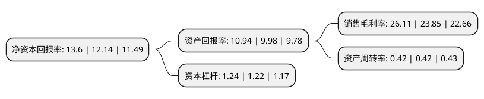

> 本页面由自动化程序生成于 2022年5月20日 01:35
> 内容可能存在错误，如有bug请提交issue至：https://github.com/Eroleice/doc-pi/issues
{.is-warning}

# 上市公司基本情况

## 基本资料

浙江寿仙谷医药股份有限公司（以下简称“寿仙谷”）成立于1997年03月03日，金华市。于2017年05月10日在上交所主板上市。

寿仙谷注册资本15,249.842万元，公司系一家专业从事灵芝，铁皮石斛等名贵中药材的品种选育，栽培，加工和销售的高新技术企业。主要产品为中药饮片，保健食品等。以下是详细信息：

- 公司名称: 浙江寿仙谷医药股份有限公司
- 股票代码: 603896.SH
- 所在地: 浙江 - 金华市
- 成立日期: 1997年03月03日
- 注册资本: 15,249.842万元
- 法定代表人: 李明焱
- 主营业务: 公司系一家专业从事灵芝，铁皮石斛等名贵中药材的品种选育，栽培，加工和销售的高新技术企业主要产品为中药饮片，保健食品等
- 公司官网: www.sxg1909.com
- 公司介绍: 公司为国家高新技术企业、中华老字号企业；全国食用菌协会、中国医药教育协会副会长单位，浙江省中药材产业协会会长单位。公司秉承“重德觅上药、诚善济世人”的祖训，恪守“为民众的健康美丽长寿服务，创百年寿仙谷”的企业宗旨，致力“打造有机国药第一品牌”，长期不懈坚持铁皮石斛、灵芝、西红花等珍稀名贵中药材的优良品种选育、生态有机栽培、中药炮制技艺和新产品的研发。“寿仙谷中药炮制技艺”被国务院认定为“国家非物质文化遗产”。公司建有省级“院士专家工作站”、“浙江省珍稀植物药工程技术研究中心”、“浙江寿仙谷珍稀植物药研究院”、“铁皮石斛浙江省工程研究中心”等省级研发机构。与北京大学医学部，浙江大学药学院、浙江中医药大学、上海中医药大学、北京302医院、北京广安门医院等权威研究机构建立产、学、研联合的交流平台。为浙江省星火计划培训基地、清华大学博士生实践基地、浙江大学农业与生物技术实验基地等科研实践基地。

## 股东及高管情况

上市公司第一大股东为浙江寿仙谷投资管理有限公司，持股43,624,030股，占比28.6%，**疑似为**上市公司实际控制人。

截至2022年03月31日，上市公司的前十大股东中，共有6名自然人股东，1名机构股东，3个产品账户，其中5%以上大股东共有2名。上市公司前十大股东明细如下：

> 未能通过持股比例判定出上市公司实际控制人（持股30%以上）
> 可能存在通过间接持股、联合持股、协议控制等方式拥有实际控制权的主体，具体请参考上市公司定期公告！
{.is-warning}

> 截至2022年03月31日，上市公司前十大股东信息如下：

| 股东名称 | 持股数量（股） | 持股比例 |
| --- | --- | --- |
| 浙江寿仙谷投资管理有限公司 | 43,624,030 | 28.6% |
| 李振皓 | 11,570,500 | 7.59% |
| 徐美芸 | 5,927,800 | 3.89% |
| 李振宇 | 3,933,970 | 2.58% |
| 郑化先 | 3,769,875 | 2.47% |
| 中国银行股份有限公司-广发聚鑫债券型证券投资基金 | 3,659,984 | 2.4% |
| 浙江寿仙谷医药股份有限公司回购专用证券账户 | 3,585,000 | 2.35% |
| 兴银基金-郑仟仟-兴银基金-兴易7号单一资产管理计划 | 2,121,725 | 1.39% |
| 方正顺 | 2,000,100 | 1.31% |
| 王瑛 | 1,778,125 | 1.17% |

## 利润表分析

上市公司2021年总收入为7.67亿元，净利润为2亿元，实现盈利。

## 杜邦分析

> 数据列示周期：2021年 | 2020年 | 2019年
{.is-info}

上市公司的净资产收益率在近一年有所上升，上升幅度为12.03%，其变化情况分解如下：
- 上市公司的销售毛利率在近一年上升了9.48%，可能是生产效率的提升、商品原材料价格下跌或商品价格的上涨所致。
- 上市公司的资产周转率在近一年下降了0%，可能是源自于更慢的销售回款或库存管理效果下降。
- 上市公司的财务杠杆比率在近一年上升了1.64%，可能是增加负债扩大生产规模。

