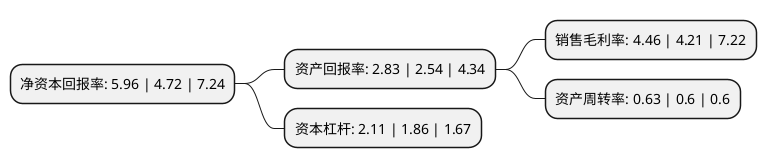

> 本页面由自动化程序生成于 2022年5月20日 01:36
> 内容可能存在错误，如有bug请提交issue至：https://github.com/Eroleice/doc-pi/issues
{.is-warning}

# 上市公司基本情况

## 基本资料

湖南方盛制药股份有限公司（以下简称“方盛制药”）成立于1997年10月13日，长沙市。于2014年12月05日在上交所主板上市。

方盛制药注册资本42,942.972万元，主营业务:主要从事心脑血管中成药，骨伤科药，儿科药，抗感染药等药品的研发，生产与销售的高新技术企业。主要产品:有血塞通分散片，血塞通片，藤黄健骨片，赖氨酸维B12颗粒，头孢克肟片，金英胶囊等。以下是详细信息：

- 公司名称: 湖南方盛制药股份有限公司
- 股票代码: 603998.SH
- 所在地: 湖南 - 长沙市
- 成立日期: 1997年10月13日
- 注册资本: 42,942.972万元
- 法定代表人: 周晓莉
- 主营业务: 主营业务:主要从事心脑血管中成药，骨伤科药，儿科药，抗感染药等药品的研发，生产与销售的高新技术企业主要产品:有血塞通分散片，血塞通片，藤黄健骨片，赖氨酸维B12颗粒，头孢克肟片，金英胶囊等
- 公司官网: www.fangsheng.com.cn
- 公司介绍: 公司是一家集医药工业、医疗服务、大健康业务于一体的高品质、综合性、科研型医药健康产业集团。主要从事心脑血管中成药、骨伤科药、儿科药、妇科药、抗感染药等药品的研发、生产与销售，主要产品有血塞通分散片、血塞通片、藤黄健骨片、赖氨酸维B12颗粒、头孢克肟片、金英胶囊等。公司现拥有国家级企业技术中心、国家博士后科研工作站、湖南省心脑血管药物工程技术研究中心，承担国家重大新药创制科技重大专项2项、多项省部级科技项目。公司先后获评国家火炬计划重点高新技术企业、中华民族医药百强品牌企业、中国医药行业AAA诚信企业、中国优秀民营企业、国家守合同重信用企业、湖南省省长质量奖企业、湖南省首批示范性医药企业等荣誉称号。

## 股东及高管情况

上市公司第一大股东为张庆华，持股156,019,500股，占比36.33%，为上市公司实际控制人。

截至2022年03月31日，上市公司的前十大股东中，共有7名自然人股东，2名机构股东，1个海外主体，其中5%以上大股东共有1名。上市公司前十大股东明细如下：

> 截至2022年03月31日，上市公司前十大股东信息如下：

| 股东名称 | 持股数量（股） | 持股比例 |
| --- | --- | --- |
| 张庆华 | 156,019,500 | 36.33% |
| 堆龙德庆共生创业投资管理有限公司 | 14,434,875 | 3.36% |
| 天风证券股份有限公司 | 6,427,203 | 1.5% |
| 李飞飞 | 3,813,300 | 0.89% |
| 李克丽 | 3,100,000 | 0.72% |
| 梁焯森 | 2,976,173 | 0.69% |
| 方传龙 | 2,925,000 | 0.68% |
| 周永发 | 2,788,200 | 0.65% |
| UBS AG | 2,689,384 | 0.63% |
| 张蕾 | 2,597,302 | 0.6% |

## 利润表分析

上市公司2021年总收入为15.66亿元，净利润为0.69亿元，实现盈利。

## 杜邦分析

> 数据列示周期：2021年 | 2020年 | 2019年
{.is-info}

上市公司的净资产收益率在近一年有所上升，上升幅度为26.27%，其变化情况分解如下：
- 上市公司的销售毛利率在近一年上升了5.94%，可能是生产效率的提升、商品原材料价格下跌或商品价格的上涨所致。
- 上市公司的资产周转率在近一年上升了5%，可能是源自于更快的销售回款或库存管理效果提升。
- 上市公司的财务杠杆比率在近一年上升了13.44%，可能是增加负债扩大生产规模。

