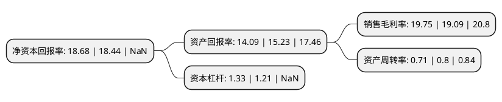

> 本页面由自动化程序生成于 2022年5月20日 01:05
> 内容可能存在错误，如有bug请提交issue至：https://github.com/Eroleice/doc-pi/issues
{.is-warning}

## 股东及高管情况

上市公司第一大股东为江西阳光乳业集团有限公司，持股154,200,000股，占比54.55%，为上市公司实际控制人。

截至2022年05月20日，上市公司的前十大股东中，共有4名机构股东，6个产品账户，其中5%以上大股东共有2名。上市公司前十大股东明细如下：

> 截至2022年05月20日，上市公司前十大股东信息如下：

| 股东名称 | 持股数量（股） | 持股比例 |
| --- | --- | --- |
| 江西阳光乳业集团有限公司 | 154,200,000 | 54.55% |
| 南昌致合企业管理中心(有限合伙) | 51,400,000 | 18.18% |
| 共青城鼎盛博盈投资中心(有限合伙) | 6,360,000 | 2.25% |
| 东兴证券股份有限公司 | 249,388 | 0.09% |
| 中国建设银行股份有限公司企业年金计划-中国工商银行股份有限公司 | 7,462 | 0.0026% |
| 中国工商银行股份有限公司企业年金计划-中国建设银行股份有限公司 | 6,888 | 0.0024% |
| 广东省叁号职业年金计划-中国银行 | 6,314 | 0.0022% |
| 中国石油化工集团公司企业年金计划-中国工商银行股份有限公司 | 6,314 | 0.0022% |
| 中国石油天然气集团公司企业年金计划-中国工商银行股份有限公司 | 5,740 | 0.002% |
| 中国移动通信集团有限公司企业年金计划-中国工商银行股份有限公司 | 5,740 | 0.002% |

## 杜邦分析

> 数据列示周期：2020年 | 2019年 | 2018年
{.is-info}

上市公司的净资产收益率在近一年有所上升，上升幅度为1.3%，其变化情况分解如下：
- 上市公司的销售毛利率在近一年上升了3.46%，可能是生产效率的提升、商品原材料价格下跌或商品价格的上涨所致。
- 上市公司的资产周转率在近一年下降了-11.25%，可能是源自于更慢的销售回款或库存管理效果下降。
- 上市公司的财务杠杆比率在近一年上升了9.92%，可能是增加负债扩大生产规模。

