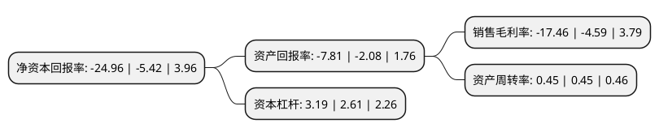

> 本页面由自动化程序生成于 2022年5月20日 01:08
> 内容可能存在错误，如有bug请提交issue至：https://github.com/Eroleice/doc-pi/issues
{.is-warning}

# 上市公司基本情况

## 基本资料

皇氏集团股份有限公司（以下简称“皇氏集团”）成立于2001年05月31日，南宁市。于2010年01月06日在深交所中小板上市。

皇氏集团注册资本83,764.004万元，主营业务为液态乳和液态乳制品的生产，加工，销售以及与此产业关联的奶牛养殖和牧草种植，主要产品以巴氏奶为主，包括营养价值高的水牛奶，南方特色鲜明的果奶和具有益生作用的发酵型酸奶。公司拥有的产品主要是液态奶产品以下是详细信息：

- 公司名称: 皇氏集团股份有限公司
- 股票代码: 002329.SZ
- 所在地: 广西 - 南宁市
- 成立日期: 2001年05月31日
- 注册资本: 83,764.004万元
- 法定代表人: 黄嘉棣
- 主营业务: 主营业务为液态乳和液态乳制品的生产，加工，销售以及与此产业关联的奶牛养殖和牧草种植，主要产品以巴氏奶为主，包括营养价值高的水牛奶，南方特色鲜明的果奶和具有益生作用的发酵型酸奶公司拥有的产品主要是液态奶产品
- 公司官网: www.gxhsry.com
- 公司介绍: 公司是我国水牛奶产业经营规模最大、技术实力最强的乳品企业，广西地区唯一拥有自治区级企业技术中心的乳品企业。公司主营液态乳制品的生产、加工、销售以及与此产业关联的奶牛养殖、牧草种植业务，主要产品是以黑白花牛奶、水牛奶为主要原料的巴氏杀菌奶、水牛奶、特色果奶、酸奶等液态乳制品和乳饮料。先后担任国家科技攻关计划项目《水牛奶制品加工技术和标准研究》的主持单位、国家级星火计划项目《南方优质牧草产业化示范工程》和《引进国外先进技术建设标准化乳产品加工生产基地》的承担单位、“十一五”国家科技支撑计划重大项目《奶业发展重大关键技术研究与示范》中《奶水牛生产技术集成研究与示范》课题的主持单位。

## 股东及高管情况

上市公司第一大股东为黄嘉棣，持股263,023,388股，占比31.4%，为上市公司实际控制人。

截至2022年03月31日，上市公司的前十大股东中，共有7名自然人股东，2名机构股东，1个海外主体，其中5%以上大股东共有2名。上市公司前十大股东明细如下：

> 截至2022年03月31日，上市公司前十大股东信息如下：

| 股东名称 | 持股数量（股） | 持股比例 |
| --- | --- | --- |
| 黄嘉棣 | 263,023,388 | 31.4% |
| 东方证券股份有限公司 | 58,410,000 | 6.97% |
| 联储证券有限责任公司 | 33,499,800 | 4% |
| 徐蕾蕾 | 22,640,630 | 2.7% |
| 李红杰 | 5,600,000 | 0.67% |
| 陈小锋 | 5,447,000 | 0.65% |
| 朱干群 | 5,031,100 | 0.6% |
| 杨浩 | 3,175,700 | 0.38% |
| 何海晏 | 2,780,220 | 0.33% |
| JPMORGAN CHASE BANK,NATIONAL ASSOCIATION | 2,344,369 | 0.28% |

## 利润表分析

上市公司2021年总收入为25.68亿元，净利润为-4.49亿元，**未实现盈利**。

## 杜邦分析

> 数据列示周期：2021年 | 2020年 | 2019年
{.is-info}

上市公司的净资产收益率在近一年有所上升，上升幅度为360.52%，其变化情况分解如下：
- 上市公司的销售毛利率在近一年上升了280.39%，可能是生产效率的提升、商品原材料价格下跌或商品价格的上涨所致。
- 上市公司的资产周转率在近一年下降了0%，可能是源自于更慢的销售回款或库存管理效果下降。
- 上市公司的财务杠杆比率在近一年上升了22.22%，可能是增加负债扩大生产规模。

