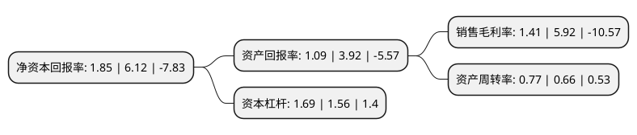

> 本页面由自动化程序生成于 2022年5月20日 01:11
> 内容可能存在错误，如有bug请提交issue至：https://github.com/Eroleice/doc-pi/issues
{.is-warning}

# 上市公司基本情况

## 基本资料

麦趣尔集团股份有限公司（以下简称“麦趣尔”）成立于2002年12月30日，昌吉回族自治州。于2014年01月28日在深交所中小板上市。

麦趣尔注册资本17,413.946万元，本公司的主营业务是乳制品的生产和销售，烘焙食品的连锁经营。本公司生产的乳制品主要包括灭菌乳，调制乳和含乳饮料三大系列20余种产品。以下是详细信息：

- 公司名称: 麦趣尔集团股份有限公司
- 股票代码: 002719.SZ
- 所在地: 新疆 - 昌吉回族自治州
- 成立日期: 2002年12月30日
- 注册资本: 17,413.946万元
- 法定代表人: 李勇
- 主营业务: 本公司的主营业务是乳制品的生产和销售，烘焙食品的连锁经营本公司生产的乳制品主要包括灭菌乳，调制乳和含乳饮料三大系列20余种产品
- 公司官网: www.maiquer.com
- 公司介绍: 公司为一家现代化食品加工企业，立足食品行业中高端领域，以乳制品、烘焙食品制造、分销及烘焙连锁门店为核心业态，并辅以节日食品、冷冻饮品等产品的研发、加工与销售。其中，乳制品包括灭菌乳、调制乳、含乳饮料和发酵乳四大系列产品；烘焙食品包括面包、蛋糕、中西式糕点、月饼等系列产品，形成乳制品和烘焙食品为主导的产品线格局。公司是新疆地区首家一次性通过ISO9001质量管理体系、ISO14001环境管理体系、ISO22000食品安全管理体系认证的食品加工企业。公司建立了以“麦趣尔”为主品牌的品牌架构，麦趣尔品牌成为疆内广受消费者认可的品牌。公司先后获得“中国名牌”、“中国烘焙最具竞争力十大品牌”、“新疆名牌产品”、“中国名饼”等诸多荣誉。

## 股东及高管情况

上市公司第一大股东为新疆麦趣尔集团有限责任公司，持股62,376,372股，占比35.82%，为上市公司实际控制人。

截至2022年03月31日，上市公司的前十大股东中，共有6名自然人股东，3名机构股东，1个产品账户，其中5%以上大股东共有3名。上市公司前十大股东明细如下：

> 截至2022年03月31日，上市公司前十大股东信息如下：

| 股东名称 | 持股数量（股） | 持股比例 |
| --- | --- | --- |
| 新疆麦趣尔集团有限责任公司 | 62,376,372 | 35.82% |
| 昌吉州国有资产投资经营集团有限公司 | 14,491,612 | 8.32% |
| 李勇 | 11,223,843 | 6.45% |
| 新疆聚和盛投资有限公司 | 6,199,900 | 3.56% |
| 陈惜如 | 1,420,000 | 0.82% |
| 胡晓红 | 1,255,000 | 0.72% |
| 王翠先 | 960,168 | 0.55% |
| 王海定 | 878,800 | 0.5% |
| 曹健 | 820,000 | 0.47% |
| 泰康资管-中国银行-泰康资产管理有限责任公司量化增强资产管理产品 | 782,200 | 0.45% |

## 杜邦分析

> 数据列示周期：2021年 | 2020年 | 2019年
{.is-info}

上市公司的净资产收益率在近一年有所下降，下降幅度为-69.77%，其变化情况分解如下：
- 上市公司的销售毛利率在近一年下降了-76.18%，可能是生产效率的下降、商品原材料价格上涨或商品价格的下跌所致。
- 上市公司的资产周转率在近一年上升了16.67%，可能是源自于更快的销售回款或库存管理效果提升。
- 上市公司的财务杠杆比率在近一年上升了8.33%，可能是增加负债扩大生产规模。

