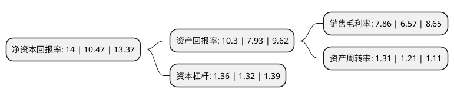

> 本页面由自动化程序生成于 2022年5月20日 01:11
> 内容可能存在错误，如有bug请提交issue至：https://github.com/Eroleice/doc-pi/issues
{.is-warning}

# 上市公司基本情况

## 基本资料

广东燕塘乳业股份有限公司（以下简称“燕塘乳业”）成立于2002年12月30日，广州市。于2014年12月05日在深交所中小板上市。

燕塘乳业注册资本15,735万元，主营业务为乳制品和含乳饮料的研发，生产和销售。公司产品包括巴氏杀菌奶，UHT灭菌奶，酸奶，花式奶和乳酸菌乳饮料等，其中巴氏杀菌奶，花式奶为主要产品。以下是详细信息：

- 公司名称: 广东燕塘乳业股份有限公司
- 股票代码: 002732.SZ
- 所在地: 广东 - 广州市
- 成立日期: 2002年12月30日
- 注册资本: 15,735万元
- 法定代表人: 李志平
- 主营业务: 主营业务为乳制品和含乳饮料的研发，生产和销售公司产品包括巴氏杀菌奶，UHT灭菌奶，酸奶，花式奶和乳酸菌乳饮料等，其中巴氏杀菌奶，花式奶为主要产品
- 公司官网: www.yantangmilk.com
- 公司介绍: 公司是一家集牧场、研发、加工、销售于一体，专业从事乳制品和含乳饮料的研发、生产和销售的乳制品生产企业，是华南地区规模最大的乳制品生产企业之一。公司先后向美国维绿、德国SIG康美包、瑞典利乐等公司引进世界上先进的生产设备，拥有广东最早的乳品科技创新中心，先后从国内外引进了远红外线牛奶成分综合测定仪、微生物快速检测仪、体细胞快速检测仪、液相色谱仪、气相色谱仪、双道电子莹光光度计、原子吸收光谱仪等尖端检测仪器。公司严格执行食品生产许可管理制度，建立了完善的质量检测体系，坚持对每一批次产品实行全程监测。公司通过了“ISO9001：2008质量管理体系”、“ISO22000:2005食品安全管理体系”、“危害分析与关键控制点(HACCP)和GMP(良好生产规范)”的要求，保证了产品质量。

## 股东及高管情况

上市公司第一大股东为广东省燕塘投资有限公司，持股64,465,743股，占比40.97%，为上市公司实际控制人。

截至2022年03月31日，上市公司的前十大股东中，共有3名自然人股东，4名机构股东，3个产品账户，其中5%以上大股东共有3名。上市公司前十大股东明细如下：

> 截至2022年03月31日，上市公司前十大股东信息如下：

| 股东名称 | 持股数量（股） | 持股比例 |
| --- | --- | --- |
| 广东省燕塘投资有限公司 | 64,465,743 | 40.97% |
| 广东省粤垦投资有限公司 | 18,401,011 | 11.69% |
| 广东省湛江农垦集团有限公司 | 7,916,846 | 5.03% |
| 基本养老保险基金一零零三组合 | 4,546,193 | 2.89% |
| 广东中远轻工有限公司 | 2,028,010 | 1.29% |
| 陈锦洪 | 2,019,300 | 1.28% |
| 李嘉俊 | 1,520,000 | 0.97% |
| 基本养老保险基金三零四组合 | 979,000 | 0.62% |
| 华夏基金华兴2号股票型养老金产品-中国建设银行股份有限公司 | 842,850 | 0.54% |
| 瞿小刚 | 814,900 | 0.52% |

## 利润表分析

上市公司2021年总收入为19.84亿元，净利润为1.56亿元，实现盈利。

## 杜邦分析

> 数据列示周期：2021年 | 2020年 | 2019年
{.is-info}

上市公司的净资产收益率在近一年有所上升，上升幅度为33.72%，其变化情况分解如下：
- 上市公司的销售毛利率在近一年上升了19.63%，可能是生产效率的提升、商品原材料价格下跌或商品价格的上涨所致。
- 上市公司的资产周转率在近一年上升了8.26%，可能是源自于更快的销售回款或库存管理效果提升。
- 上市公司的财务杠杆比率在近一年上升了3.03%，可能是增加负债扩大生产规模。

