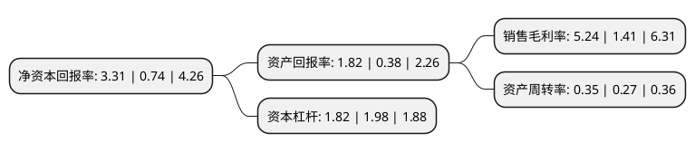

> 本页面由自动化程序生成于 2022年5月20日 01:13
> 内容可能存在错误，如有bug请提交issue至：https://github.com/Eroleice/doc-pi/issues
{.is-warning}

# 上市公司基本情况

## 基本资料

兰州庄园牧场股份有限公司（以下简称“庄园牧场”）成立于2000年04月25日，兰州市。于2017年10月31日在深交所中小板上市。

庄园牧场注册资本23,238.103万元，发行人主要从事乳制品和含乳饮料的生产，加工，销售及奶牛养殖业务。以下是详细信息：

- 公司名称: 兰州庄园牧场股份有限公司
- 股票代码: 002910.SZ
- 所在地: 甘肃 - 兰州市
- 成立日期: 2000年04月25日
- 注册资本: 23,238.103万元
- 法定代表人: 姚革显
- 主营业务: 发行人主要从事乳制品和含乳饮料的生产，加工，销售及奶牛养殖业务
- 公司官网: www.lzzhuangyuan.com
- 公司介绍: 公司成立于2000年4月，属民营股份制企业，是集奶牛养殖、技术研发、乳品加工、销售为一体的专业化乳制品生产企业。公司在甘肃、青海、宁夏经营有8个现代化奶牛养殖牧场，主要产品包括巴氏杀菌乳、灭菌乳、调制乳、发酵乳、含乳饮料等各类液态乳制品，有“庄园牧场”、“圣湖”、“永道布”系列七大类60多个品种。几年来，依靠先进的技术、全新的营销理念、富有活力的企业文化及稳定的产品质量，庄园乳业迅速成长，已成为甘肃和青海地区乳业的排头兵。公司已通ISO9001质量管理体系认证；HACCP食品安全体系认证；诚信管理体系认证；绿色食品认证；获得“全国农产品加工示范企业”；农业产业化国家重点龙头企业；国家扶贫龙头企业等。

## 股东及高管情况

上市公司第一大股东为甘肃省农垦资产经营有限公司，持股37,931,665股，占比16.32%，**疑似为**上市公司实际控制人。

截至2022年03月31日，上市公司的前十大股东中，共有4名自然人股东，4名机构股东，2个海外主体，其中5%以上大股东共有5名。上市公司前十大股东明细如下：

> 未能通过持股比例判定出上市公司实际控制人（持股30%以上）
> 可能存在通过间接持股、联合持股、协议控制等方式拥有实际控制权的主体，具体请参考上市公司定期公告！
{.is-warning}

> 截至2022年03月31日，上市公司前十大股东信息如下：

| 股东名称 | 持股数量（股） | 持股比例 |
| --- | --- | --- |
| 甘肃省农垦资产经营有限公司 | 37,931,665 | 16.32% |
| 香港中央结算(代理人)有限公司 | 35,122,847 | 15.11% |
| 马红富 | 32,197,400 | 13.86% |
| 兰州庄园投资有限公司 | 30,894,700 | 13.29% |
| 上海福菡商务咨询有限公司 | 15,000,000 | 6.45% |
| 香港中央结算有限公司(陆股通) | 2,812,405 | 1.21% |
| 顾建花 | 1,038,900 | 0.45% |
| 于述伟 | 679,200 | 0.29% |
| 阎力 | 660,000 | 0.28% |
| 华泰证券股份有限公司 | 568,887 | 0.24% |

## 利润表分析

上市公司2021年总收入为10.21亿元，净利润为0.53亿元，实现盈利。

## 杜邦分析

> 数据列示周期：2021年 | 2020年 | 2019年
{.is-info}

上市公司的净资产收益率在近一年有所上升，上升幅度为347.3%，其变化情况分解如下：
- 上市公司的销售毛利率在近一年上升了271.63%，可能是生产效率的提升、商品原材料价格下跌或商品价格的上涨所致。
- 上市公司的资产周转率在近一年上升了29.63%，可能是源自于更快的销售回款或库存管理效果提升。
- 上市公司的财务杠杆比率在近一年下降了-8.08%，可能是减少负债降低财务费用。

