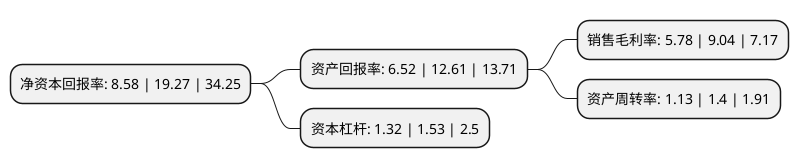

> 本页面由自动化程序生成于 2022年5月20日 01:21
> 内容可能存在错误，如有bug请提交issue至：https://github.com/Eroleice/doc-pi/issues
{.is-warning}

# 上市公司基本情况

## 基本资料

品渥食品股份有限公司（以下简称“品渥食品”）成立于1997年09月09日，上海市。于2020年09月24日在深交所创业板上市。

品渥食品注册资本10,000万元，公司主要从事自有品牌食品的开发，进口，销售及国外食品的合作代理销售业务。公司产品以自有品牌和合作品牌进口食品为主，主要聚焦于乳品，啤酒，粮油，谷物以及饼干点心类等五大食品品类。以下是详细信息：

- 公司名称: 品渥食品股份有限公司
- 股票代码: 300892.SZ
- 所在地: 上海 - 上海市
- 成立日期: 1997年09月09日
- 注册资本: 10,000万元
- 法定代表人: 王牧
- 主营业务: 公司主要从事自有品牌食品的开发，进口，销售及国外食品的合作代理销售业务公司产品以自有品牌和合作品牌进口食品为主，主要聚焦于乳品，啤酒，粮油，谷物以及饼干点心类等五大食品品类
- 公司官网: www.pinlive.com
- 公司介绍: 作为国内较早实现进口食品品牌运营的企业，公司始终秉持“通过世界美食，让大众更时尚、更健康”的使命，通过整合全球优质食品资源，全力打造“原装进口食品”的品牌发展战略，致力于将中国美食品牌与全球生产体系嫁接，将全球的健康美食和时尚生活方式带给中国消费者。经过多年发展，公司已成功自主开发和推广“德亚”、“瓦伦丁”、“亨利”、“雅娜”等自有品牌以及“品利”等合作品牌，品牌影响力逐年提升，在消费者中拥有较高的声誉和品牌辨识度。公司已成为国内知名的进口食品品牌运营商。报告期内，公司主要从事自有品牌食品的开发、进口、销售及国外食品的合作代理销售业务。目前，公司产品以自有品牌和合作品牌进口食品为主，主要聚焦于乳品、啤酒、粮油、谷物以及饼干点心类等五大食品品类。截止本招股说明书签署日，公司重点经营的自有品牌5款，合作品牌4款以及代理品牌1款。作为国内知名的进口食品品牌运营商，公司高度重视渠道建设工作，坚持线上渠道与线下渠道同时发展的营销策略，构建了包括大型商超，天猫商城、京东等电商平台以及各地经销商等在内的多元化销售体系。目前，公司销售渠道分为线下渠道和线上渠道。

## 股东及高管情况

上市公司第一大股东为王牧，持股45,000,000股，占比45%，为上市公司实际控制人。

截至2022年03月31日，上市公司的前十大股东中，共有7名自然人股东，1名机构股东，2个产品账户，其中5%以上大股东共有3名。上市公司前十大股东明细如下：

> 截至2022年03月31日，上市公司前十大股东信息如下：

| 股东名称 | 持股数量（股） | 持股比例 |
| --- | --- | --- |
| 王牧 | 45,000,000 | 45% |
| 吴柏赓 | 18,750,000 | 18.75% |
| 宁波梅山保税港区熹利投资管理中心(有限合伙) | 5,250,000 | 5.25% |
| 宋奇峰 | 3,750,000 | 3.75% |
| 徐松莉 | 2,250,000 | 2.25% |
| 兴业银行股份有限公司-兴全有机增长灵活配置混合型证券投资基金 | 836,463 | 0.84% |
| 宁波银行股份有限公司-东方红智远三年持有期混合型证券投资基金 | 325,040 | 0.33% |
| 杨剑雄 | 200,000 | 0.2% |
| 戴树林 | 164,504 | 0.16% |
| 戴杰 | 158,106 | 0.16% |

## 利润表分析

上市公司2021年总收入为16.5亿元，净利润为0.95亿元，实现盈利。

## 杜邦分析

> 数据列示周期：2021年 | 2020年 | 2019年
{.is-info}

上市公司的净资产收益率在近一年有所下降，下降幅度为-55.47%，其变化情况分解如下：
- 上市公司的销售毛利率在近一年下降了-36.06%，可能是生产效率的下降、商品原材料价格上涨或商品价格的下跌所致。
- 上市公司的资产周转率在近一年下降了-19.29%，可能是源自于更慢的销售回款或库存管理效果下降。
- 上市公司的财务杠杆比率在近一年下降了-13.73%，可能是减少负债降低财务费用。

