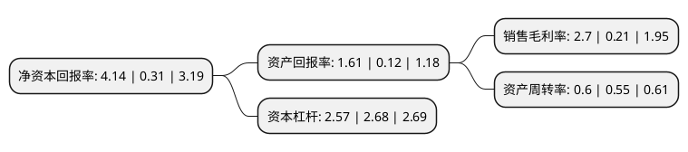

> 本页面由自动化程序生成于 2022年5月20日 01:26
> 内容可能存在错误，如有bug请提交issue至：https://github.com/Eroleice/doc-pi/issues
{.is-warning}

# 上市公司基本情况

## 基本资料

北京三元食品股份有限公司（以下简称“三元股份”）成立于1997年03月13日，北京市。于2003年09月15日在上交所主板上市。

三元股份注册资本149,755.743万元，主营业务为乳制品生产，加工，销售。以下是详细信息：

- 公司名称: 北京三元食品股份有限公司
- 股票代码: 600429.SH
- 所在地: 北京 - 北京市
- 成立日期: 1997年03月13日
- 注册资本: 149,755.743万元
- 法定代表人: 于永杰
- 主营业务: 主营业务为乳制品生产，加工，销售
- 公司官网: www.sanyuan.com.cn
- 公司介绍: 公司是一家农牧业、副食品为主业综合性上市公司，公司属于乳制品制造行业，主要业务涉及加工乳制品、饮料、食品、冷食冷饮；公司旗下拥有液体乳、发酵乳、乳饮料、奶粉、奶酪、冰淇淋等几大产品系列。公司拥有“三元”、“极致”、“爱力优”、“八喜”、“燕山”、“太子奶”等一系列有较高知名度的品牌。公司是国家高新技术企业、中关村高新技术企业、国家技术创新示范企业、首批国家级两化融合示范企业和“国家乳品健康科技创新联盟”理事长单位，荣获“全国食品工业科技竞争力卓越企业”。

## 股东及高管情况

上市公司第一大股东为北京首农食品集团有限公司，持股535,908,935股，占比35.79%，为上市公司实际控制人。

截至2022年03月31日，上市公司的前十大股东中，共有3名自然人股东，4名机构股东，1个产品账户，2个海外主体，其中5%以上大股东共有4名。上市公司前十大股东明细如下：

> 截至2022年03月31日，上市公司前十大股东信息如下：

| 股东名称 | 持股数量（股） | 持股比例 |
| --- | --- | --- |
| 北京首农食品集团有限公司 | 535,908,935 | 35.79% |
| BEIJING ENTERPRISES (DAIRY) LIMITED | 283,142,849 | 18.91% |
| BEIJING ENTERPRISES (DAIRY)   LIMITED | 283,142,849 | 18.91% |
| 上海平闰投资管理有限公司 | 249,617,151 | 16.67% |
| 上海复星创泓股权投资基金合伙企业(有限合伙) | 56,661,562 | 3.78% |
| 何忠 | 5,376,601 | 0.36% |
| 江苏省国信集团有限公司 | 5,009,724 | 0.33% |
| 中垦国邦(天津)有限公司 | 4,150,000 | 0.28% |
| 郭彦超 | 4,080,000 | 0.27% |
| 苏华 | 2,831,000 | 0.19% |

## 利润表分析

上市公司2021年总收入为77.3亿元，净利润为2.08亿元，实现盈利。

## 杜邦分析

> 数据列示周期：2021年 | 2020年 | 2019年
{.is-info}

上市公司的净资产收益率在近一年有所上升，上升幅度为1235.48%，其变化情况分解如下：
- 上市公司的销售毛利率在近一年上升了1185.71%，可能是生产效率的提升、商品原材料价格下跌或商品价格的上涨所致。
- 上市公司的资产周转率在近一年上升了9.09%，可能是源自于更快的销售回款或库存管理效果提升。
- 上市公司的财务杠杆比率在近一年下降了-4.1%，可能是减少负债降低财务费用。

