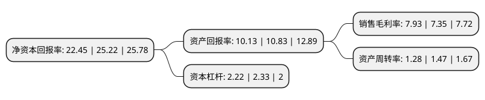

> 本页面由自动化程序生成于 2022年5月20日 01:29
> 内容可能存在错误，如有bug请提交issue至：https://github.com/Eroleice/doc-pi/issues
{.is-warning}

# 上市公司基本情况

## 基本资料

内蒙古伊利实业集团股份有限公司（以下简称“伊利股份”）成立于1993年06月04日，呼和浩特市。于1996年03月12日在上交所主板上市。

伊利股份注册资本640,013.092万元，液体乳系列，冷饮产品系列，奶粉及奶食品系列，混和饲料，方便食品以下是详细信息：

- 公司名称: 内蒙古伊利实业集团股份有限公司
- 股票代码: 600887.SH
- 所在地: 内蒙古 - 呼和浩特市
- 成立日期: 1993年06月04日
- 注册资本: 640,013.092万元
- 法定代表人: 潘刚
- 主营业务: 液体乳系列，冷饮产品系列，奶粉及奶食品系列，混和饲料，方便食品
- 公司官网: www.yili.com
- 公司介绍: 公司一直为消费者提供健康、营养的乳制品，规模大、产品线健全，是符合奥运会标准，为2008年北京奥运会提供服务的乳制品企业；也是符合世博会标准，为2010年上海世博会提供服务的乳制品企业。目前，伊利在亚洲、欧洲、美洲、大洋洲等乳业发达地区构建了一张覆盖全球资源体系、全球创新体系、全球市场体系的骨干大网。伊利一直坚持和推动创新战略，经过多年发展，已经建立了多个领先的技术研发和产学研合作平台，持续推动行业创新。其中，国家认定企业技术中心、乳品深加工技术国家和地方联合工程研究中心、全国冷冻饮品标准化技术委员会秘书处、国家乳制品加工技术研发专业分中心、国家乳肉检测中心的乳品检测研究室等都属于国家级别的研发创新平台。

## 股东及高管情况

上市公司第一大股东为香港中央结算有限公司(陆股通)，持股954,633,209股，占比14.92%，**疑似为**上市公司实际控制人。

截至2022年03月31日，上市公司的前十大股东中，共有4名自然人股东，2名机构股东，2个产品账户，1个海外主体，1名其他股东，其中5%以上大股东共有2名。上市公司前十大股东明细如下：

> 未能通过持股比例判定出上市公司实际控制人（持股30%以上）
> 可能存在通过间接持股、联合持股、协议控制等方式拥有实际控制权的主体，具体请参考上市公司定期公告！
{.is-warning}

> 截至2022年03月31日，上市公司前十大股东信息如下：

| 股东名称 | 持股数量（股） | 持股比例 |
| --- | --- | --- |
| 香港中央结算有限公司(陆股通) | 954,633,209 | 14.92% |
| 呼和浩特投资有限责任公司 | 538,535,826 | 8.41% |
| 潘刚 | 286,746,628 | 4.48% |
| 中国证券金融股份有限公司 | 182,421,475 | 2.85% |
| 中国银行股份有限公司-易方达蓝筹精选混合型证券投资基金 | 116,000,000 | 1.81% |
| 赵成霞 | 92,420,140 | 1.44% |
| 刘春海 | 91,638,288 | 1.43% |
| 交通银行股份有限公司-易方达上证50指数增强型证券投资基金 | 58,523,790 | 0.91% |
| 阿布达比投资局 | 44,841,297 | 0.7% |
| 胡利平 | 42,463,512 | 0.66% |

## 利润表分析

上市公司2021年总收入为1,105.95亿元，净利润为87.32亿元，实现盈利。

## 杜邦分析

> 数据列示周期：2021年 | 2020年 | 2019年
{.is-info}

上市公司的净资产收益率在近一年有所下降，下降幅度为-10.98%，其变化情况分解如下：
- 上市公司的销售毛利率在近一年上升了7.89%，可能是生产效率的提升、商品原材料价格下跌或商品价格的上涨所致。
- 上市公司的资产周转率在近一年下降了-12.93%，可能是源自于更慢的销售回款或库存管理效果下降。
- 上市公司的财务杠杆比率在近一年下降了-4.72%，可能是减少负债降低财务费用。

