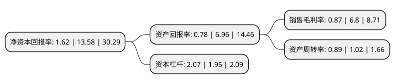

> 本页面由自动化程序生成于 2022年5月20日 01:36
> 内容可能存在错误，如有bug请提交issue至：https://github.com/Eroleice/doc-pi/issues
{.is-warning}

# 上市公司基本情况

## 基本资料

浙江一鸣食品股份有限公司（以下简称“一鸣食品”）成立于2005年09月13日，温州市。于2020年12月28日在上交所主板上市。

一鸣食品注册资本40,100万元，主要从事新鲜乳品与烘焙食品的研发，生产，销售及连锁经营业务。其中，乳品主要包括低温巴氏杀菌乳，风味发酵乳，低温调制乳及蛋奶，热奶等特色乳饮品，烘焙食品包括各式短保质期的面包，米制品，中式糕点等。以下是详细信息：

- 公司名称: 浙江一鸣食品股份有限公司
- 股票代码: 605179.SH
- 所在地: 浙江 - 温州市
- 成立日期: 2005年09月13日
- 注册资本: 40,100万元
- 法定代表人: 朱立科
- 主营业务: 主要从事新鲜乳品与烘焙食品的研发，生产，销售及连锁经营业务其中，乳品主要包括低温巴氏杀菌乳，风味发酵乳，低温调制乳及蛋奶，热奶等特色乳饮品，烘焙食品包括各式短保质期的面包，米制品，中式糕点等
- 公司官网: www.inm.cn
- 公司介绍: 公司主要从事新鲜乳品与烘焙食品的研发、生产、销售及连锁经营业务。其中，乳品主要包括低温巴氏杀菌乳、风味发酵乳、低温调制乳及蛋奶、热奶等特色乳饮品，烘焙食品包括各式短保质期的面包、米制品、中式糕点等。公司产品以“新鲜、健康、营养”为定位，乳品保质期通常在15天以内、烘焙食品保质期通常在3天以内，公司产品主要通过“一鸣真鲜奶吧”专业食品连锁门店进行销售。公司以“新鲜健康的食品、真诚永远的服务”为品牌理念，始终专注于各式新鲜乳品与烘焙食品的研发、制造与销售，以及奶吧连锁经营模式的探索与升级。以“牛奶+面包”的“营养早餐”为起点，公司逐步增加各式鲜牛奶、风味酸奶、三明治等产品，如先后开发了满足营养需求的“真鲜蛋奶”、适于国人温热饮食习惯的“热奶”及可加热饮用的“温酸奶”等畅销创新产品。未来，公司将通过在特种菌株上的基础研发、微生物发酵技术上的工艺改良、饮食口味上的产品创新，持续推出新鲜、健康、营养并满足消费升级饮食需求的新产品。

## 股东及高管情况

上市公司第一大股东为浙江明春投资有限公司，持股161,908,000股，占比40.38%，为上市公司实际控制人。

截至2022年03月31日，上市公司的前十大股东中，共有4名自然人股东，4名机构股东，2个产品账户，其中5%以上大股东共有4名。上市公司前十大股东明细如下：

> 截至2022年03月31日，上市公司前十大股东信息如下：

| 股东名称 | 持股数量（股） | 持股比例 |
| --- | --- | --- |
| 浙江明春投资有限公司 | 161,908,000 | 40.38% |
| 李美香 | 76,194,000 | 19% |
| 朱立群 | 31,756,000 | 7.92% |
| 朱立科 | 31,756,000 | 7.92% |
| 平阳心悦投资管理合伙企业(有限合伙) | 16,728,000 | 4.17% |
| 李红艳 | 15,878,000 | 3.96% |
| 平阳鸣牛投资管理合伙企业(有限合伙) | 3,740,000 | 0.93% |
| 平阳诚悦投资管理合伙企业(有限合伙) | 2,040,000 | 0.51% |
| 中国工商银行股份有限公司-华夏优加生活混合型证券投资基金 | 865,600 | 0.22% |
| 中国建设银行股份有限公司-华夏新兴消费混合型证券投资基金 | 470,500 | 0.12% |

## 利润表分析

上市公司2021年总收入为23.16亿元，净利润为0.2亿元，实现盈利。

## 杜邦分析

> 数据列示周期：2021年 | 2020年 | 2019年
{.is-info}

上市公司的净资产收益率在近一年有所下降，下降幅度为-88.07%，其变化情况分解如下：
- 上市公司的销售毛利率在近一年下降了-87.21%，可能是生产效率的下降、商品原材料价格上涨或商品价格的下跌所致。
- 上市公司的资产周转率在近一年下降了-12.75%，可能是源自于更慢的销售回款或库存管理效果下降。
- 上市公司的财务杠杆比率在近一年上升了6.15%，可能是增加负债扩大生产规模。

