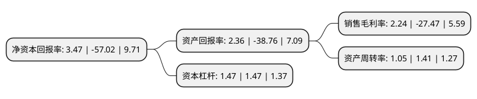

> 本页面由自动化程序生成于 2022年5月20日 01:03
> 内容可能存在错误，如有bug请提交issue至：https://github.com/Eroleice/doc-pi/issues
{.is-warning}

# 上市公司基本情况

## 基本资料

智度科技股份有限公司（以下简称“智度股份”）成立于1996年12月16日，广州市。于1996年12月24日在深交所主板上市。

智度股份注册资本127,650.697万元，主要业务包括互联网媒体业务，数字营销业务和新零售，自有品牌，区块链，互联网金融等其他业务。以下是详细信息：

- 公司名称: 智度科技股份有限公司
- 股票代码: 000676.SZ
- 所在地: 广东 - 广州市
- 成立日期: 1996年12月16日
- 注册资本: 127,650.697万元
- 法定代表人: 陆宏达
- 主营业务: 主要业务包括互联网媒体业务，数字营销业务和新零售，自有品牌，区块链，互联网金融等其他业务
- 公司官网: www.genimous.com
- 公司介绍: 公司基于在互联网搜索、大数据、AI、IOT、区块链等领域的技术沉淀，致力于开发与提供优质的互联网产品与服务，主要业务包括互联网媒体、数字营销和新零售、自有品牌、区块链、互联网金融等。互联网媒体业务围绕搜索这一PC端互联网流量重要入口，以及广告展示、搜索等形式的移动端媒体矩阵流量入口开展，为谷歌、FACEBOOK、雅虎、沃尔玛、亚马逊等全球知名企业提供精准流量变现服务。公司拥有腾讯、百度、搜狗、阿里、爱奇艺等众多媒体渠道代理牌照；在HUAWEI Ads(游戏、工具、社交行业)已取得华为独家授权，也是其影音娱乐、旅游、阅读、金融等互联网行业，电子电器、食品饮料、日化美妆等非互联网行业的代理商；拥有2020-2022年芒果TV-OTT端广告投放独家代理权。公司积极布局社交类媒体营销业务赛道。新零售业务为以大数据为基础、直播平台为渠道，提供品牌方和流量端智能匹配，落实到“货找人”的零售平台，目前主要聚焦珠宝饰品品类。自有品牌业务为结合公司在数字营销领域多年深耕积累的经验，以及对消费品市场领域的专业化人才队伍建设，打造自有电声品牌矩阵，目前拥有丹麦Vifa、中国爱浪以及中国珠江三大品牌。区块链业务为区块链底层技术创新研发及基于区块链技术的行业升级解决方案的创新性研究与落地，目前已完成区块链底层技术平台搭建，并在供应链金融、溯源防伪、智慧政务等领域完成了区块链解决方案设计与应用建设。

## 股东及高管情况

上市公司第一大股东为北京智度德普股权投资中心(有限合伙)，持股363,654,023股，占比28.4882%，**疑似为**上市公司实际控制人。

截至2022年03月31日，上市公司的前十大股东中，共有2名自然人股东，8名机构股东，其中5%以上大股东共有6名。上市公司前十大股东明细如下：

> 未能通过持股比例判定出上市公司实际控制人（持股30%以上）
> 可能存在通过间接持股、联合持股、协议控制等方式拥有实际控制权的主体，具体请参考上市公司定期公告！
{.is-warning}

> 截至2022年03月31日，上市公司前十大股东信息如下：

| 股东名称 | 持股数量（股） | 持股比例 |
| --- | --- | --- |
| 北京智度德普股权投资中心(有限合伙) | 363,654,023 | 28.4882% |
| 北京智度德普股权投资中心(有限合伙) | 354,631,823 | 27.78% |
| 北京智度德普股权投资中心(有限合伙) | 349,491,823 | 27.3788% |
| 智度集团有限公司 | 83,088,573 | 6.51% |
| 智度集团有限公司 | 83,088,573 | 6.51% |
| 智度集团有限公司 | 83,088,573 | 6.51% |
| 新天世安(北京)科技有限公司 | 36,803,000 | 2.88% |
| 杨方 | 31,551,000 | 2.47% |
| 上海易晋网络科技有限公司 | 12,519,000 | 0.98% |
| 胡明兰 | 7,381,200 | 0.58% |

## 利润表分析

上市公司2021年总收入为58.44亿元，净利润为1.27亿元，实现盈利。

## 杜邦分析

> 数据列示周期：2021年 | 2020年 | 2019年
{.is-info}

上市公司的净资产收益率在近一年有所下降，下降幅度为-106.09%，其变化情况分解如下：
- 上市公司的销售毛利率在近一年下降了-108.15%，可能是生产效率的下降、商品原材料价格上涨或商品价格的下跌所致。
- 上市公司的资产周转率在近一年下降了-25.53%，可能是源自于更慢的销售回款或库存管理效果下降。
- 上市公司的财务杠杆比率在近一年下降了0%，可能是减少负债降低财务费用。

