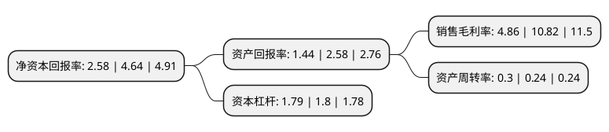

> 本页面由自动化程序生成于 2022年5月20日 01:06
> 内容可能存在错误，如有bug请提交issue至：https://github.com/Eroleice/doc-pi/issues
{.is-warning}

# 上市公司基本情况

## 基本资料

浙江网盛生意宝股份有限公司（以下简称“生意宝”）成立于2000年08月07日，杭州市。于2006年12月15日在深交所中小板上市。

生意宝注册资本25,272万元，主要产品:以经营中国化工网，全球化工网和中国纺织网为主。主营业务:化工行业和纺织行业的商务资讯服务，网站建设和维护服务以及广告服务。以下是详细信息：

- 公司名称: 浙江网盛生意宝股份有限公司
- 股票代码: 002095.SZ
- 所在地: 浙江 - 杭州市
- 成立日期: 2000年08月07日
- 注册资本: 25,272万元
- 法定代表人: 孙德良
- 主营业务: 主要产品:以经营中国化工网，全球化工网和中国纺织网为主主营业务:化工行业和纺织行业的商务资讯服务，网站建设和维护服务以及广告服务
- 公司官网: corp.netsun.com
- 公司介绍: 公司是一家专业从事互联网信息服务、电子商务、专业搜索引擎和企业应用软件开发的高新企业，目前已发展成为国内较大行业电子商务运营商和领先的综合B2B运营商。公司先后在北京、上海、青岛、济南、南京、无锡、成都、广州、郑州、石家庄、沈阳、武汉、太原、长沙、厦门、韩国首尔、美国西雅图、荷兰等地余地设立了分支机构，形成遍布全国、辐射全球的市场营销与服务体系，是当今国内屈指可数的大型互联网企业。公司曾先后承担“国家发改委化工行业电子商务应用工程”、“全国电子信息推广应用项目”，“浙江省软件产业发展计划项目”，“浙江省经贸委推进流通企业电子商务进程项目”，“浙江省信息产业科技、新产品试制计划项目”，“杭州市第一批高技术产业化项目”等一大批国家省市级重点项目。享受国家发改委电子商务专项资金，浙江省软件发展专项资金及浙江省信息服务业发展专项资金等，被浙江省科技厅认定为“浙江省高新技术企业”，被批准为“杭州高新技术产业开发区软件产业园企业”；通过“软件企业认证”；被杭州企业信用评级委员会评定为“AAA级企业”。

## 股东及高管情况

上市公司第一大股东为浙江网盛投资管理有限公司，持股115,662,511股，占比45.77%，为上市公司实际控制人。

截至2022年03月31日，上市公司的前十大股东中，共有8名自然人股东，2名机构股东，其中5%以上大股东共有2名。上市公司前十大股东明细如下：

> 截至2022年03月31日，上市公司前十大股东信息如下：

| 股东名称 | 持股数量（股） | 持股比例 |
| --- | --- | --- |
| 浙江网盛投资管理有限公司 | 115,662,511 | 45.77% |
| 杭州涉其网络有限公司 | 12,821,831 | 5.07% |
| 彭兵 | 2,124,029 | 0.84% |
| 王方南 | 1,021,800 | 0.4% |
| 傅智勇 | 899,556 | 0.36% |
| 刘天刚 | 856,324 | 0.34% |
| 高旭 | 637,588 | 0.25% |
| 陈德贤 | 562,872 | 0.22% |
| 朱晓霞 | 545,000 | 0.22% |
| 吴秀梅 | 500,000 | 0.2% |

## 利润表分析

上市公司2021年总收入为4.82亿元，净利润为0.22亿元，实现盈利。

## 杜邦分析

> 数据列示周期：2021年 | 2020年 | 2019年
{.is-info}

上市公司的净资产收益率在近一年有所下降，下降幅度为-44.4%，其变化情况分解如下：
- 上市公司的销售毛利率在近一年下降了-55.08%，可能是生产效率的下降、商品原材料价格上涨或商品价格的下跌所致。
- 上市公司的资产周转率在近一年上升了25%，可能是源自于更快的销售回款或库存管理效果提升。
- 上市公司的财务杠杆比率在近一年下降了-0.56%，可能是减少负债降低财务费用。

