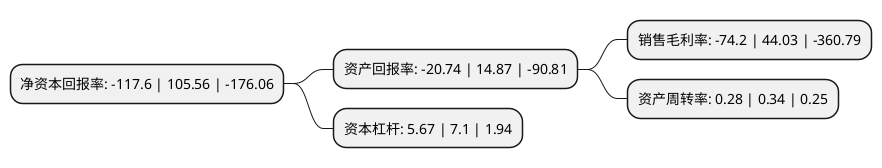

> 本页面由自动化程序生成于 2022年5月20日 01:06
> 内容可能存在错误，如有bug请提交issue至：https://github.com/Eroleice/doc-pi/issues
{.is-warning}

# 上市公司基本情况

## 基本资料

湖南天润数字娱乐文化传媒股份有限公司（以下简称“ST天润”）成立于1989年04月02日，岳阳市。于2007年02月08日在深交所中小板上市。

ST天润注册资本151,054.702万元，主营业务:物业租赁，贸易等，游戏收入以下是详细信息：

- 公司名称: 湖南天润数字娱乐文化传媒股份有限公司
- 股票代码: 002113.SZ
- 所在地: 湖南 - 岳阳市
- 成立日期: 1989年04月02日
- 注册资本: 151,054.702万元
- 法定代表人: 江峰
- 主营业务: 主营业务:物业租赁，贸易等，游戏收入
- 公司官网: www.trfz.com
- 公司介绍: 公司原主营业务为物业租赁。2016年公司进行产业转型、调整产业结构。公司通过非公开发行股份，购买上海点点乐信息科技有限公司100%股权，正式转型为移动网络游戏的研发及运营业务行业。上海点点乐拥有经验丰富的网络游戏行业的经营管理团队和成熟稳定的业务团队，长期的技术积累，研发精品的战略方针，严格把控产品质量，力求为用户打造出别具特色的经典游戏作品。2017年公司收购拇指游玩100%股权及虹软协创100%股权，拇指游玩在游戏代理与推广业务方面有较完善的体系；虹软协创专注于计费服务、用户分析和应用推广方面的业务。

## 股东及高管情况

上市公司第一大股东为广东恒润华创实业发展有限公司，持股172,719,999股，占比11.43%，**疑似为**上市公司实际控制人。

截至2022年03月31日，上市公司的前十大股东中，共有2名自然人股东，7名机构股东，1名其他股东，其中5%以上大股东共有4名。上市公司前十大股东明细如下：

> 未能通过持股比例判定出上市公司实际控制人（持股30%以上）
> 可能存在通过间接持股、联合持股、协议控制等方式拥有实际控制权的主体，具体请参考上市公司定期公告！
{.is-warning}

> 截至2022年03月31日，上市公司前十大股东信息如下：

| 股东名称 | 持股数量（股） | 持股比例 |
| --- | --- | --- |
| 广东恒润华创实业发展有限公司 | 172,719,999 | 11.43% |
| 广东恒润互兴资产管理有限公司 | 159,165,254 | 10.54% |
| 梁逍 | 129,872,200 | 8.6% |
| 国泰君安证券股份有限公司 | 81,600,000 | 5.4% |
| 新余市君创铭石投资中心(有限合伙) | 46,023,685 | 3.05% |
| 新余市咸城信阳投资中心(有限合伙) | 46,023,685 | 3.05% |
| 岳阳市财政局 | 28,214,322 | 1.87% |
| 天津大拇指企业管理咨询中心(有限合伙) | 25,992,619 | 1.72% |
| 兴业证券股份有限公司 | 23,970,000 | 1.59% |
| 靳伦全 | 13,260,000 | 0.88% |

## 利润表分析

上市公司2021年总收入为4.35亿元，净利润为-3.24亿元，**未实现盈利**。

## 杜邦分析

> 数据列示周期：2021年 | 2020年 | 2019年
{.is-info}

上市公司的净资产收益率在近一年有所下降，下降幅度为-211.41%，其变化情况分解如下：
- 上市公司的销售毛利率在近一年下降了-268.52%，可能是生产效率的下降、商品原材料价格上涨或商品价格的下跌所致。
- 上市公司的资产周转率在近一年下降了-17.65%，可能是源自于更慢的销售回款或库存管理效果下降。
- 上市公司的财务杠杆比率在近一年下降了-20.14%，可能是减少负债降低财务费用。

