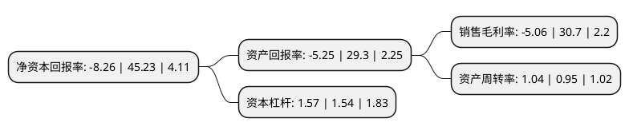

> 本页面由自动化程序生成于 2022年5月20日 01:06
> 内容可能存在错误，如有bug请提交issue至：https://github.com/Eroleice/doc-pi/issues
{.is-warning}

# 上市公司基本情况

## 基本资料

利欧集团股份有限公司（以下简称“利欧股份”）成立于2001年05月21日，台州市。于2007年04月27日在深交所中小板上市。

利欧股份注册资本675,480.421万元，主要产品:微小型水泵，园林机械，清洗和植保机械及工业泵等。主营业务:主要从事微型小型水泵，园林机械，清洗和植保机械，工业泵的研发，设计，制造，销售业务。以下是详细信息：

- 公司名称: 利欧集团股份有限公司
- 股票代码: 002131.SZ
- 所在地: 浙江 - 台州市
- 成立日期: 2001年05月21日
- 注册资本: 675,480.421万元
- 法定代表人: 王相荣
- 主营业务: 主要产品:微小型水泵，园林机械，清洗和植保机械及工业泵等主营业务:主要从事微型小型水泵，园林机械，清洗和植保机械，工业泵的研发，设计，制造，销售业务
- 公司官网: www.leogroup.cn
- 公司介绍: 公司原有业务为传统制造业，主要从事泵、园林机械、清洗和植保机械的研发、制造和销售，在整个泵业领域覆盖了较为完整的产业链。2014年度，公司通过对漫酷广告、上海氩氪和琥珀传播的成功收购，进军数字营销业务领域。2015年度，公司又成功完成对万圣伟业、微创时代的收购，公司数字营销服务已覆盖营销策略和创意、媒体投放和执行、效果监测和优化、社会化营销、精准营销、流量整合等完整的服务链条，成功建立了从基础的互联网流量整合到全方位精准数字营销服务于一体的整合营销平台。目前，公司成为行业内为数不多的能够提供一站式整合数字营销服务的数字营销集团，已成功跻身国内数字营销行业的领先梯队。

## 股东及高管情况

上市公司第一大股东为王相荣，持股637,387,033股，占比9.44%，**疑似为**上市公司实际控制人。

截至2022年03月31日，上市公司的前十大股东中，共有3名自然人股东，3名机构股东，3个产品账户，1个海外主体，其中5%以上大股东共有2名。上市公司前十大股东明细如下：

> 未能通过持股比例判定出上市公司实际控制人（持股30%以上）
> 可能存在通过间接持股、联合持股、协议控制等方式拥有实际控制权的主体，具体请参考上市公司定期公告！
{.is-warning}

> 上市公司第一大股东持股不超过10%，请检查是否存在公司控制权风险！
{.is-danger}

> 截至2022年03月31日，上市公司前十大股东信息如下：

| 股东名称 | 持股数量（股） | 持股比例 |
| --- | --- | --- |
| 王相荣 | 637,387,033 | 9.44% |
| 王壮利 | 503,903,819 | 7.46% |
| 香港中央结算有限公司(陆股通) | 65,671,353 | 0.97% |
| 中国工商银行股份有限公司-广发中证传媒交易型开放式指数证券投资基金 | 63,605,100 | 0.94% |
| 中国水务投资有限公司 | 63,230,996 | 0.94% |
| 珠海阿巴马资产管理有限公司-阿巴马元享红利15号私募证券投资基金 | 59,180,000 | 0.88% |
| 迹象信息技术(上海)有限公司 | 45,779,220 | 0.68% |
| 中国北方工业有限公司 | 39,750,574 | 0.59% |
| 周兰云 | 37,432,900 | 0.55% |
| 中国农业银行股份有限公司-中证500交易型开放式指数证券投资基金 | 33,366,402 | 0.49% |

## 利润表分析

上市公司2021年总收入为202.8亿元，净利润为-10.27亿元，**未实现盈利**。

## 杜邦分析

> 数据列示周期：2021年 | 2020年 | 2019年
{.is-info}

上市公司的净资产收益率在近一年有所下降，下降幅度为-118.26%，其变化情况分解如下：
- 上市公司的销售毛利率在近一年下降了-116.48%，可能是生产效率的下降、商品原材料价格上涨或商品价格的下跌所致。
- 上市公司的资产周转率在近一年上升了9.47%，可能是源自于更快的销售回款或库存管理效果提升。
- 上市公司的财务杠杆比率在近一年上升了1.95%，可能是增加负债扩大生产规模。

