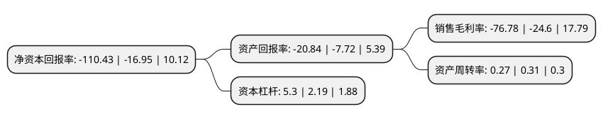

> 本页面由自动化程序生成于 2022年5月20日 01:06
> 内容可能存在错误，如有bug请提交issue至：https://github.com/Eroleice/doc-pi/issues
{.is-warning}

# 上市公司基本情况

## 基本资料

深圳市惠程信息科技股份有限公司（以下简称“惠程科技”）成立于1999年07月02日，深圳市。于2007年09月19日在深交所中小板上市。

惠程科技注册资本80,192.957万元，主营业务:高端智能制造，互联网综合服务以下是详细信息：

- 公司名称: 深圳市惠程信息科技股份有限公司
- 股票代码: 002168.SZ
- 所在地: 广东 - 深圳市
- 成立日期: 1999年07月02日
- 注册资本: 80,192.957万元
- 法定代表人: 陈国庆
- 主营业务: 主营业务:高端智能制造，互联网综合服务
- 公司官网: www.hifuture.com
- 公司介绍: 公司已经形成高端智能制造和互联网综合服务两大业务板块双主业运营，双轮业绩驱动的发展态势。智能高端制造领域，惠程以新型高分子电气绝缘材料技术为特色核心优势，致力于提供专业配网装备及综合解决方案，专业从事高可靠、全密闭、全绝缘、小型化新一代电气装备的研发、生产、销售、安装及配网综合解决方案。产品包括成套开关设备、全密闭绝缘中低压电缆分接箱、电缆对接箱、硅橡胶电缆附件、可分离连接器、外置母线连接器、避雷器、电气接点防护罩等硅橡胶绝缘制品、APG环氧树脂产品、管型母线、SMC电气设备箱体等。互联网综合服务，主要是基于大数据精细化营销的流量经营、变现业务，移动游戏的研发、发行，及游戏平台的运营业务。2017年惠程成功收购成都哆可梦科技有限公司，迈出布局互联网文娱产业的重要一步，并以此为契机，完善互联网文娱板块和互联网大数据领域。哆可梦是中国领先的移动互联网游戏企业，主营为基于大数据精细化营销的流量经营业务和移动游戏的研发、发行及游戏平台的运营业务。

## 股东及高管情况

上市公司第一大股东为重庆绿发城市建设有限公司，持股84,119,291股，占比10.49%，**疑似为**上市公司实际控制人。

截至2022年03月31日，上市公司的前十大股东中，共有7名自然人股东，3名机构股东，其中5%以上大股东共有2名。上市公司前十大股东明细如下：

> 未能通过持股比例判定出上市公司实际控制人（持股30%以上）
> 可能存在通过间接持股、联合持股、协议控制等方式拥有实际控制权的主体，具体请参考上市公司定期公告！
{.is-warning}

> 截至2022年03月31日，上市公司前十大股东信息如下：

| 股东名称 | 持股数量（股） | 持股比例 |
| --- | --- | --- |
| 重庆绿发城市建设有限公司 | 84,119,291 | 10.49% |
| 中驰惠程企业管理有限公司 | 46,278,466 | 5.77% |
| 陆洋 | 19,220,000 | 2.4% |
| 蔡明友 | 4,998,200 | 0.62% |
| 岳崴 | 4,855,584 | 0.61% |
| 吴松骏 | 3,800,600 | 0.47% |
| 共青城中源信投资管理合伙企业(有限合伙) | 3,127,318 | 0.39% |
| 代青 | 3,031,500 | 0.38% |
| 谢光胜 | 2,800,500 | 0.35% |
| 杨富年 | 2,685,000 | 0.33% |

## 利润表分析

上市公司2021年总收入为3.29亿元，净利润为-2.54亿元，**未实现盈利**。

## 杜邦分析

> 数据列示周期：2021年 | 2020年 | 2019年
{.is-info}

上市公司的净资产收益率在近一年有所上升，上升幅度为551.5%，其变化情况分解如下：
- 上市公司的销售毛利率在近一年上升了212.11%，可能是生产效率的提升、商品原材料价格下跌或商品价格的上涨所致。
- 上市公司的资产周转率在近一年下降了-12.9%，可能是源自于更慢的销售回款或库存管理效果下降。
- 上市公司的财务杠杆比率在近一年上升了142.01%，可能是增加负债扩大生产规模。

