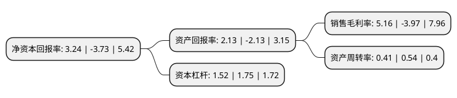

> 本页面由自动化程序生成于 2022年5月20日 01:06
> 内容可能存在错误，如有bug请提交issue至：https://github.com/Eroleice/doc-pi/issues
{.is-warning}

# 上市公司基本情况

## 基本资料

游族网络股份有限公司（以下简称“游族网络”）成立于1995年09月22日，泉州市。于2007年09月25日在深交所中小板上市。

游族网络注册资本91,586.183万元，主营业务:网页网络游戏和移动网络游戏的开发及运营以下是详细信息：

- 公司名称: 游族网络股份有限公司
- 股票代码: 002174.SZ
- 所在地: 福建 - 泉州市
- 成立日期: 1995年09月22日
- 注册资本: 91,586.183万元
- 法定代表人: 许芬芬
- 主营业务: 主营业务:网页网络游戏和移动网络游戏的开发及运营
- 公司官网: www.yoozoo.com
- 公司介绍: 公司以“大数据”、“全球化”、“精品化”为战略方向，立足全球化游戏研发与发行，知名IP管理，大数据与智能化，泛娱乐产业投资四大业务板块全面发展。公司旗下拥有全球领先的移动开发者服务平台Mob，覆盖80亿移动设备，通过与Google、Facebook、阿里巴巴的战略合作，不断深化大数据优势。以大数据为支撑，游族网络以“影游联动”为商业模式，围绕优秀IP打造系列电影、游戏、动漫、小说、商业地产等大文化产品体系，构建全球化的泛娱乐产业生态。作为中国领先的互动娱乐供应商，游族继续集中精力发展移动游戏和网页游戏的研发、发行及运营的主营业务，在巩固核心业务优势的基础上，通过持续稳健地推动游戏品类拓展，不断更新研发、发行技术及理念，同时，持续打造顶级IP，对现有的IP矩阵不断巩固，为今后积蓄更多能量密集的爆发点；在过去开拓的海外市场的基础上继续对海外区域市场进行深度拓展。通过近十年的研发经营的探索与经验积累，公司目前已形成精品游戏研运一体化的流程化体系和经营模式，组建了兼具成熟理念与团队活力的研发队伍，拥有其各具特色的美术风格和游玩风格，为游族的多品类精品游戏矩阵的发展和壮大奠定了坚实的基础。

## 股东及高管情况

上市公司第一大股东为林奇，持股86,681,638股，占比9.46%，**疑似为**上市公司实际控制人。

截至2022年03月31日，上市公司的前十大股东中，共有6名自然人股东，3个产品账户，1个海外主体，其中5%以上大股东共有1名。上市公司前十大股东明细如下：

> 未能通过持股比例判定出上市公司实际控制人（持股30%以上）
> 可能存在通过间接持股、联合持股、协议控制等方式拥有实际控制权的主体，具体请参考上市公司定期公告！
{.is-warning}

> 上市公司第一大股东持股不超过10%，请检查是否存在公司控制权风险！
{.is-danger}

> 截至2022年03月31日，上市公司前十大股东信息如下：

| 股东名称 | 持股数量（股） | 持股比例 |
| --- | --- | --- |
| 林奇 | 86,681,638 | 9.46% |
| 王卿伟 | 41,177,479 | 4.5% |
| 林漓 | 37,680,945 | 4.11% |
| 林芮璟 | 37,680,944 | 4.11% |
| 林小溪 | 37,680,944 | 4.11% |
| 王卿泳 | 32,438,319 | 3.54% |
| 香港中央结算有限公司(陆股通) | 29,856,061 | 3.26% |
| 游族网络股份有限公司-第一期员工持股计划 | 10,696,090 | 1.17% |
| 游族网络股份有限公司-第二期员工持股计划 | 9,446,693 | 1.03% |
| 中国工商银行股份有限公司-广发中证传媒交易型开放式指数证券投资基金 | 6,913,500 | 0.75% |

## 利润表分析

上市公司2021年总收入为32.04亿元，净利润为1.65亿元，实现盈利。

## 杜邦分析

> 数据列示周期：2021年 | 2020年 | 2019年
{.is-info}

上市公司的净资产收益率在近一年有所下降，下降幅度为-186.86%，其变化情况分解如下：
- 上市公司的销售毛利率在近一年下降了-229.97%，可能是生产效率的下降、商品原材料价格上涨或商品价格的下跌所致。
- 上市公司的资产周转率在近一年下降了-24.07%，可能是源自于更慢的销售回款或库存管理效果下降。
- 上市公司的财务杠杆比率在近一年下降了-13.14%，可能是减少负债降低财务费用。

