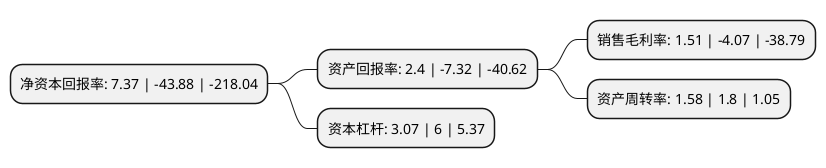

> 本页面由自动化程序生成于 2022年5月20日 01:08
> 内容可能存在错误，如有bug请提交issue至：https://github.com/Eroleice/doc-pi/issues
{.is-warning}

# 上市公司基本情况

## 基本资料

中科云网科技集团股份有限公司（以下简称“中科云网”）成立于1999年09月14日，北京市。于2009年11月11日在深交所中小板上市。

中科云网注册资本84,000万元，主营业务:餐饮团膳业务。以下是详细信息：

- 公司名称: 中科云网科技集团股份有限公司
- 股票代码: 002306.SZ
- 所在地: 北京 - 北京市
- 成立日期: 1999年09月14日
- 注册资本: 84,000万元
- 法定代表人: 陈继
- 主营业务: 主营业务:餐饮团膳业务
- 公司官网: www.cltg.com.cn
- 公司介绍: 公司是一家融中餐酒楼、快餐、团膳、食品工业及餐饮投资与营运管理于一体的专业化的餐饮集团，主营业务为餐饮团膳。公司团膳项目主要分布在北京、郑州等地，始终秉承安全、营养、健康、诚信的服务理念，为项目业主提供专业、优质的团餐服务。公司在团膳服务中大胆创新，突破中餐烹调标准化的“瓶颈”，使用自动化烹饪机器人来制作部分菜肴，成功实现了中餐团膳的工业化和标准化生产。公司由自动化烹饪机器人制作出来的菜品既可复制国内各大菜系的经典菜式,又延续了传统工艺的色香味形，同时还降低了烹饪时间和人工成本，提高了工作效率，从而也保证了利润率的提升。公司团膳事业在技术、客户、制度、中央厨房工业化生产方面均具有独特优势，是北京市首批拥有“中央国家机关健康食堂”资质的团膳服务商。在餐饮领域深耕多年，公司已形成了成熟的项目经营管理模式，有一支经验丰富的团餐业务管理团队，成熟的管理模式、丰富的服务经验和优秀的管理团队。

## 股东及高管情况

上市公司第一大股东为上海臻禧企业管理咨询合伙企业(有限合伙)，持股184,876,100股，占比22.01%，**疑似为**上市公司实际控制人。

截至2022年03月31日，上市公司的前十大股东中，共有9名自然人股东，1名机构股东，其中5%以上大股东共有1名。上市公司前十大股东明细如下：

> 未能通过持股比例判定出上市公司实际控制人（持股30%以上）
> 可能存在通过间接持股、联合持股、协议控制等方式拥有实际控制权的主体，具体请参考上市公司定期公告！
{.is-warning}

> 截至2022年03月31日，上市公司前十大股东信息如下：

| 股东名称 | 持股数量（股） | 持股比例 |
| --- | --- | --- |
| 上海臻禧企业管理咨询合伙企业(有限合伙) | 184,876,100 | 22.01% |
| 龚兆玮 | 13,136,342 | 1.56% |
| 李增梅 | 9,980,160 | 1.19% |
| 单小龙 | 8,353,470 | 0.99% |
| 翁史伟 | 6,500,000 | 0.77% |
| 汪双凤 | 6,241,300 | 0.74% |
| 方健 | 6,219,354 | 0.74% |
| 陈继 | 5,609,318 | 0.67% |
| 刘柏权 | 4,989,603 | 0.59% |
| 黄婧 | 4,847,000 | 0.58% |

## 利润表分析

上市公司2021年总收入为3.17亿元，净利润为0.04亿元，实现盈利。

## 杜邦分析

> 数据列示周期：2021年 | 2020年 | 2019年
{.is-info}

上市公司的净资产收益率在近一年有所下降，下降幅度为-116.8%，其变化情况分解如下：
- 上市公司的销售毛利率在近一年下降了-137.1%，可能是生产效率的下降、商品原材料价格上涨或商品价格的下跌所致。
- 上市公司的资产周转率在近一年下降了-12.22%，可能是源自于更慢的销售回款或库存管理效果下降。
- 上市公司的财务杠杆比率在近一年下降了-48.83%，可能是减少负债降低财务费用。

