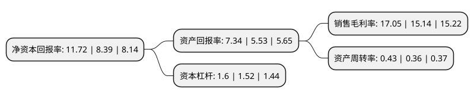

> 本页面由自动化程序生成于 2022年5月20日 01:08
> 内容可能存在错误，如有bug请提交issue至：https://github.com/Eroleice/doc-pi/issues
{.is-warning}

# 上市公司基本情况

## 基本资料

焦点科技股份有限公司（以下简称“焦点科技”）成立于1996年01月09日，南京市。于2009年12月09日在深交所中小板上市。

焦点科技注册资本30,604.408万元，综合型第三方B2B电子商务平台运营商，专注服务于全球贸易领域，在帮助中国中小企业应用互联网络开展国际营销，产品推广以下是详细信息：

- 公司名称: 焦点科技股份有限公司
- 股票代码: 002315.SZ
- 所在地: 江苏 - 南京市
- 成立日期: 1996年01月09日
- 注册资本: 30,604.408万元
- 法定代表人: 沈锦华
- 主营业务: 综合型第三方B2B电子商务平台运营商，专注服务于全球贸易领域，在帮助中国中小企业应用互联网络开展国际营销，产品推广
- 公司官网: www.focuschina.com
- 公司介绍: 公司是国家规划布局内重点软件企业，国家信息化试点单位，国家工业和信息化深度融合示范企业，国家电子商务示范城市试点项目单位，商务部电子商务示范企业。公司主营业务是外贸B2B电子商务平台及跨境贸易综合服务、互联网保险B2B/B2C电子商务平台及互联网保险综合服务、内贸B2B电子商务平台及企业采购供应链管理服务，以及各类互联网及电子商务相关的创新孵化业务。公司始终致力于将传统行业与互联网深度融合，先后将互联网引入外贸、保险、企业采购、教育、医疗等多个领域，研发并运营了中国制造网(Made-in-China.com)、百卓采购网(Abiz.com)、新一站保险网(xyz.cn)三大电子商务平台，以及移动医疗等互联网项目。凭借多年来的不断积累，旗下中国制造网已成为全球采购商寻找中国供应商以及贸易伙伴的重要网络渠道。一直以来，焦点科技以“竭尽全力创造客户认可的有价值的产品和服务”为使命，持续进行产品与服务创新，连续多年荣获“中国最佳客户服务奖”“中国最佳服务管理奖”等殊荣，获得业界广泛好评。

## 股东及高管情况

上市公司第一大股东为沈锦华，持股150,247,358股，占比48.95%，为上市公司实际控制人。

截至2022年03月31日，上市公司的前十大股东中，共有8名自然人股东，2个产品账户，其中5%以上大股东共有1名。上市公司前十大股东明细如下：

> 截至2022年03月31日，上市公司前十大股东信息如下：

| 股东名称 | 持股数量（股） | 持股比例 |
| --- | --- | --- |
| 沈锦华 | 150,247,358 | 48.95% |
| 姚瑞波 | 8,571,038 | 2.79% |
| 中国工商银行股份有限公司-交银施罗德趋势优先混合型证券投资基金 | 7,280,878 | 2.37% |
| 易方达基金-中央汇金资产管理有限责任公司-易方达基金-汇金资管单一资产管理计划 | 6,167,720 | 2.01% |
| 黄良发 | 4,480,000 | 1.46% |
| 谢永忠 | 4,275,970 | 1.39% |
| 黄世霖 | 3,876,600 | 1.26% |
| 欧阳芳 | 2,566,200 | 0.84% |
| 许剑峰 | 2,001,008 | 0.65% |
| 吕强 | 1,757,975 | 0.57% |

## 利润表分析

上市公司2021年总收入为14.74亿元，净利润为2.47亿元，实现盈利。

## 杜邦分析

> 数据列示周期：2021年 | 2020年 | 2019年
{.is-info}

上市公司的净资产收益率在近一年有所上升，上升幅度为39.69%，其变化情况分解如下：
- 上市公司的销售毛利率在近一年上升了12.62%，可能是生产效率的提升、商品原材料价格下跌或商品价格的上涨所致。
- 上市公司的资产周转率在近一年上升了19.44%，可能是源自于更快的销售回款或库存管理效果提升。
- 上市公司的财务杠杆比率在近一年上升了5.26%，可能是增加负债扩大生产规模。

