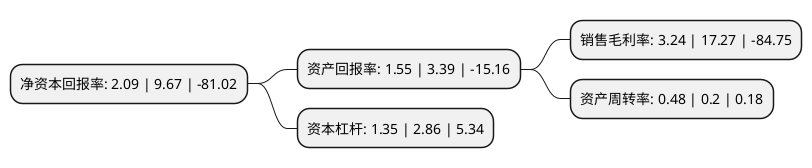

> 本页面由自动化程序生成于 2022年5月20日 01:08
> 内容可能存在错误，如有bug请提交issue至：https://github.com/Eroleice/doc-pi/issues
{.is-warning}

# 上市公司基本情况

## 基本资料

天娱数字科技(大连)集团股份有限公司（以下简称“天娱数科”）成立于2003年08月29日，大连市。于2010年02月09日在深交所中小板上市。

天娱数科注册资本166,228.329万元，主营业务:网页网游和移动网游的研发和发行业务。以下是详细信息：

- 公司名称: 天娱数字科技(大连)集团股份有限公司
- 股票代码: 002354.SZ
- 所在地: 辽宁 - 大连市
- 成立日期: 2003年08月29日
- 注册资本: 166,228.329万元
- 法定代表人: 徐德伟
- 主营业务: 主营业务:网页网游和移动网游的研发和发行业务
- 公司官网: www.tianshenyule.com
- 公司介绍: 公司主营业务为游戏竞技业务、移动应用分发业务、广告营销业务与影视娱乐业务。经过多年发展，吸引并培养了大批拥有优秀研发、制作、运营及营销能力、拥有丰富市场运作经验和国际化视野的互联网人才，凭借深厚的应用程序基础、强大的大数据以及全球化运营能力，形成了游戏内容与影视内容互为转化、品牌内容整合营销与数字营销渠道多维度推广、互联网流量经营与移动应用分发同步增强的产品矩阵和企业生态。在游戏研发、海外游戏发行和棋牌游戏领域搭建了有竞争力的产品体系，开创了“棋牌+电竞”模式，拥有庞大的用户群体，与游戏大厂形成差异化竞争；培育了月活跃用户数超2000万的互联网超级流量入口爱思助手，形成了强大的移动应用分发能力；构建了覆盖全球超10亿台独立设备的移动互联网广告科技SaaS平台Altamob，致力于为全球移动开发者和广告主提供高质量的商业化变现与程序化广告解决方案；公司卡位核心资源，不断延伸在影视娱乐内容制作、渠道、IP运营上的布局，并从影视剧品牌内容营销切入，构建了涵盖栏目授权、艺人经纪、电梯场景营销的品牌内容全场景营销平台，长期服务国内外一线企业。

## 股东及高管情况

上市公司第一大股东为朱晔，持股130,603,964股，占比7.86%，**疑似为**上市公司实际控制人。

截至2022年03月31日，上市公司的前十大股东中，共有4名自然人股东，3名机构股东，3个产品账户，其中5%以上大股东共有1名。上市公司前十大股东明细如下：

> 未能通过持股比例判定出上市公司实际控制人（持股30%以上）
> 可能存在通过间接持股、联合持股、协议控制等方式拥有实际控制权的主体，具体请参考上市公司定期公告！
{.is-warning}

> 上市公司第一大股东持股不超过10%，请检查是否存在公司控制权风险！
{.is-danger}

> 截至2022年03月31日，上市公司前十大股东信息如下：

| 股东名称 | 持股数量（股） | 持股比例 |
| --- | --- | --- |
| 朱晔 | 130,603,964 | 7.86% |
| 为新有限公司 | 67,069,178 | 4.03% |
| 芜湖歌斐资产管理有限公司-创世神娱一号私募基金 | 63,822,124 | 3.84% |
| 石波涛 | 28,281,988 | 1.7% |
| 王玉辉 | 26,921,702 | 1.62% |
| 芜湖歌斐资产管理有限公司-创世神娱二号私募基金 | 19,283,727 | 1.16% |
| 上海诚自投资中心(有限合伙) | 15,599,998 | 0.94% |
| 金元顺安基金-宁波银行-国金证券股份有限公司 | 14,311,525 | 0.86% |
| 雪松国际信托股份有限公司 | 11,697,036 | 0.7% |
| 张先云 | 8,655,800 | 0.52% |

## 利润表分析

上市公司2021年总收入为17.64亿元，净利润为0.57亿元，实现盈利。

## 杜邦分析

> 数据列示周期：2021年 | 2020年 | 2019年
{.is-info}

上市公司的净资产收益率在近一年有所下降，下降幅度为-78.39%，其变化情况分解如下：
- 上市公司的销售毛利率在近一年下降了-81.24%，可能是生产效率的下降、商品原材料价格上涨或商品价格的下跌所致。
- 上市公司的资产周转率在近一年上升了140%，可能是源自于更快的销售回款或库存管理效果提升。
- 上市公司的财务杠杆比率在近一年下降了-52.8%，可能是减少负债降低财务费用。

